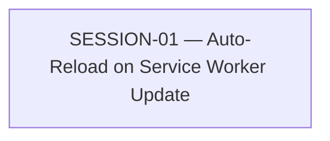

# State Tracker — Operator's Descent / cache-buster-auto-reload

## Program / Feature / Intent / Sessions

- **Program:** Operator's Descent
- **Feature:** cache-buster-auto-reload
- **Intent:** Whenever the player (re)opens the app, the runtime detects that a newer service worker has taken control (i.e., the shipped JS changed since they last saw it) and silently reloads once to apply it — closing the gap where `service-worker.js` already caches correctly but nothing tells an open/returning tab to actually refresh.
- **Sessions:** 1

## Session Status

| # | Session | Modules | Owns | Status | Checkpoint | Completed | Notes |
|---|---------|---------|------|--------|------------|-----------|-------|
| 01 | Auto-Reload on Service Worker Update | M86, M34 | `src/runtime.js`, `src/state/bus.js`, `tests/integration/runtime.test.js` | done | 3 | 2026-08-14 | Auto-reload closed. On returning visits M86 arms a one-shot `controllerchange` listener that dispatches `runtime:update-applied` and reloads once; `visibilitychange` re-runs `registration.update()` so tabs left open across a deploy still pick up the new worker. First-ever visits are guarded by `hadController` — `clients.claim()`'s initial `controllerchange` does not trigger a reload. `serviceWorkerStatus` gains `reloading:boolean`. Vitest 8/8 for `runtime.test.js` (was 5/5); full suite 1805/1806, the one failure is pre-existing/unrelated in `tests/tooling/check-tokens.test.js`. `service-worker.js` untouched. |

(Status: pending \| in-progress \| done \| blocked \| skipped)
(Checkpoint: last committed checkpoint, or —)

## Wave Plan

| Wave | Sessions | Why concurrent |
|------|----------|-----------------|
| 1 | 01 | Only session in this feature — no concurrency to schedule. |

## Dependency Graph

## Architecture Reference (feature-specific)

- **M81 (Service Worker, `./service-worker.js`)** — unchanged by this feature. Already versioned, cache-first, `skipWaiting()` + `clients.claim()` on activate. Read-only context for this session.
- **M86 (Hot Runtime, `./src/runtime.js`)** — gains: a `hadController`-guarded `navigator.serviceWorker.oncontrollerchange` listener that reloads the page exactly once when a *returning* visit's active worker changes (not on a brand-new install), and a `document.visibilitychange`-triggered re-check of `registration.update()` so a long-lived open tab self-corrects.
- **M34 (Event Bus, `./src/state/bus.js`)** — gains one contract: `runtime:update-applied`, dispatched immediately before the reload, mirroring the existing `runtime:error` pattern.
- Full stack/conventions/verification commands live in `./program/operator-s-descent/FORGE-CONFIG.md` — not duplicated here.

## Scope Summary (modules affected, indexed by ID)

| ID | Module | Change |
|----|--------|--------|
| M86 | Hot Runtime | Controller-change reload guard + visibility re-check added to `registerServiceWorkerOnce()` |
| M34 | Event Bus | New `runtime:update-applied` event contract |

## Design Decisions

| Choice | Rationale |
|--------|-----------|
| Silent, unconditional auto-reload (no confirmation banner) | User-confirmed "Option A". Autosave at floor-transition/combat-resolution boundaries plus deterministic floor regeneration from `floorSubSeed` means a reload mid-floor loses only in-progress movement, not save data — acceptable trade for guaranteed freshness. No new UI surface required. |
| Guard reload on `hadController` (page already controlled before this load) | `clients.claim()` in `service-worker.js` fires `controllerchange` even on a brand-new install (uncontrolled → controlled). Reloading on a player's very first visit would be a pointless, unexplained refresh. Only arm the reload listener when the tab was already controlled — i.e., a genuinely newer worker took over. |
| Re-check `registration.update()` on `visibilitychange` → visible (in addition to the existing boot-time check) | User-confirmed addition. Covers a tab left open across a deploy, not just fresh navigations. |
| One session, not split by file | `src/runtime.js` and `src/state/bus.js` changes are small and tightly coupled (the reload logic dispatches the bus event this session also defines); splitting would just add a merge/handoff tax for no file-ownership reason. |

## Handoff Notes

### SESSION-01 (2026-08-14, done, checkpoint 3)

**Notes:** Auto-reload closed: on returning visits M86 arms a one-shot controllerchange listener that dispatches runtime:update-applied and reloads once; visibilitychange re-runs registration.update() so tabs left open across a deploy still pick up the new worker. First-ever visits are guarded by hadController — clients.claim()'s initial controllerchange does not trigger a reload. serviceWorkerStatus gains reloading:boolean.

**Delivered:** M34 gains `runtime:update-applied` event contract. M86 gains hadController-guarded controllerchange reload + visibilitychange revalidate inside `registerServiceWorkerOnce()`; tracks `serviceWorkerReloadPending` + `serviceWorkerRegistration` module-locals; extends `serviceWorkerStatus` with `reloading:false`. Tests: extended `installBrowserGlobals({hasController})` to expose update mock + swListeners map; extended `installDocument` to expose docListeners map and visibilityState; added 3 tests in a new `describe('service worker update handling')` block with a `beforeEach` that `vi.resetModules()` to reset persistent SW module-state that prior tests set.

**Verification:** `node --check src/runtime.js && node --check src/state/bus.js` pass. `npx vitest run ./tests/integration/runtime.test.js`: 8/8 pass (was 5/5). `npx vitest run` full suite: 1805/1806 pass, 1 pre-existing unrelated failure in `tests/tooling/check-tokens.test.js` (reproduces on stashed clean tree — see surprises). `git diff` shows `service-worker.js` untouched.

**Surprises:** Pre-existing failing test unrelated to this lease: `tests/tooling/check-tokens.test.js` expects `checkColorTokens()` to return `[]` but it reports extras like `--scrollbar-width`. Verified failing on clean tree before Mu's changes. Also: had to add `vi.resetModules()` in the new describe's `beforeEach` because `serviceWorkerStarted` / `serviceWorkerRegistration` are module-level flags that persist across tests in-file; without a fresh module load the new SW listener code is skipped by the `serviceWorkerStarted` early-return. Could not test with a real first-load browser scenario (no server started this session) — only fake unit coverage; brief flagged this as the behavior easiest to get backwards.

**Follow-up:** `./program/operator-s-descent/arch/runtime-and-offline.md` Change History row appended by Jikijitsu (this receive). Consider a future browser-acceptance test that exercises a real deploy → returning visit → reload flow (Playwright, out of scope here). Pre-existing check-tokens failure predates this session but should probably be triaged in its own feature.
