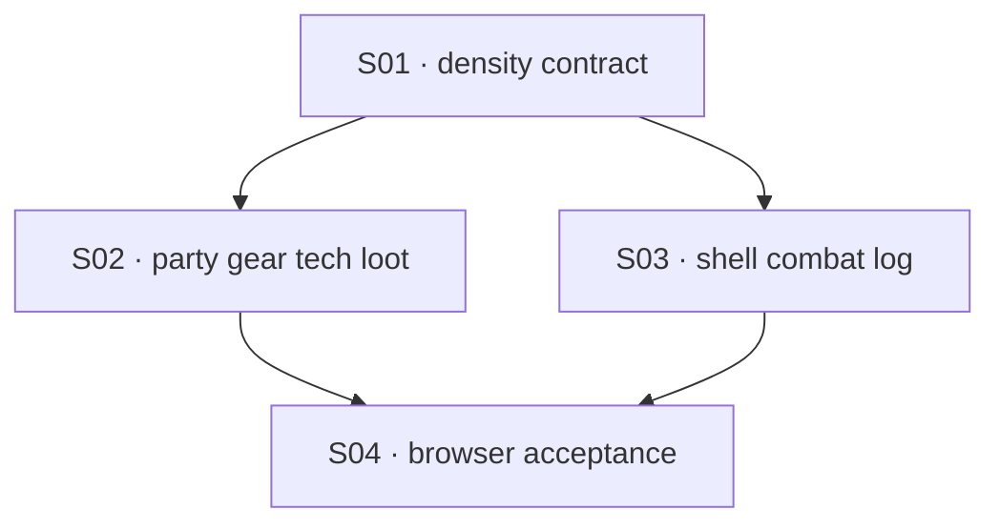

# State Tracker — Operator's Descent / console-submenu-density-and-scroll

## Program / Feature / Intent / Sessions

- **Program:** Operator's Descent (`operator-s-descent`)
- **Feature:** `console-submenu-density-and-scroll`
- **Intent:** Reclaim wasted vertical space in every console submenu by separating static/readout content from touch-target rows, while keeping all content in-flow and reachable through portrait and wide scrolling.
- **Sessions:** 4
- **Authoritative config:** `./program/operator-s-descent/FORGE-CONFIG.md` (existing; reused without override)

## Session Status

| # | Session | Modules | Owns | Status | Checkpoint | Completed | Notes |
|---|---|---|---|---|---|---|---|
| 01 | Establish semantic console density and scroll contract | M56, M79, M97, M99, M101 | `./src/ui/components.js`, `./styles/components.css`, `./styles/wide.css`, `./specs/design.md`, `./docs/accessibility-audit.md`, `./docs/icon-density-gap.md`, `./tests/ui/components.test.js` | done | 2/2 | 2026-08-22 | Established compact static-card API and semantic density/scroll contract. Follow-up: SESSION-02 should pass compact: true only for non-clickable static equipment/protocol articles and use console-static-row for other static render nodes. Control selectors retain the 96px floor; static markers reset to min-height: 0. |
| 02 | Compact PARTY, GEAR, TECH, and LOOT content | M63–M66 | `./src/ui/console/party.js`, `./src/ui/console/gear.js`, `./src/ui/console/tech.js`, `./src/ui/console/loot.js`, `./tests/ui/console-party.test.js`, `./tests/ui/console-gear.test.js`, `./tests/ui/console-tech.test.js`, `./tests/ui/console-loot.test.js`, `./tests/ui/party-gear.test.js` | done | 2/2 | 2026-08-22 | Classified PARTY/GEAR/TECH/LOOT readouts as static while preserving all composite action rows and named scroll surfaces. Follow-up: PARTY detail, GEAR inventory, TECH deck, and LOOT contents retain focusable named scroll contracts. Composite member/item/protocol/TAKE rows intentionally retain the 96px interactive floor. |
| 03 | Compact COMBAT/LOG chrome and harden the console scroll owner | M60, M62, M67, M103 | `./src/ui/console/console.js`, `./src/ui/console/combat.js`, `./src/ui/console/log.js`, `./tests/ui/console.test.js`, `./tests/ui/console-combat.test.js`, `./tests/ui/console-log.test.js` | done | 2/2 | 2026-08-22 | Marked COMBAT/LOG static readouts with console-static-row while preserving all action/direction/target/protocol/item control classes and testids; added an explicit data-scroll-owner="console-mode" marker on the shell content node and hardened keyed scroll-offset preservation across refresh and mode switches. Follow-up: None — SESSION-04 (browser acceptance) may proceed; its dependency on SESSION-02 and SESSION-03 is satisfied. |
| 04 | Browser acceptance for dense submenus and reachable scrolling | M95, M97, M99, M103 | `./tests/helpers/console-density-fixture.js`, `./tests/e2e/console-submenu-density.spec.js`, `./tests/e2e/scroll-restore.spec.js`, `./tests/e2e/touch-flow.spec.js`, `./tests/e2e/combat-touch.spec.js`, `./tests/e2e/portrait-usability.spec.js`, `./tests/e2e/adaptive-layout.spec.js` | blocked | 1/2 + residual | 2026-08-22 | Blocked: no handoff JSON; see `./.forge/results/SESSION-04.result.md`. Checkpoint 1 is committed; checkpoint 2 was only preserved as a session-end residual. Lease violation: checkpoint 1 commit `ccbc87c` also deleted `./program/operator-s-descent/prompts/mobile-combat-density-repair/STATE.md`, outside SESSION-04 Owns. |

## Wave Plan

| Wave | Sessions | Why concurrent |
|---|---|---|
| 1 | SESSION-01 | Shared component/CSS/design contract must land before mode renderers consume the new markers. |
| 2 | SESSION-02, SESSION-03 | After SESSION-01, their source and unit-test write sets are disjoint: PARTY/GEAR/TECH/LOOT versus shell/COMBAT/LOG. |
| 3 | SESSION-04 | Browser fixtures and acceptance selectors consume both renderer branches and must run after both are complete. |

## Dependency Graph

## Architecture Reference (feature-specific only; full config in `./program/operator-s-descent/FORGE-CONFIG.md`)

- **Primary scroll owner:** portrait `.console-content.scroll-area`; wide `.wide-console-content-body.scroll-area`.
- **Scroll memory:** existing M103 keys offsets as `console:${mode}`; preserve capture-before-destroy and restore-after-mount.
- **Density markers:** `console-static-row` for noninteractive render nodes; `console-static-card` for opt-in compact static equipment/protocol articles.
- **Touch floor:** 96px remains on actual touch controls and composite action rows; wide fine-pointer densification remains in `./styles/wide.css`; no positive sub-96px `min-height` is added to `./styles/components.css`.
- **Content policy:** preserve all text, stats, rarity/affix data, warnings, and actions; reclaim space through intrinsic sizing and compact gaps, then scroll when content exceeds the mode surface.

## Scope Summary (modules affected, indexed by ID)

| ID | Module | Scope |
|---|---|---|
| M56 | UI Components | Add opt-in compact static card marker; default card behavior unchanged. |
| M60 | Console Shell | Explicit mode scroll-owner marker and restoration contract tests. |
| M61 | Console Move | Acceptance coverage only; existing D-pad controls remain unchanged. |
| M62 | Console Combat | Compact static readouts/feedback; preserve action geometry. |
| M63 | Console Party | Compact detail/readout content; preserve member cards and detail scroll surface. |
| M64 | Console Gear | Compact static inventory/equipment content; preserve composite item rows and list scroll semantics. |
| M65 | Console Tech | Compact protocol/slot/catalog readouts; preserve protocol action rows and deck scroll semantics. |
| M66 | Console Loot | Compact container/inventory readouts; preserve TAKE/junk/toggle rows and list scroll semantics. |
| M67 | Console Log | Compact event/share/readout content; preserve full-history scroll and copy action. |
| M79 | Components CSS | Semantic static reset, control floor, portrait scroll behavior. |
| M95 | Browser Acceptance | New density/scroll matrix and legacy selector updates across portrait/wide projects. |
| M97 | Design Compliance Scanner | Read-only compatibility gate; scanner must continue to pass. |
| M99 | Screenshot Parity Tool | Read-only visual parity gate for affected console mock pages and production screens. |
| M101 | Wide CSS | Static reset, fine-pointer exclusion, coarse-pointer floor, wide scroll body. |
| M103 | Scroll Memory | Read-only existing keyed implementation; browser regression coverage. |

## Design Decisions (choice + rationale)

1. **Scope all seven console modes and both layout classes:** the screenshots cover PARTY/GEAR/TECH/LOOT/LOG plus combat states, and the same shared floor affects MOVE/COMBAT and wide dock rendering. MOVE is expected to need no visual rewrite, but remains in the acceptance matrix.
2. **Use semantic markers instead of a selector heuristic:** `.console-static-row` and opt-in `.console-static-card` make intent explicit and avoid accidentally shrinking a `role="button"` or composite action row.
3. **Keep the 96px touch contract:** only static wrappers/articles lose the forced floor. Existing control geometry, keyboard activation, manual links, and wide pointer/coarse-pointer policy remain intact.
4. **Keep content in-flow and scrollable:** no deletion, truncation, fixed row-count cap, or overflow clipping. Mode-level scroll remains the reliable bottom-reachability contract; named nested lists retain their focusable `scroll-area` semantics.
5. **Repair class overwrites:** PARTY, GEAR, and TECH must append visual classes to `createScrollArea` results so the named surfaces keep scrollbar styling and keyboard focusability.
6. **No new dependencies or build step:** the repository is native ES modules with CSS and Playwright/Vitest tooling; the feature is implemented with existing classes, factories, and test fixtures.

## Handoff Notes (Jikijitsu writes here after each session — from Mu's handoff JSON, verbatim)

<!-- Intentionally empty. Jikijitsu appends Mu's `notes` and `followUp` verbatim. -->

<!-- SESSION-01 -->
- **notes:** Established compact static-card API and semantic density/scroll contract.
- **followUp:** SESSION-02 should pass compact: true only for non-clickable static equipment/protocol articles and use console-static-row for other static render nodes. Control selectors retain the 96px floor; static markers reset to min-height: 0.
- **delivered:** Added opts.compact static article handling for equipment/protocol cards; preserved interactive/default behavior; excluded static markers from control floors and documented portrait/wide scroll ownership.
- **verification:** npx vitest run ./tests/ui/components.test.js ./tests/tooling/extract-design-spec.test.js → 67 pass; node --check ./src/ui/components.js → pass; npm run design:scan → 0 errors, 0 warnings; parity console-party portrait + wide captured and inspected.
- **surprises:** Pre-existing unrelated working-tree changes remain: deleted ./program/operator-s-descent/prompts/shared-menu-primitives/STATE.md and untracked ./.DS_Store.
- **layoutClasses:** ["portrait", "wide"]
- **evidence:** [{"shot":"console-party.png","note":"Portrait parity capture inspected; console content is in flow with no clipped controls."},{"shot":"console-party-wide.png","note":"Wide parity capture inspected; dock content is visible and scroll surface remains stable."}]
- **a11yNotes:** Static articles remain non-focusable; named portrait and wide scroll owners retain keyboard-reachable in-flow content.

<!-- SESSION-02 -->
- **notes:** Classified PARTY/GEAR/TECH/LOOT readouts as static while preserving all composite action rows and named scroll surfaces.
- **followUp:** PARTY detail, GEAR inventory, TECH deck, and LOOT contents retain focusable named scroll contracts. Composite member/item/protocol/TAKE rows intentionally retain the 96px interactive floor.
- **delivered:** Preserved scroll-area classes, added compact static cards, and covered static-versus-interactive semantics.
- **verification:** Targeted Vitest: 71 pass; syntax checks: pass; design scan: 0 errors, 0 warnings. Full Vitest: 2810 pass, 2 unrelated exploration failures.
- **surprises:** Full-suite exploration failures are outside this lease. Pre-existing deleted prompt STATE file and untracked .DS_Store remain outside the lease. Portrait PARTY/GEAR/TECH parity captures were inspected; LOOT parity capture did not complete.
- **layoutClasses:** ["portrait", "wide"]
- **evidence:** [{"shot":"/tmp/session-02-parity/console-party.png","note":"Portrait production/mock capture inspected; PARTY readouts remain in flow and the detail surface is reachable."},{"shot":"/tmp/session-02-parity/console-gear.png","note":"Portrait production/mock capture inspected; equipment composites remain actionable and inventory content stays in flow."},{"shot":"/tmp/session-02-parity/console-tech.png","note":"Portrait production/mock capture inspected; protocol actions remain visible with compact static card content."}]
- **a11yNotes:** Named PARTY, GEAR, TECH, and LOOT scroll areas retain labels and tabindex=0; static wrappers no longer claim touch-row semantics.

<!-- SESSION-03 -->
- **blockedReason:** Zen session handle was lost after launch before persistence, so no final handoff JSON can be retrieved.
- **checkpoint:** 2/2 confirmed by git recovery log: `ac3dc23971da1277f8e72404e4b2be951cb5a16c` and `9bd2d634a5c43eff92a4486f9485806536cdfc10`.
- **recovery:** No `./.forge/sessions/SESSION-03.id`, `./.forge/results/SESSION-03.result.md`, or architecture fragment survived. The worker's final response is unavailable and is not reconstructed from commits.

<!-- SESSION-03 RECOVERY RETRY -->
- **recovery:** Human explicitly requested unblocking on 2026-08-22. SESSION-03 is returned to pending at the authoritative committed checkpoint count (2/2) solely to collect a fresh, parseable exit-contract handoff; the original handoff is not reconstructed.

<!-- SESSION-03 RECOVERY HANDOFF -->
- **notes:** Marked COMBAT/LOG static readouts with console-static-row while preserving all action/direction/target/protocol/item control classes and testids; added an explicit data-scroll-owner="console-mode" marker on the shell content node and hardened keyed scroll-offset preservation across refresh and mode switches.
- **delivered:** Recovery retry only — no new code written. Verified via git log that checkpoint 1 (static markers in combat.js/log.js, console-static-row applied to noninteractive nodes) and checkpoint 2 (data-scroll-owner marker in console.js, extended console.test.js scroll-offset-preservation coverage) were both already committed and complete against the session's Implementation and Verification sections. Re-ran full verification to produce this handoff.
- **verification:** npx vitest run ./tests/ui/console.test.js ./tests/ui/console-combat.test.js ./tests/ui/console-log.test.js ./tests/ui/scroll-memory.test.js → 82 pass (4 files); node --check on ./src/ui/console/console.js, ./src/ui/console/combat.js, ./src/ui/console/log.js → pass; npm run design:scan → 0 errors, 0 warnings, 2 info (unrelated corner-radius notes); full npx vitest run → 2817 pass, 2 fail (both in ./tests/ui/exploration-screen.test.js, outside this session's lease).
- **surprises:** The 2 full-suite failures in ./tests/ui/exploration-screen.test.js are pre-existing and outside this lease (M70, not touched by SESSION-03) — this matches the same 'unrelated exploration failures' already recorded in SESSION-02's handoff. A later, separate feature (mobile-combat-density-repair SESSION-01, commit 0364660) has since layered additional changes onto ./src/ui/console/combat.js and ./tests/ui/console-combat.test.js on top of this session's work; those are a different session's commits, not part of this lease, and were left untouched. Pre-existing outside-lease working-tree state remains: staged deletion of ./program/operator-s-descent/prompts/mobile-combat-density-repair/STATE.md, unstaged edit to ../../README.MD, and untracked ../../.DS_Store.
- **followUp:** None — SESSION-04 (browser acceptance) may proceed; its dependency on SESSION-02 and SESSION-03 is satisfied.
- **filesTouched:** []
- **blockedReason:** null

<!-- SESSION-04 ATTEMPT-01 RECOVERY -->
- **recovery:** Zen attempt 1 was launched with handle `642a27c7-f69a-40a4-ab8b-eb0014f11443`, but `await_subagent_result` returned `Failed to parse tool arguments: JSON Parse error: Property name must be a string literal` followed by an unknown replacement session id. The raw reply is archived in `./.forge/results/SESSION-04.attempt1.await-error.md`; it contains no handoff JSON. Git recovery found no SESSION-04 checkpoint commit and uncommitted in-lease files `./tests/e2e/console-submenu-density.spec.js` and `./tests/helpers/console-density-fixture.js`. They are preserved for the recovery worker; Jikijitsu does not commit or reset them.

<!-- SESSION-04 ATTEMPT-02 BLOCKED -->
- **blockedReason:** no handoff JSON; see `./.forge/results/SESSION-04.result.md`.
- **checkpoint:** 1/2 confirmed by worker checkpoint commit `ccbc87c6b04e4f8871b3cb15f71c782e66956fc2` (`console-submenu-density-and-scroll SESSION-04: checkpoint 1 — deterministic browser fixtures and portrait acceptance`).
- **rawResult:** `Waiting for the full E2E suite to complete before finishing checkpoint 2 verification. I'll check back shortly.` This is not a parseable exit-contract handoff.
- **residual:** Uncommitted in-lease changes to `./tests/e2e/adaptive-layout.spec.js` were committed by Jikijitsu as allowed session-end residual `1125e9e8e6e00510c2e0c88f39241c2c0c5a93dd` (`console-submenu-density-and-scroll SESSION-04: session-end residual`). They are not treated as a verified worker checkpoint.
- **leaseViolation:** `ccbc87c6b04e4f8871b3cb15f71c782e66956fc2` also deleted `./program/operator-s-descent/prompts/mobile-combat-density-repair/STATE.md`, which is outside SESSION-04 Owns. The deletion was already staged before the launch, but its inclusion in the worker checkpoint commit remains a lease violation. Jikijitsu did not restore or otherwise modify that external path.
