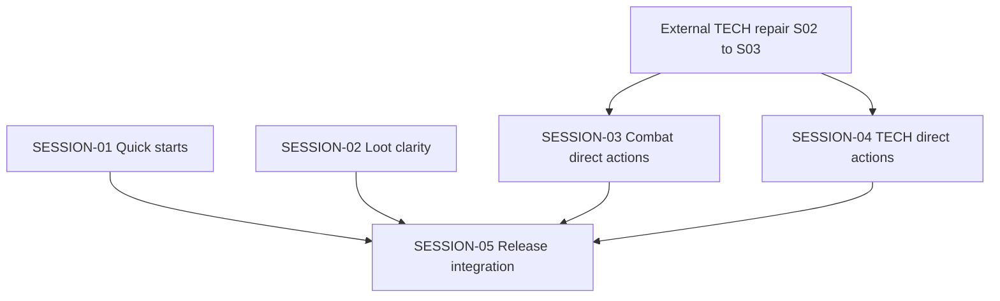

# State Tracker — Operator's Descent / direct-actions-and-quick-starts

## Program / Feature / Intent / Sessions

| Field | Value |
|---|---|
| **Program** | Operator's Descent |
| **Feature** | `direct-actions-and-quick-starts` |
| **Intent** | Remove scroll-dependent generic confirmation from normal play, make current state/results visible on touch, and let a new player deploy an editable recommended party quickly. |
| **Sessions** | 5 |
| **Plan directory** | `./program/operator-s-descent/prompts/direct-actions-and-quick-starts/` |
| **External gate** | `./program/operator-s-descent/prompts/tech-protocol-e2e-repair/SESSION-02.md` and `./program/operator-s-descent/prompts/tech-protocol-e2e-repair/SESSION-03.md` must complete before SESSION-03 or SESSION-04 starts. Its SESSION-01 is already done. |

## Worktree Coordination at Planning Time

- **External repair lease in progress**: `./tests/ui/combat-screen.test.js` has uncommitted changes identified with `tech-protocol-e2e-repair` SESSION-02. It overlaps this plan’s future SESSION-03 lease. That external session must commit or explicitly hand off the work before SESSION-03 reads, stages, reverts, or changes the file.
- **Unrelated local artifact**: `./.DS_Store` is untracked and outside every session lease. Do not stage it.

## Session Status

| # | Session | Modules | Owns | Status | Checkpoint | Completed | Notes |
|---|---|---|---|---|---|---|---|
| 1 | `./SESSION-01.md` — Add Editable Quick-Start Parties | M92, M69, M95 | `./src/ui/creation-model.js`, `./src/ui/screens/creation.js`, `./tests/ui/creation-model.test.js`, `./tests/ui/creation-screen.test.js` | done | 3/3 | 2026-08-24 | Added three immutable, editable quick-start presets (BREACH DRILL, SCOUT PAIR, FULL CREW) via getQuickStartParties()/load_quick_start; wired a QUICK START chooser before the detailed editor in the portrait creation screen; 4 focused regression tests added. |
| 2 | `./SESSION-02.md` — Make Loot Pickup Self-Evident | M66, M95 | `./src/ui/console/loot.js`, `./tests/ui/console-loot.test.js` | pending | — | — | Direct TAKE stays direct; result is visible above CONTENTS and acquired row disappears. |
| 3 | `./SESSION-03.md` — Replace Combat Confirmation with Direct Actions | M62, M71, M95 | `./src/ui/console/combat.js`, `./src/ui/screens/combat.js`, `./tests/ui/console-combat.test.js`, `./tests/ui/combat-screen.test.js`, `./tests/e2e/combat-touch.spec.js`, `./tests/e2e/mobile-combat-density.spec.js`, `./tests/e2e/touch-flow.spec.js` | pending | — | — | Blocked only by the external TECH repair gate; removes `combat-confirm` without a sticky replacement. |
| 4 | `./SESSION-04.md` — Remove the Generic TECH Confirmation Step | M65, M95 | `./src/ui/console/tech.js`, `./tests/ui/console-tech.test.js`, `./tests/helpers/tech-protocol-e2e-fixture.js`, `./tests/e2e/tech-protocols.spec.js` | pending | — | — | Blocked only by the external TECH repair gate; preserves the repaired 20-protocol transaction. |
| 5 | `./SESSION-05.md` — Direct Descent, Update the Manual, and Release the Cache | M61, M70, M111, M81, M95 | `./src/ui/console/move.js`, `./src/ui/screens/exploration.js`, `./data/manual.json`, `./service-worker.js`, `./tests/ui/move-mode.test.js`, `./tests/ui/exploration-screen.test.js`, `./tests/data/manual-content.test.js`, `./tests/integration/service-worker.test.js`, `./tests/e2e/playtest-feedback.spec.js` | pending | — | — | Integrates the direct-action contract, mobile regression story, and offline cache release. |

## Wave Plan

| Wave | Sessions | Why concurrent |
|---|---|---|
| 1 | SESSION-01 ∥ SESSION-02 | Their write leases are literally disjoint: creation model/screen/tests versus loot console/test. Both use focused unit/UI verification only. |
| Gate | External TECH repair SESSION-02 → SESSION-03 | The current repair’s live TECH transaction and strict E2E matrix are artifacts that direct-TECH work must consume. |
| 2 | SESSION-03 ∥ SESSION-04 | COMBAT and TECH leases are disjoint and can begin after the external gate. Both name `playwright:webserver`; Jikijitsu must hold that exclusive resource, so browser execution serializes even though source ownership does not overlap. |
| 3 | SESSION-05 | One member: the manual and cache release must describe and publish the completed COMBAT/TECH direct-action contract; it also owns the cross-feature mobile acceptance artifact. |

## Dependency Graph

## Architecture Reference

1. Normal, reversible play actions use **direct activation**, not a generic confirmation screen: explicit action → one legal target/destination activation → one guarded transaction.
2. Pointer/touch is the primary direct path. Keyboard focus navigation and `Enter` remain a non-visual accessibility/power-user activation mechanism; no scrollable CONFIRM control is rendered.
3. COMBAT action blockers must be visibly rendered from current rules state. Current range/AP/weapon diagnostics are valid; line-of-sight copy is not valid unless a rules-layer check exists.
4. QUICK START presets are immutable creation-model data that load ordinary editable drafts. They do not add a saved-party schema, an asset, or a parallel deployment system.
5. A successful loot take makes three facts visible in the current console viewport: acquired item, updated inventory count, and removal/clearing of the source container.
6. The service-worker cache identity changes only after all static source/data edits land, preserving offline-first delivery while evicting stale client code.

## Scope Summary

| Module | Affected files | Scope |
|---|---|---|
| M92 | `./src/ui/creation-model.js`, `./tests/ui/creation-model.test.js` | Immutable, valid preset catalog and draft-loading reducer action. |
| M69 | `./src/ui/screens/creation.js`, `./tests/ui/creation-screen.test.js` | Direct editable QUICK START chooser in the dense builder. |
| M66 | `./src/ui/console/loot.js`, `./tests/ui/console-loot.test.js` | Above-contents acquisition feedback and truthful cleared/error state. |
| M62 | `./src/ui/console/combat.js`, `./tests/ui/console-combat.test.js` | Remove generic confirmation UI; expose actual disabled-action reasons. |
| M71 | `./src/ui/screens/combat.js`, `./tests/ui/combat-screen.test.js` | Direct target/destination/end/retreat execution using existing guarded state paths. |
| M65 | `./src/ui/console/tech.js`, `./tests/ui/console-tech.test.js` | Browse-versus-cast direct TECH contract without double transaction. |
| M61, M70 | `./src/ui/console/move.js`, `./src/ui/screens/exploration.js`, focused tests | Direct legal DESCEND control and non-mutating unavailable state. |
| M111 | `./data/manual.json`, `./tests/data/manual-content.test.js` | Accurate direct-action rules copy while retaining rule help links. |
| M81 | `./service-worker.js`, `./tests/integration/service-worker.test.js` | Cache-version release for static source/data changes. |
| M95 | Owned E2E files in SESSION-03 through SESSION-05 | Touch/browser proof without an independent verification-only session. |

## Design Decisions

| Choice | Rationale |
|---|---|
| Delete generic normal-play confirmation rather than move it | The mobile failure is structural: target lists place CONFIRM below a scrolling pane, and the owner explicitly dislikes the interaction itself. |
| Do not add a sticky GO/CONFIRM replacement | A relocation recreates the same extra action and does not make state clearer. |
| Keep destructive confirmations out of this feature | Corrupt equipment, mass junking, and deletion have a different irreversibility threshold than attack, movement, loot, retreat, or end turn. |
| Use visible action blockers, not title-only tooltips | Touch users cannot rely on hover, and the game already computes truthful reasons. |
| Keep range messaging honest | Existing combat supports range, AP, weapons, and cover; do not promise line-of-sight diagnostics that rules do not enforce. |
| Ship three editable quick starts in the creation model | They ease the first-run funnel without removing the crunchy builder or adding asset/schema complexity. |
| Put loot result before CONTENTS | The player can verify the action, item removal, and inventory count in one current viewport. |
| Release through a cache bump last | Offline cache invalidation must publish the final integrated JS/data behavior, not an intermediate UI contract. |

## Handoff Notes

### SESSION-01

- **Notes:** Added three immutable, editable quick-start presets (BREACH DRILL, SCOUT PAIR, FULL CREW) via getQuickStartParties()/load_quick_start; wired a QUICK START chooser before the detailed editor in the portrait creation screen; 4 focused regression tests added.
- **Delivered:** src/ui/creation-model.js: QUICK_START_PARTIES catalog (hand-validated against classes/equipment/protocols/sigils data), getQuickStartParties() read-only descriptor API, and a load_quick_start reducer action that clones+normalizes a preset into the ordinary draft. src/ui/screens/creation.js: a QUICK START section rendered before the character rail/tabs in the portrait layout, with stable test IDs quick-start-breach-drill/scout-pair/full-crew, the required visible promise copy, and post-select focus on the chosen card.
- **Verification:** npx vitest run ./tests/ui/creation-model.test.js ./tests/ui/creation-screen.test.js → 57 passed; node --check on both source files passed; git diff --check clean.
- **Surprises:** The actual repo lives at the workspace root, not under program/operator-s-descent/ (that path only holds FORGE-CONFIG.md, arch/, prompts/) — resolved paths against the workspace root instead. Two unrelated files were touched by other in-flight sessions during this run (program/operator-s-descent/prompts/tech-protocol-e2e-repair/STATE.md staged-deleted, tests/ui/console-loot.test.js modified) — left untouched, not staged, not committed; each of my three commits used an explicit pathspec restricted to my Owns files so neither landed in my history.
- **Follow-up:** QUICK START is only wired into the portrait layout (the default/mobile-first experience per Custom Rule 8); the wide layout's editor does not yet surface it. A future session should add an equivalent QUICK START block to renderWide()/wide-editor if wide-layout parity is desired. No manual/copy changes needed from this session per se, but SESSION-05 (manual + release) may want a one-line mention of the QUICK START shortcut when it documents the direct-action contract.
