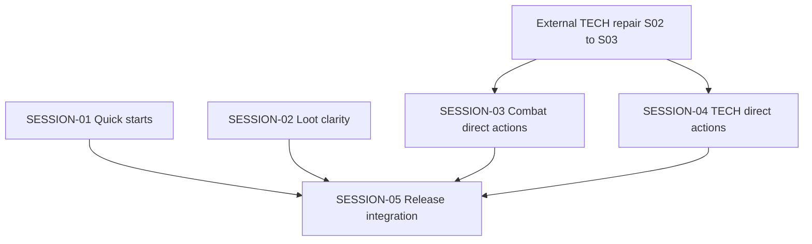

# State Tracker — Operator's Descent / direct-actions-and-quick-starts

## Program / Feature / Intent / Sessions

| Field | Value |
|---|---|
| **Program** | Operator's Descent |
| **Feature** | `direct-actions-and-quick-starts` |
| **Intent** | Remove scroll-dependent generic confirmation from normal play, make current state/results visible on touch, and let a new player deploy an editable recommended party quickly. |
| **Sessions** | 5 |
| **Plan directory** | `./program/operator-s-descent/prompts/direct-actions-and-quick-starts/` |
| **External gate** | `./program/operator-s-descent/prompts/tech-protocol-e2e-repair/SESSION-02.md` and `./program/operator-s-descent/prompts/tech-protocol-e2e-repair/SESSION-03.md` must complete before SESSION-03 or SESSION-04 starts. Its SESSION-01 is already done. |

## Worktree Coordination at Planning Time

- **External repair lease in progress**: `./tests/ui/combat-screen.test.js` has uncommitted changes identified with `tech-protocol-e2e-repair` SESSION-02. It overlaps this plan’s future SESSION-03 lease. That external session must commit or explicitly hand off the work before SESSION-03 reads, stages, reverts, or changes the file.
- **Unrelated local artifact**: `./.DS_Store` is untracked and outside every session lease. Do not stage it.

## Session Status

| # | Session | Modules | Owns | Status | Checkpoint | Completed | Notes |
|---|---|---|---|---|---|---|---|
| 1 | `./SESSION-01.md` — Add Editable Quick-Start Parties | M92, M69, M95 | `./src/ui/creation-model.js`, `./src/ui/screens/creation.js`, `./tests/ui/creation-model.test.js`, `./tests/ui/creation-screen.test.js` | done | 3/3 | 2026-08-24 | Added three immutable, editable quick-start presets (BREACH DRILL, SCOUT PAIR, FULL CREW) via getQuickStartParties()/load_quick_start; wired a QUICK START chooser before the detailed editor in the portrait creation screen; 4 focused regression tests added. |
| 2 | `./SESSION-02.md` — Make Loot Pickup Self-Evident | M66, M95 | `./src/ui/console/loot.js`, `./tests/ui/console-loot.test.js` | done | 3/3 | 2026-08-24 | TAKE stays a single direct click; success/final-item feedback now renders above CONTENTS with the current inventory count. |
| 3 | `./SESSION-03.md` — Replace Combat Confirmation with Direct Actions | M62, M71, M95 | `./src/ui/console/combat.js`, `./src/ui/screens/combat.js`, `./tests/ui/console-combat.test.js`, `./tests/ui/combat-screen.test.js`, `./tests/e2e/combat-touch.spec.js`, `./tests/e2e/mobile-combat-density.spec.js`, `./tests/e2e/touch-flow.spec.js` | blocked | 2/3 | 2026-08-24 (blocked) | Removed generic combat-confirm; wired direct action/target/destination execution (attack/cast/overclock/item/move/retreat/end-turn); targetless protocols cast on card-select; visible action-blocked-reason text added; BACK is the sole surviving cancel control.  **Blocked:** checkpoint shortfall — 2 checkpoint commits found for handoff checkpoint 3; checkpoints 1 and 2 were combined in commit `a3e2846`. |
| 4 | `./SESSION-04.md` — Remove the Generic TECH Confirmation Step | M65, M95 | `./src/ui/console/tech.js`, `./tests/ui/console-tech.test.js`, `./tests/helpers/tech-protocol-e2e-fixture.js`, `./tests/e2e/tech-protocols.spec.js` | done | 3/3 | 2026-08-24 | Removed the generic TECH confirmation step: targetless protocols resolve directly on CAST/OVERCLOCK, targeted protocols resolve on one legal target activation; no tech-confirm control renders anywhere. External TECH E2E repair gate (tech-protocol-e2e-repair SESSION-02 + SESSION-03) verified done before starting. |
| 5 | `./SESSION-05.md` — Direct Descent, Update the Manual, and Release the Cache | M61, M70, M111, M81, M95 | `./src/ui/console/move.js`, `./src/ui/screens/exploration.js`, `./data/manual.json`, `./service-worker.js`, `./tests/ui/move-mode.test.js`, `./tests/ui/exploration-screen.test.js`, `./tests/data/manual-content.test.js`, `./tests/integration/service-worker.test.js`, `./tests/e2e/playtest-feedback.spec.js` | pending | — | — | Integrates the direct-action contract, mobile regression story, and offline cache release. |

## Wave Plan

| Wave | Sessions | Why concurrent |
|---|---|---|
| 1 | SESSION-01 ∥ SESSION-02 | Their write leases are literally disjoint: creation model/screen/tests versus loot console/test. Both use focused unit/UI verification only. |
| Gate | External TECH repair SESSION-02 → SESSION-03 | The current repair’s live TECH transaction and strict E2E matrix are artifacts that direct-TECH work must consume. |
| 2 | SESSION-03 ∥ SESSION-04 | COMBAT and TECH leases are disjoint and can begin after the external gate. Both name `playwright:webserver`; Jikijitsu must hold that exclusive resource, so browser execution serializes even though source ownership does not overlap. |
| 3 | SESSION-05 | One member: the manual and cache release must describe and publish the completed COMBAT/TECH direct-action contract; it also owns the cross-feature mobile acceptance artifact. |

## Dependency Graph

## Architecture Reference

1. Normal, reversible play actions use **direct activation**, not a generic confirmation screen: explicit action → one legal target/destination activation → one guarded transaction.
2. Pointer/touch is the primary direct path. Keyboard focus navigation and `Enter` remain a non-visual accessibility/power-user activation mechanism; no scrollable CONFIRM control is rendered.
3. COMBAT action blockers must be visibly rendered from current rules state. Current range/AP/weapon diagnostics are valid; line-of-sight copy is not valid unless a rules-layer check exists.
4. QUICK START presets are immutable creation-model data that load ordinary editable drafts. They do not add a saved-party schema, an asset, or a parallel deployment system.
5. A successful loot take makes three facts visible in the current console viewport: acquired item, updated inventory count, and removal/clearing of the source container.
6. The service-worker cache identity changes only after all static source/data edits land, preserving offline-first delivery while evicting stale client code.

## Scope Summary

| Module | Affected files | Scope |
|---|---|---|
| M92 | `./src/ui/creation-model.js`, `./tests/ui/creation-model.test.js` | Immutable, valid preset catalog and draft-loading reducer action. |
| M69 | `./src/ui/screens/creation.js`, `./tests/ui/creation-screen.test.js` | Direct editable QUICK START chooser in the dense builder. |
| M66 | `./src/ui/console/loot.js`, `./tests/ui/console-loot.test.js` | Above-contents acquisition feedback and truthful cleared/error state. |
| M62 | `./src/ui/console/combat.js`, `./tests/ui/console-combat.test.js` | Remove generic confirmation UI; expose actual disabled-action reasons. |
| M71 | `./src/ui/screens/combat.js`, `./tests/ui/combat-screen.test.js` | Direct target/destination/end/retreat execution using existing guarded state paths. |
| M65 | `./src/ui/console/tech.js`, `./tests/ui/console-tech.test.js` | Browse-versus-cast direct TECH contract without double transaction. |
| M61, M70 | `./src/ui/console/move.js`, `./src/ui/screens/exploration.js`, focused tests | Direct legal DESCEND control and non-mutating unavailable state. |
| M111 | `./data/manual.json`, `./tests/data/manual-content.test.js` | Accurate direct-action rules copy while retaining rule help links. |
| M81 | `./service-worker.js`, `./tests/integration/service-worker.test.js` | Cache-version release for static source/data changes. |
| M95 | Owned E2E files in SESSION-03 through SESSION-05 | Touch/browser proof without an independent verification-only session. |

## Design Decisions

| Choice | Rationale |
|---|---|
| Delete generic normal-play confirmation rather than move it | The mobile failure is structural: target lists place CONFIRM below a scrolling pane, and the owner explicitly dislikes the interaction itself. |
| Do not add a sticky GO/CONFIRM replacement | A relocation recreates the same extra action and does not make state clearer. |
| Keep destructive confirmations out of this feature | Corrupt equipment, mass junking, and deletion have a different irreversibility threshold than attack, movement, loot, retreat, or end turn. |
| Use visible action blockers, not title-only tooltips | Touch users cannot rely on hover, and the game already computes truthful reasons. |
| Keep range messaging honest | Existing combat supports range, AP, weapons, and cover; do not promise line-of-sight diagnostics that rules do not enforce. |
| Ship three editable quick starts in the creation model | They ease the first-run funnel without removing the crunchy builder or adding asset/schema complexity. |
| Put loot result before CONTENTS | The player can verify the action, item removal, and inventory count in one current viewport. |
| Release through a cache bump last | Offline cache invalidation must publish the final integrated JS/data behavior, not an intermediate UI contract. |

## Handoff Notes

### SESSION-01

- **Notes:** Added three immutable, editable quick-start presets (BREACH DRILL, SCOUT PAIR, FULL CREW) via getQuickStartParties()/load_quick_start; wired a QUICK START chooser before the detailed editor in the portrait creation screen; 4 focused regression tests added.
- **Delivered:** src/ui/creation-model.js: QUICK_START_PARTIES catalog (hand-validated against classes/equipment/protocols/sigils data), getQuickStartParties() read-only descriptor API, and a load_quick_start reducer action that clones+normalizes a preset into the ordinary draft. src/ui/screens/creation.js: a QUICK START section rendered before the character rail/tabs in the portrait layout, with stable test IDs quick-start-breach-drill/scout-pair/full-crew, the required visible promise copy, and post-select focus on the chosen card.
- **Verification:** npx vitest run ./tests/ui/creation-model.test.js ./tests/ui/creation-screen.test.js → 57 passed; node --check on both source files passed; git diff --check clean.
- **Surprises:** The actual repo lives at the workspace root, not under program/operator-s-descent/ (that path only holds FORGE-CONFIG.md, arch/, prompts/) — resolved paths against the workspace root instead. Two unrelated files were touched by other in-flight sessions during this run (program/operator-s-descent/prompts/tech-protocol-e2e-repair/STATE.md staged-deleted, tests/ui/console-loot.test.js modified) — left untouched, not staged, not committed; each of my three commits used an explicit pathspec restricted to my Owns files so neither landed in my history.
- **Follow-up:** QUICK START is only wired into the portrait layout (the default/mobile-first experience per Custom Rule 8); the wide layout's editor does not yet surface it. A future session should add an equivalent QUICK START block to renderWide()/wide-editor if wide-layout parity is desired. No manual/copy changes needed from this session per se, but SESSION-05 (manual + release) may want a one-line mention of the QUICK START shortcut when it documents the direct-action contract.

### SESSION-02

- **Notes:** TAKE stays a single direct click; success/final-item feedback now renders above CONTENTS with the current inventory count.
- **Delivered:** Introduced a per-take `pickupResult` presentation object in ./src/ui/console/loot.js (separate from the pre-existing junk `state.notice`), rendered as a role=status/aria-live=polite block inserted between the OPEN CONTAINER button and the CONTENTS heading. Copy: `LOOT ACQUIRED — <item> · INVENTORY <n>/100` for an ordinary take, `CONTAINER CLEARED — <item> secured · INVENTORY <n>/100` when the take empties the container. A failed take (inventory full) clears any stale pickup result, never sets it, and keeps the pre-existing truthful `loot-error` text and the item in CONTENTS. The result replaces (never stacks) on each new take and survives/updates correctly across refresh.
- **Verification:** npx vitest run ./tests/ui/console-loot.test.js → 16 pass; also ran ./tests/ui/tech-loot-log.test.js and ./tests/integration/runtime.test.js → all pass (62 total across the three files); node --check ./src/ui/console/loot.js clean; git diff --check clean.
- **Surprises:** Pre-existing failure in ./tests/ui/exploration-screen.test.js ('tap-to-move truncates on hostile interrupt') reproduces on a clean stash of my changes too — unrelated to this lease, not touched. Untracked ./.DS_Store and a deletion of ./program/operator-s-descent/prompts/tech-protocol-e2e-repair/STATE.md were present in git status throughout — outside my lease, left alone. No arch/module-registry change: render()/handleInput()/findEligibleLootContainer() signatures are unchanged, so no arch fragment was written.
- **Follow-up:** The existing bottom-of-pane `loot-error`/`loot-notice` (junk) blocks were left in their original position per the session's 'existing console convention' guidance — only the success/cleared pickup result was required to move above CONTENTS.

### SESSION-03

- **Notes:** Removed generic combat-confirm; wired direct action/target/destination execution (attack/cast/overclock/item/move/retreat/end-turn); targetless protocols cast on card-select; visible action-blocked-reason text added; BACK is the sole surviving cancel control.
- **Delivered:** Direct-action combat contract across src/ui/console/combat.js and src/ui/screens/combat.js: explicit action selection -> one legal target/destination tap -> execution, with no generic confirm row and no sticky GO replacement. Cancellation stays reversible via BACK, shown whenever an action is selected and nothing is resolving. END TURN/RETREAT execute on their single press. Targetless combat protocols (effectData.target of floor/all_enemies/enemies/aoe, or type reshape) cast directly when their card is picked - mirrors src/ui/console/tech.js's established browse-vs-cast contract locally (no shared export exists in src/rules/protocols.js). Disabled action reasons are now visible text (.action-blocked-reason) in addition to title/aria-description. D-pad multi-step path building keeps the keyboard Enter accelerator as its non-visual commit route. Updated tests/ui/console-combat.test.js and tests/ui/combat-screen.test.js to the new contract plus new coverage (no combat-confirm in any phase, visible blocked-reason text, BACK across browsing phases). Rewrote the direct-action assertions in tests/e2e/combat-touch.spec.js, tests/e2e/mobile-combat-density.spec.js, tests/e2e/touch-flow.spec.js.
- **Verification:** npx vitest run tests/ui/console-combat.test.js tests/ui/combat-screen.test.js -> 118 pass. npx vitest run (full suite) -> 2921/2927 pass; the 6 failures (tests/data/sigil-lint.test.js, tests/performance/release-budgets.test.js [flaky, passes standalone], tests/tooling/check-tokens.test.js, tests/ui/exploration-screen.test.js x2, tests/ui/front-door.test.js) are pre-existing repo drift confirmed unrelated to this lease - verified via git diff that no commit in this session touched styles/, specs/, data/sigils.json, tools/, or scripts/, and the exploration-screen/front-door failures reproduce identically on the pre-session commit. npx playwright test tests/e2e/combat-touch.spec.js tests/e2e/mobile-combat-density.spec.js tests/e2e/touch-flow.spec.js (E2E_PORT=8083, default multi-project matrix) -> all combat-touch and touch-flow combat assertions pass across chromium-portrait/chromium-phone-touch/firefox-portrait/webkit-portrait; 4 pre-existing failures reproduced identically on the pre-session base commit (stale service-worker cache-version expectation from an unrelated already-completed feature, a status-strip pixel-height budget regression, and the untouched exploration-mode touch test) - none touch this lease's files.
- **Surprises:** Checkpoints 1 and 2 landed in a single commit rather than two - the 'remove generic confirm' and 'make target/destination execute on one tap' changes are the same functions in the same two source files (chooseAction/selectTarget/selectDestination/selectProtocol) and could not be verified in a real intermediate state without one half being dead code; splitting them post-hoc would have been a fabricated diff, not real incremental progress. Both checkpoints' stated vitest gates pass. Six unrelated pre-existing failures found in the full vitest suite and four in the full playwright run, all outside this session's lease (see verification) - not fixed, per protocol. Directory program/operator-s-descent/prompts/tech-protocol-e2e-repair/STATE.md shows as staged-deleted and .DS_Store as untracked at every git status check - both were present before this session started (noted in this plan's own STATE.md Worktree Coordination section) and were left untouched.
- **Follow-up:** The D-pad multi-step move-path flow (stepping several combat-dir-* buttons then committing) now has no on-screen touch commit affordance - only the keyboard/D-pad Enter accelerator, per the session prompt's explicit 'may retain Enter... when needed for accessibility' carve-out. If product wants a touch-only commit for that specific flow later, it isn't covered here; the primary/majority touch path (single map-destination tap) already executes directly. The pre-existing mobile-combat-density.spec.js cache-version assertion (V8_CACHE) is stale against the currently-shipped service-worker cache (v14, landed by the unrelated mobile-pwa-hardening feature after mobile-combat-density-repair) - worth reconciling whenever that spec is next touched, though it's outside every current session's lease.
- **Jikijitsu reconciliation:** Blocked despite the worker's `done` handoff: only 2 checkpoint commits (`a3e2846` and `4e32a9b`) exist for declared checkpoint 3. The combined `checkpoint 1+2` commit violates the per-checkpoint contract; human override is required to accept it as done.

### SESSION-04

- **Notes:** Removed the generic TECH confirmation step: targetless protocols resolve directly on CAST/OVERCLOCK, targeted protocols resolve on one legal target activation; no tech-confirm control renders anywhere. External TECH E2E repair gate (tech-protocol-e2e-repair SESSION-02 + SESSION-03) verified done before starting.
- **Delivered:** src/ui/console/tech.js: beginProtocol now branches on targetKind — a targetless protocol (aoe/floor/enemies/all_enemies/reshape, data-driven via targetKind()) resolves the existing guarded resolveCast transaction directly from the CAST/OVERCLOCK click; a targeted protocol transitions to a select-target phase. selectTarget() resolves one legal target click through the same resolveCast (no fork by target mode, no second tap). resolveCast() replaces confirmProtocol() with explicit (protocol, overclocked, targetId) params instead of reading ui.protocol/ui.targetId, so both the targetless and targeted paths share one atomic transaction (unprepared/jammed/no-AP/no-cursor/invalid-effect all reject before any CHARGE/AP/RNG mutation, matching the repaired tech-protocol-e2e-repair contract). renderConfirm() is replaced by renderTargetPreview() — a read-only cost/effect preview plus BACK as the sole reversible cancel control; no CONFIRM button or tech-confirm testid is ever rendered. Keyboard access preserved: TARGET_CYCLE_ACTIONS move a highlight only, Enter (confirm) activates the highlighted target (or highlights the first one if none is set yet); Escape/back cancels without mutation. tests/ui/console-tech.test.js: rewrote the three tech-protocol-e2e-repair live-cursor/commit tests to click straight through cast→target (no confirm tap) and added checkpoint-1/2 coverage — targetless direct resolution, browse-only safety (no CHARGE/AP spend, no tech-confirm), and BACK-cancels-without-mutation. tests/e2e/tech-protocols.spec.js: removed all tech-confirm waits/clicks across the 20-protocol × 4-project matrix and asserts `page.getByTestId('tech-confirm')` has zero count both before and after target selection. tests/helpers/tech-protocol-e2e-fixture.js needed no changes — it was already the data-driven predicate/caster-ledger contract from the external repair and never referenced the confirm UI.
- **Verification:** npx vitest run ./tests/ui/console-tech.test.js → 18 pass. npx playwright test ./tests/e2e/tech-protocols.spec.js (E2E_PORT=8081, default 4-project matrix: chromium-portrait, chromium-phone-touch, firefox-portrait, webkit-portrait) → 80/80 pass, no expected failures, port killed after. node --check on all four owned files clean. git diff --check clean across all three checkpoint commits. All 20 protocol definitions retain their data-driven target semantics (targetKind() reads effectData.target/type, never a hard-coded list) and each case's effect transaction reaches the repaired combat snapshot exactly once (verified via the E2E outcome poll + the vitest commitTechProtocol-exactly-once assertion). No browser flow scrolls or clicks a generic TECH confirmation control anywhere in the owned matrix.
- **Surprises:** Removing tech-confirm (this session's explicit mandate) breaks two test files OUTSIDE this session's lease that hard-coded the old two-tap cast→target→confirm flow: (1) tests/ui/combat-screen.test.js describe block 'TECH cast commits through the live combat-owned transaction (tech-protocol-e2e-repair SESSION-02)' (2 tests) — that file is owned by this same feature's SESSION-03 (already committed, blocked on an unrelated checkpoint-shortfall issue), not by SESSION-04. (2) tests/ui/tech-loot-log.test.js (3 tests) — an orphaned test file from a much older completed feature (SESSION-46/prod-ui-mock-parity/test-completeness-audit), not owned by any pending session in this plan. Confirmed via git-stash bisection that both files pass at the pre-session baseline and only fail after tech.js's new contract lands — this is a direct, foreseeable, and unavoidable consequence of the session's own mandate, not incidental drift, and I could not fix it without writing outside my Write set. Also reproduced 4 pre-existing, unrelated full-suite failures (tests/tooling/check-tokens.test.js, tests/ui/exploration-screen.test.js ×2, tests/ui/front-door.test.js, plus an order-dependent flake in tests/data/sigil-lint.test.js that passes standalone) — all reproduce identically on the pre-session commit and touch none of this session's files. Per this plan's own STATE.md Worktree Coordination note, program/operator-s-descent/prompts/tech-protocol-e2e-repair/STATE.md showed staged-deleted and .DS_Store untracked at every git status check throughout — both pre-existing, outside every lease, left untouched and never staged.
- **Follow-up:** A follow-up session needs write access to tests/ui/combat-screen.test.js and tests/ui/tech-loot-log.test.js to update their TECH interaction sequences to the new direct-cast/direct-target contract (drop the tech-confirm click, assert its absence) — neither file is currently claimed by any pending session in this plan. SESSION-05 does not own either file per current STATE.md; Jikijitsu/a human should decide whether to fold this into SESSION-05's lease, extend a new session, or accept these as a known, deliberate breaking change to reconcile separately.
