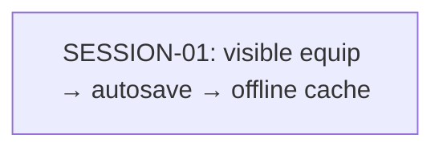

# State Tracker — Operator's Descent / gear-equip-actions-save-contrast

## Program / Feature / Intent / Sessions

| Field | Value |
|---|---|
| **Program** | Operator's Descent |
| **Feature** | `gear-equip-actions-save-contrast` |
| **Intent** | Restore visible GEAR equip controls, prevent black native-control text, and prove successful equipment changes persist to local storage and survive reload. |
| **Sessions** | 1 |

## Session Status

| # | Session | Modules | Owns | Status | Checkpoint | Completed | Notes |
|---|---|---|---|---|---|---|---|
| 01 | Restore visible GEAR equip actions, palette-safe controls, and autosave proof | M18, M25, M33–M35, M43–M45, M56, M60, M64, M77, M79, M81, M86, M95 | `./src/ui/console/gear.js`, `./src/runtime.js`, `./styles/base.css`, `./styles/components.css`, `./service-worker.js`, `./tests/ui/console-gear.test.js`, `./tests/integration/runtime.test.js`, `./tests/integration/service-worker.test.js`, `./tests/e2e/gear-actions-persistence.spec.js` | done | 4/4 | 2026-08-23 | Restored literal EQUIP controls with slot-specific accessible labels; added palette-safe native-control defaults and runtime failure styling; proved inventory-change autosave, stable storage key/index, and local-storage resume; bumped cache to v10. |

## Wave Plan

| Wave | Sessions | Why concurrent |
|---|---|---|
| 1 | SESSION-01 | Single session: its lease contains one inseparable user path from visible GEAR action through autosave proof and offline cache release. No concurrency is safe or useful. |

## Dependency Graph

## Architecture Reference

- **Interaction path**: A legal inventory item in `./src/ui/console/gear.js` renders a visible `EQUIP` action. Its existing transaction result calls the existing inventory-change notifier only after a successful state mutation.
- **Persistence path**: `state:inventory-change` travels through `./src/state/bus.js` to the listener in `./src/runtime.js`, which calls `commitAutosave`; `./src/state/library.js` then writes the encoded current run to `od_run_<key>` and updates `od_runs`.
- **Restore proof**: The browser test must reload via the ordinary local-storage resume route and observe the newly equipped item, rather than merely asserting an event dispatch.
- **Palette contract**: `./styles/base.css` provides explicit foreground/font inheritance for native controls; `./styles/components.css` keeps the GEAR action physically visible and reachable. Intentional dark backgrounds and canvas/mask effects are not evidence of black text.
- **Offline release**: `./service-worker.js` moves from cache v9 to `2026-08-23-gear-equip-save-v10`; its existing manifest already includes the changed client assets.

## Scope Summary

| Module | Scope |
|---|---|
| M18 Equipment rules | Read-only behavioral guardrails for legal, blocked, corrupted, and combat-gated transactions. |
| M25 Inventory | Read-only inventory mutation and capacity contract. |
| M33–M35 State | Preserve the run-state shape and established inventory-change event contract. |
| M43–M45 Save codec/library | Prove the existing encoded local-storage record and restore route; no schema changes planned. |
| M56, M60, M64 UI | Restore the visible GEAR action using existing component and console patterns. |
| M77, M79 Styling | Eliminate native browser black-text fallbacks and preserve narrow/wide action reachability. |
| M81 Service worker | Version the offline cache and verify predecessor cleanup. |
| M86 Runtime | Maintain the sole autosave committer and style direct runtime failure controls safely. |
| M95 E2E | Add browser proof of visual affordance, actual storage mutation, and reload durability. |

## Design Decisions

| Choice | Rationale |
|---|---|
| Show literal `EQUIP` text for a legal action | The GEAR mockups use a named action; icon-only rendering caused the reported missing-button regression. |
| Retain the slot-specific accessible label | Visible text can stay concise while assistive technology receives `EQUIP <SLOT>`. |
| Treat black-text prevention as an explicit-control-foreground invariant | This fixes browser-native fallback risk without changing intended dark visual layers or canvas glyph design. |
| Keep one autosave pipeline | GEAR emits the existing event; runtime owns `commitAutosave`; the library owns storage encoding/index updates. |
| Use reload as the durability acceptance test | A changed event or in-memory state alone cannot prove the correct local-storage record was written. |
| Advance cache v9 to exact v10 | Changed offline client assets require a cache revision and deterministic cleanup coverage. |

## Handoff Notes

### SESSION-01

- **notes:** Restored literal EQUIP controls with slot-specific accessible labels; added palette-safe native-control defaults and runtime failure styling; proved inventory-change autosave, stable storage key/index, and local-storage resume; bumped cache to v10.
- **delivered:** Visible/reachable GEAR equip actions, durable autosave/reload coverage, narrow and wide browser coverage, and v9→v10 service-worker cleanup coverage.
- **verification:** Focused Vitest: 41 pass; GEAR E2E: 8 pass across Chromium, Firefox, WebKit, and wide contexts; design:scan pass (0 errors/warnings, 2 info); check:assets pass. npm test has 2 unrelated exploration-screen failures; full E2E has unrelated accessibility/manual failures.
- **surprises:** Pre-existing/unrelated full-suite failures: exploration tap-path assertions; E2E portrait-frame ratio and manual Escape focus assertions. Untracked .DS_Store existed and was untouched.
- **followUp:** —
- **blockedReason:** null
