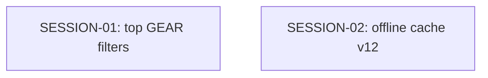

# State Tracker — Operator's Descent / gear-inventory-filters

## Program / Feature / Intent / Sessions

| Field | Value |
|---|---|
| **Program** | Operator's Descent |
| **Feature** | `gear-inventory-filters` |
| **Intent** | Let players narrow the GEAR inventory from a top-of-screen, accessible selector without altering inventory state, equipment rules, or save data. |
| **Sessions** | 2 |

## Session Status

| # | Session | Modules | Owns | Status | Checkpoint | Completed | Notes |
|---|---|---|---|---|---|---|---|
| 01 | Add top-level GEAR inventory filters | M06, M09, M12, M17, M18, M25, M33, M34, M56, M60, M64, M79, M95 | `./src/ui/console/gear.js`, `./styles/components.css`, `./tests/ui/console-gear.test.js`, `./tests/e2e/gear-actions-persistence.spec.js` | done | 2 | 2026-08-23 | Added ALL/EQUIPPABLE/CONSUMABLES/JUNK radio filters to GEAR (src/ui/console/gear.js), rendered after gear-selectors and before the EQUIPPED heading, view-only in a per-run WeakMap (never RunState/save/localStorage/bus). EQUIPPABLE = resolveEquipSlot + itemLegalForCharacter (ignores transient combat-swap gate). Filter change cancels pending CORRUPT/junk-all confirmation; re-clicking the active filter is a no-op. Added styles/components.css .gear-filter-row/.gear-filter (inherits existing 96px console-row touch floor + wide fine-pointer 48px density, no new CSS needed there). Commands run: node --check gear.js, npx vitest run tests/ui/console-gear.test.js (26/26 pass), npx playwright test tests/e2e/gear-actions-persistence.spec.js (12/12 pass across chromium-portrait/phone-touch/firefox/webkit), npm run design:scan (PASS, 0 errors/warnings), npm run check:assets (pass, within budget), full npx vitest run (2861 tests: 2859 pass, 2 pre-existing failures in tests/ui/exploration-screen.test.js unrelated to this lease, confirmed via git stash against the pre-session baseline). |
| 02 | Release GEAR filters through the offline cache | M81, M83, M95 | `./service-worker.js`, `./tests/integration/service-worker.test.js` | done | 2 | 2026-08-23 | Advanced service-worker cache identity from operator-descent-2026-08-23-auto-slot-gear-equip-v11 to operator-descent-2026-08-23-gear-inventory-filters-v12. Renamed v10→v11 test describe block to v11→v12, updated exact predecessor/expected cache-name assertions, and added a focused v12 test pinning ./src/ui/console/gear.js and ./styles/components.css in the manifest. No manifest, fetch strategy, or asset paths changed. |

## Wave Plan

| Wave | Sessions | Why concurrent |
|---|---|---|
| 1 | SESSION-01 ∥ SESSION-02 | Their leases are literally disjoint. SESSION-01 changes rendered GEAR behavior and proof; SESSION-02 changes only M81's release identity/tests. Both shipped UI files already exist in the worker manifest, so neither consumes an artifact from the other. |

## Dependency Graph



## Architecture Reference

- **Top-level control:** M64 renders an `Inventory filters` radio group after `gear-selectors` and before the EQUIPPED readout in `./src/ui/console/gear.js`. It controls only the un-equipped list.
- **Transient state:** The active filter lives in M64's existing per-run WeakMap and defaults to `all`. It never becomes an M33 field, portable-save value, URL parameter, local-storage preference, or bus event.
- **Predicate boundary:** `ALL` retains every entry in order. `EQUIPPABLE` requires M64's direct slot resolver plus M17 class/proficiency legality; it intentionally ignores momentary combat-swap availability. `CONSUMABLES` is category exact. `JUNK` uses the existing `junkTagged` flag.
- **Action safety:** A filter switch cancels any pending CORRUPT or junk-all confirmation. It does not change inventory, equipped rows, capacity/scrap summary, or the established global `JUNK ALL TAGGED` transaction.
- **Accessibility and layout:** M64 uses native radio buttons with explicit `aria-checked` state. M79 makes them wrap at narrow widths and retains the existing `console-row` touch floor; existing wide fine-pointer CSS densifies them without a new wide-only branch.
- **Offline release:** M81 advances the cache from `operator-descent-2026-08-23-auto-slot-gear-equip-v11` to `operator-descent-2026-08-23-gear-inventory-filters-v12`. The manifest already precaches both changed UI files.

## Scope Summary

| Module | Scope |
|---|---|
| M06, M09, M12 | Read-only catalog authority for class gates, item slots, and consumable category. |
| M17–M18, M25 | Read-only legality/transaction/salvage contracts retained by M64. |
| M33–M34 | Read-only persistence/event boundary; filters are intentionally view-only. |
| M56, M60, M64, M79 | Add radio selector, filtered rendering, responsive styling, and focused unit/browser proof. |
| M81 | Cache v11→v12 and exact predecessor/manifest regression tests. |
| M95 | Focused production-browser coverage of filter behavior and no-autosave guarantee. |

## Design Decisions

| Choice | Rationale |
|---|---|
| Ship ALL, EQUIPPABLE, CONSUMABLES, and JUNK | These cover every current inventory workflow with four discoverable controls; separate weapon/armor filters add clutter without fulfilling the requested compatibility view. |
| Define EQUIPPABLE by slot resolution + class/proficiency legality | The player sees items the selected character can actually use, while temporary combat timing remains an action-level disabled reason rather than hiding compatible gear. |
| Store selection only in M64's WeakMap | Filtering is a local presentation preference; persisting it would expand portable save and autosave scope for no gameplay value. |
| Keep JUNK ALL TAGGED global | Existing salvage semantics intentionally operate on all tagged inventory. A view filter must not silently change the destructive transaction's scope. |
| Split the cache release from UI work | The write sets are disjoint and can safely run concurrently; the v12 cache identity prevents offline clients from retaining the unfiltered GEAR UI. |

## Handoff Notes

### SESSION-01

```json
{
  "session": "01",
  "status": "done",
  "checkpoint": 2,
  "notes": "Added ALL/EQUIPPABLE/CONSUMABLES/JUNK radio filters to GEAR (src/ui/console/gear.js), rendered after gear-selectors and before the EQUIPPED heading, view-only in a per-run WeakMap (never RunState/save/localStorage/bus). EQUIPPABLE = resolveEquipSlot + itemLegalForCharacter (ignores transient combat-swap gate). Filter change cancels pending CORRUPT/junk-all confirmation; re-clicking the active filter is a no-op. Added styles/components.css .gear-filter-row/.gear-filter (inherits existing 96px console-row touch floor + wide fine-pointer 48px density, no new CSS needed there). Commands run: node --check gear.js, npx vitest run tests/ui/console-gear.test.js (26/26 pass), npx playwright test tests/e2e/gear-actions-persistence.spec.js (12/12 pass across chromium-portrait/phone-touch/firefox/webkit), npm run design:scan (PASS, 0 errors/warnings), npm run check:assets (pass, within budget), full npx vitest run (2861 tests: 2859 pass, 2 pre-existing failures in tests/ui/exploration-screen.test.js unrelated to this lease, confirmed via git stash against the pre-session baseline).",
  "delivered": "Top-of-GEAR inventory filter radiogroup (ALL/EQUIPPABLE/CONSUMABLES/JUNK) with accessible role=radio/aria-checked semantics, filtered rendering, empty-filter feedback (gear-filter-empty), and full unit + browser test coverage.",
  "verification": "node --check + vitest (26/26) + playwright (12/12, 4 browser projects) + design:scan (PASS) + check:assets (pass) + full vitest run (2859/2861, 2 unrelated pre-existing failures)",
  "surprises": "tests/ui/exploration-screen.test.js has 2 pre-existing failures ('tap on an unreachable cell...' and 'tap-to-move truncates on hostile interrupt') unrelated to this lease — confirmed present on the pre-session commit via git stash, not touched or fixed. SESSION-02 (offline cache) had already landed on main (disjoint lease, no conflict).",
  "followUp": "—",
  "filesTouched": ["src/ui/console/gear.js", "styles/components.css", "tests/ui/console-gear.test.js", "tests/e2e/gear-actions-persistence.spec.js"],
  "blockedReason": null,
  "delegatedTo": "enso"
}
```

### SESSION-02

Both checkpoints committed cleanly, only the pre-existing `.DS_Store` remains untracked outside the lease. No module or public-API change occurred (cache identity bump only), so no arch fragment is needed.

```json
{
  "session": "02",
  "status": "done",
  "checkpoint": 2,
  "notes": "Advanced service-worker cache identity from operator-descent-2026-08-23-auto-slot-gear-equip-v11 to operator-descent-2026-08-23-gear-inventory-filters-v12. Renamed v10→v11 test describe block to v11→v12, updated exact predecessor/expected cache-name assertions, and added a focused v12 test pinning ./src/ui/console/gear.js and ./styles/components.css in the manifest. No manifest, fetch strategy, or asset paths changed.",
  "delivered": "Cache v12 release identity for gear-inventory-filters, with lifecycle test proving v11 predecessor deletion and v12 retention, plus explicit GEAR filter client-file precache regression coverage.",
  "verification": "node --check ./service-worker.js → ok; npx vitest run ./tests/integration/service-worker.test.js → 7 passed (7); npm run check:assets → 118 manifest assets, brotli transfer 336666 / budget 512000.",
  "surprises": "Referenced read path ./program/operator-s-descent/prompts/auto-slot-gear-equip/STATE.md does not exist in this workspace (only the current feature's prompts dir is present); the needed v11 cache-name info was already present directly in ./service-worker.js, so this did not block the session. No prior commits existed for this session's lease before this run (fresh start, not a crash-recovery resume).",
  "followUp": "—",
  "filesTouched": ["./service-worker.js", "./tests/integration/service-worker.test.js"],
  "blockedReason": null
}
```
