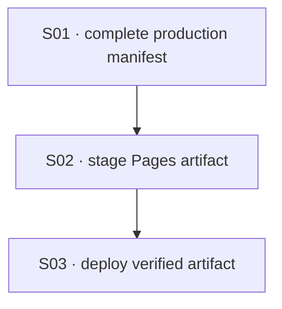

# State Tracker — Operator's Descent / github-pages-build-script

## Program / Feature / Intent / Sessions

- **Program:** Operator's Descent (`operator-s-descent`)
- **Feature:** `github-pages-build-script`
- **Intent:** Publish a minimal, deterministic GitHub Pages artifact made only from verified production assets, then deploy it on updates to `main` without changing the browser runtime or its project-subpath behavior.
- **Sessions:** 3
- **Authoritative config:** `./program/operator-s-descent/FORGE-CONFIG.md` (existing; reused without override)

## Session Status

| # | Session | Modules | Owns | Status | Checkpoint | Completed | Notes |
|---|---|---|---|---|---|---|---|
| 01 | Complete the offline manifest and Pages asset contract | M81, M94, M96, M107 | `./service-worker.js`, `./scripts/verify-assets.js`, `./scripts/report-budget.js`, `./tests/integration/service-worker.test.js` | done | 2/2 | 2026-08-23 | Cache runtime SVG sprite (./assets/icons.svg) into PRODUCTION_ASSETS, bump service-worker cache v8→v9, and align verify-assets.js/report-budget.js required-singleton and text-compression lists so cache, verifier, and budget reporter agree. |
| 02 | Create deterministic Pages artifact staging | M81, M83, M94, M107 | `./scripts/build-pages.js`, `./package.json`, `./.gitignore`, `./tests/tools/build-pages.test.js` | done | 2/2 | 2026-08-23 | Added ./scripts/build-pages.js — manifest-driven Pages stager (buildPages/parseBuildPagesArgs), npm run build:pages (check:assets-first), /dist/ gitignore entry, and 19 Vitest cases locking artifact exactness, byte identity, stale-output replacement, and unsafe-target/malformed-manifest rejection before any filesystem mutation. |
| 03 | Publish verified artifact with GitHub Actions | M81, M83, M94 | `./.github/workflows/deploy-pages.yml`, `./README.MD`, `./tests/tooling/github-pages-workflow.test.js` | pending | — | — | Calls the staged artifact command, uploads only the temporary artifact, and records the one-time GitHub Pages setting prerequisite. |

## Wave Plan

| Wave | Sessions | Why Concurrent |
|---|---|---|
| 1 | SESSION-01 | The production manifest is the artifact contract; it must first include the actual icon sprite used by the browser runtime. |
| 2 | SESSION-02 | Depends on SESSION-01's expanded manifest and has a disjoint write set. |
| 3 | SESSION-03 | Depends on the real `build:pages` command and its artifact behavior from SESSION-02; its workflow must not guess a future interface. |

## Dependency Graph

## Architecture Reference (Feature-Specific Only; Full Config in `./program/operator-s-descent/FORGE-CONFIG.md`)

- **Runtime remains static:** `./index.html`, CSS, ES modules, JSON, fonts, and the SVG sprite remain served as files. The new `build:pages` command only copies verified bytes; it does not bundle, transpile, minify, rewrite URLs, or import a package at runtime.
- **One production list:** `PRODUCTION_ASSETS` in `./service-worker.js` is both the offline precache manifest and the deployment-artifact allowlist. SESSION-01 makes `./assets/icons.svg` part of that list because `./src/ui/icon.js` fetches it through external SVG `<use>` references.
- **Safe staging:** `./scripts/build-pages.js` parses that literal list without executing the service-worker script, validates each relative path, and copies exactly those regular files into an empty output directory. Its default output is ignored `./dist/`; CI provides a directory under the runner temporary path.
- **Project Pages compatibility:** existing asset and service-worker references are relative, so the artifact retains its directory structure unchanged and works below the repository Pages path. No `<base>` tag, absolute-path rewrite, router rewrite, or custom-domain file is introduced.
- **CI boundary:** the workflow regenerates the committed CSS and icon outputs, rejects a dirty generated-file diff, runs the Pages-specific artifact contracts, then sends only the temporary staging directory to GitHub's Pages artifact action. It does not upload the repository root, `./node_modules/`, source design files, tests, or planning files.

## Scope Summary (Modules Affected, Indexed by ID)

| ID | Module | Scope |
|---|---|---|
| M81 | Service Worker | Add the runtime SVG sprite to the precache/deployment manifest and advance the cache namespace so installed clients receive the corrected asset set. |
| M83 | Package Manifest | Add a `build:pages` command only; no dependency or runtime-package change. |
| M94 | Validation Tooling | Extend static-manifest and transfer-budget enumeration to include both shipped assets, and add the manifest-driven Pages artifact builder. |
| M96 | Release Simulation | Measure the corrected production asset set through the existing budget reporter; no simulation algorithm changes. |
| M107 | Icon System | Treat the existing `./assets/icons.svg` runtime sprite as a first-class production asset in cache, budget, and artifact checks. |

## Design Decisions (Choice + Rationale)

1. **Deploy a staged allowlist rather than the repository root:** the source tree intentionally contains development scripts, mocks, specifications, tests, package metadata, and planning records. The Pages artifact must contain only the runtime list already vetted by the offline policy.
2. **Repair the icon-sprite omission before staging:** `./assets/icons.svg` is requested by the existing icon factory but is currently outside `PRODUCTION_ASSETS`. Adding it closes the known offline gap and prevents a Pages artifact that renders missing icons.
3. **Keep asset generation separate from artifact staging:** the workflow runs `npm run build:assets` and fails if committed outputs differ. `build:pages` copies the verified committed file set and never silently deploys regenerated-but-uncommitted CSS or SVG output.
4. **Use the official two-job Pages flow:** the build job uses the documented Pages permission set, while the deploy job receives the artifact through `needs`, has an explicit `github-pages` environment, checks out no source, and grants no write capability beyond `pages: write` plus `id-token: write`.
5. **Do not gate Pages deployment on the known unrelated suite failures:** planning inspection found `npm test` at **2 failed / 2817 passed**, both in `./tests/ui/exploration-screen.test.js`. The workflow runs the manifest, artifact, and workflow-contract tests instead; it must not edit, skip, or relabel those existing exploration failures.
6. **Repository configuration remains an external prerequisite:** after merge, an administrator must set the repository's Pages publishing source to **GitHub Actions** once. The workflow cannot safely change repository settings or infer a custom domain.

## Handoff Notes (Jikijitsu Writes Here After Each Session — From Mu's Handoff JSON, Verbatim)

### SESSION-01

- **notes:** Cache runtime SVG sprite (./assets/icons.svg) into PRODUCTION_ASSETS, bump service-worker cache v8→v9, and align verify-assets.js/report-budget.js required-singleton and text-compression lists so cache, verifier, and budget reporter agree.
- **followUp:** Manifest now cache-consistent for './assets/icons.svg'; SESSION-02 (Pages artifact staging) can safely enumerate PRODUCTION_ASSETS as the complete artifact allowlist including the sprite.

### SESSION-02

- **notes:** Added ./scripts/build-pages.js — manifest-driven Pages stager (buildPages/parseBuildPagesArgs), npm run build:pages (check:assets-first), /dist/ gitignore entry, and 19 Vitest cases locking artifact exactness, byte identity, stale-output replacement, and unsafe-target/malformed-manifest rejection before any filesystem mutation.
- **followUp:** SESSION-03 can call `npm run build:pages -- --output <runner-tmp-dir>` directly for its GitHub Actions workflow. build-pages.js is not yet a Module Registry entry (M-number) — Jikijitsu/Forge may want to fold it under M94 (Validation Tooling) or assign a new ID at feature close.
