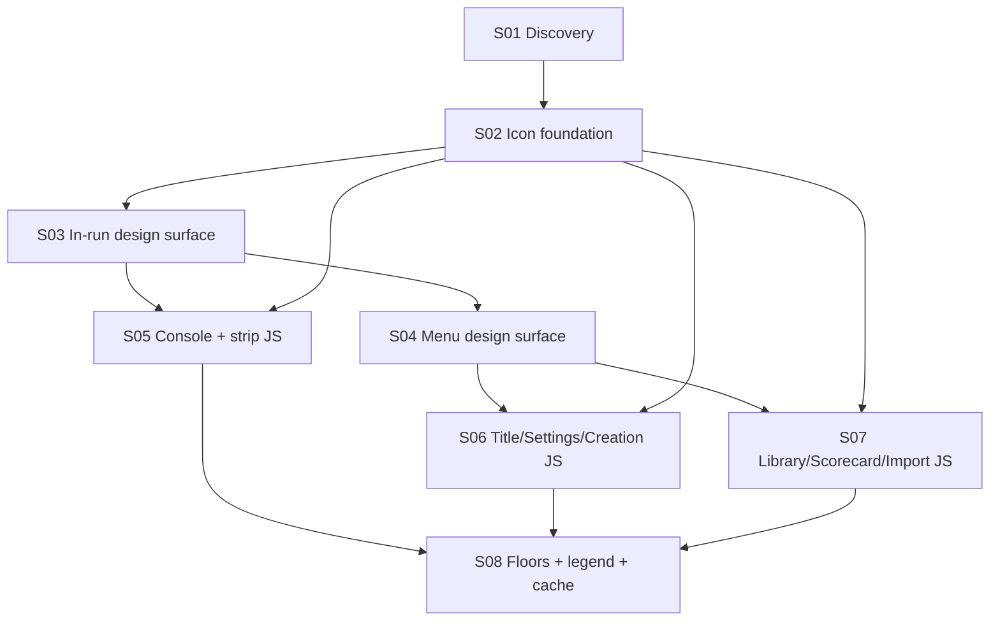

# State Tracker — Operator's Descent / icon-first-ui-density

## Program / Feature / Intent / Sessions

- **Program:** Operator's Descent (`operator-s-descent`)
- **Feature:** `icon-first-ui-density`
- **Intent:** Replace textual chrome with the M107 icon system and reclaim dead space for playfield/map + console content, in both layout classes — text survives only as content; 96px touch boxes hold; gains locked in by raised e2e floors.
- **Sessions:** 8 (source brief: `.forge/forge-prompt.icon-first-ui-density.md`)

## Session Status

| # | Session | Modules | Owns | Status | Checkpoint | Completed | Notes |
|---|---------|---------|------|--------|------------|-----------|-------|
| 01 | Discovery: inventory, icon map, height budget | — | `docs/icon-density-gap.md` | done | 2/2 | 2026-08-21 | GAP report seeded; §-numbers frozen per contract; 2 required sprite ids (chevron-down, hash) for SESSION-02, optional 3rd (sliders/settings2) noted; touch floor 96px preserved |
| 02 | Icon foundation: sprite, primitives, spec | M107, M56 | `tools/icons/subset.json`, `assets/icons.svg`, `src/ui/icon.js`, `styles/icons.css`, `src/ui/components.js`, `specs/design.md`, `tests/ui/{icon,components}.test.js`, `tests/tools/build-pipelines.test.js` | pending | — | — | |
| 03 | Design surface A: in-run mocks + CSS | M77, M79, M101, M97 | `styles/{components,wide,base}.css`, `mocks/{exploration,combat}.html`, `mocks/console-*.html`, `mocks/wide/{exploration,combat}.html`, `mocks/wide/console-*.html`, `scripts/design-scan/check-mock-classes.js`, `tests/tooling/check-mock-parity.test.js` | pending | — | — | Scan must PASS at every checkpoint |
| 04 | Design surface B: menu mocks + CSS | M79, M101 | `styles/{components,wide}.css`, `mocks/{title,creation,library,scorecard,import,settings}.html` + `mocks/wide/` twins | pending | — | — | Tutorial mocks untouched (retired route) |
| 05 | Production chrome: console + strip | M59, M60–M67 | `src/ui/console/*.js`, `src/ui/status-strip.js`, `tests/ui/{console,console-*,move-mode,status-strip,tech-loot-log,party-gear}.test.js`, `tests/e2e/accessibility.spec.js` | pending | — | — | Aria strings preserved verbatim |
| 06 | Production screens: title/settings/creation | M68, M76, M69 | `src/ui/screens/{title,settings,creation}.js`, `tests/ui/{front-door,creation-screen}.test.js` | pending | — | — | Wordmark + START untouched |
| 07 | Production screens: library/scorecard/import | M72, M73, M74 | `src/ui/screens/{library,scorecard,import}.js`, `tests/ui/persistence-screens.test.js` | pending | — | — | Destructive = icon+text |
| 08 | Lock-in: floors, legend, cache | M95, M111, M81 | `tests/e2e/{portrait-usability,wide-panes,touch-flow,combat-touch,adaptive-layout}.spec.js`, `data/manual.json`, `service-worker.js` | pending | — | — | Floors from achieved values, not aspirations |

## Wave Plan

| Wave | Sessions | Why concurrent |
|------|----------|----------------|
| W1 | 01 | Solo — produces the GAP report every other session cites; holds `parity:shots` |
| W2 | 02 | Solo — sprite + factory + spec are artifacts all downstream sessions consume |
| W3 | 03 | Solo — owns the shared stylesheets (`components.css`, `wide.css`) |
| W4 | 04 | Solo — writes the same two stylesheets as 03 (sequential by lease, not by concept) |
| W5 | 05, 06, 07 | Disjoint leases: console dir + strip + its tests vs three screens + two tests vs three screens + one test; no path intersects (checked file by file). None writes CSS/mocks — a missing class = `blocked`, not a silent CSS edit |
| W6 | 08 | Solo — floors/legend/cache must observe all landed production; holds `parity:shots` |

## Dependency Graph

## Architecture Reference (feature-specific)

- **Icon pipeline (M107):** `tools/icons/subset.json` → `npm run build:icons` → committed `assets/icons.svg`; runtime only via `createIcon(id, opts)` (`src/ui/icon.js`, `ICON_IDS` gate). No inline SVG in JS; no runtime deps (Custom Rules 1–2).
- **Design gate (M97):** error-level vs `specs/design.md` + `mocks/*.html` + `mocks/wide/*.html`. Mock classes must exist in scanned CSS; SESSION-03 extends `PRODUCTION_CSS_FILES` with `styles/icons.css`. Touch gate: every `min-height` in `components.css` ≥96 or 0.
- **Chrome ownership:** in-run chrome lives entirely in M60–M67 + M59 (`src/ui/screens/exploration.js`/`combat.js` own zero buttons). All portrait styles in `styles/components.css`; all wide structure in `styles/wide.css` single `@media` block.
- **E2E selector reality:** specs select by `data-testid`/aria; the only textContent-coupled chrome assertion is `tests/e2e/accessibility.spec.js:94-95` (owned by SESSION-05). Geometry floors: `portrait-usability:282/290/449`, `touch-flow:152`, `wide-panes:252/262`.
- **Layout classes:** `portrait` + `wide` (≥900px ∧ aspect ≥1:1), live switch re-mounts route on `ui:layout-change` (M100). Verification viewports: 412x915, 1080x1920, 1024x1024.

## Scope Summary (modules affected)

| Modules | Surface |
|---------|---------|
| M107, M56 | Sprite + subset + `icon.js` + `icons.css`; icon-only `createButton` |
| M77, M79, M101 | Stylesheet densification (tokens only if §5 requires; no new tokens without need) |
| M59, M60–M67 | Status strip / telemetry dock; console shell + 7 modes |
| M68, M69, M72–M74, M76 | Six menu screens (M75 tutorial excluded — route retired) |
| M97 | `check-mock-classes.js` file-list extension only |
| M95 | Raised geometry floors + icon-aware accessibility assertions |
| M111, M81 | Manual legend + corrections; one `CACHE_VERSION` bump |

## Design Decisions

1. **Mock-first pipeline.** Design surface (S03/S04) lands mocks + CSS before production JS (S05–S07). Scanner stays green at every checkpoint; mock↔prod visual divergence is transient mid-feature and closed by W5. Sanctioned by the brief: "spec + mocks … must land before or with the production changes."
2. **Selector-stability contract.** Production keeps every existing class + `data-testid`; icon swaps change element children only; `aria-label` preserves the former visible label string verbatim (tabs: `` `LABEL · Key N` ``). Consequence: all `getByRole(name:)`/`getByLabel` e2e survive untouched; W5 sessions own no e2e except SESSION-05's `accessibility.spec.js`.
3. **W5 sessions never write CSS or mocks.** A class the mock contract missed → `blocked` naming the file, per MU.md. Keeps W5 leases disjoint and the design surface authoritative.
4. **Tutorial screen excluded.** Route retired to `title` + `ui:manual-open` (`tests/ui/front-door.test.js:261`; design.md Manual Flow supersedes Tutorial Flow). `src/ui/screens/tutorial.js` + both tutorial mocks untouched.
5. **Manual modal (M112/M113) chrome untouched** — brief: "content change, not new UI." Legend lands last (S08) so it reflects shipped reality including NO-GLYPH fallbacks from handoffs.
6. **Single `CACHE_VERSION` bump in S08** — all three changed stylesheets are in the SW `ASSETS`; one bump on feature completion; `assets/icons.svg` stays network-first (pre-existing Custom Rule 2 caveat, follow-up unchanged).
7. **Floors from achieved px, not GAP targets.** S03/S05 handoffs report measured values; S08 asserts those. The 96px floor never moves; `touch-flow:152` rises 48 → 96.
8. **Icon color discipline.** Glyphs inherit `currentColor`; tones limited to existing `.icon-dim`/`.icon-accent`/`.icon-danger`; danger only on destructive/hostile (Custom Rule 14). No new tokens.
9. **Destructive actions = icon + short text** (library DELETE / DELETE LOCAL STATE, overwrite confirms) — sanctioned exception §3 of the brief.
10. **Routing:** every session's risk lives in the render (styles/screens/mocks/geometry/screenshot verification) → Enso by ENSO.md's rubric; Jikijitsu confirms at spawn from front matter.

## Handoff Notes

_(Jikijitsu appends after each session — Mu/Enso handoff JSON `notes` + `followUp`, verbatim.)_

### SESSION-01 (done 2026-08-21, checkpoint 2/2, enso)

- **notes:** GAP report seeded; §-numbers frozen per contract; 2 required sprite ids (chevron-down, hash) for SESSION-02, optional 3rd (sliders/settings2) noted; touch floor 96px preserved
- **followUp:** SESSION-02 MUST add `chevron-down` (loot MANAGE JUNK toggle open) and `hash` (wide-dock Seed label) to tools/icons/subset.json + rerun npm run build:icons; owner review is welcome on adding `sliders` or `settings2` for the title SETTINGS branch to resolve the `gauge` collision (§7 risk #1). SESSION-05 MUST update tests/e2e/accessibility.spec.js:94-95 to read the accessible name from aria-label rather than tab.firstChild.textContent (§7 risk #8) — that spec is in SESSION-05's lease per STATE.md wave 5. SESSION-05..07 handoffs REPORT achieved px so SESSION-08 asserts them (STATE.md Design Decision 7). No owner block: every ambiguous glyph decision documented as a risk with a mitigation, not raised as a blocker.
- **surprises:** scripts/design-scan/check-mock-classes.js:4 hard-codes PRODUCTION_CSS_FILES = ['styles/base.css', 'styles/components.css', 'styles/crt.css', 'styles/wide.css'] — does NOT include styles/icons.css. STATE.md wave 3 already lists this file as owned by SESSION-03; §7 risk #2 flags it fail-loud. Also: `hash` lucide id (wanted for the wide-dock Seed label) is not in the M107 subset; current code already uses `chevron-right` as a placeholder at src/ui/status-strip.js:11 — noted in §3.9 and §3.16.
