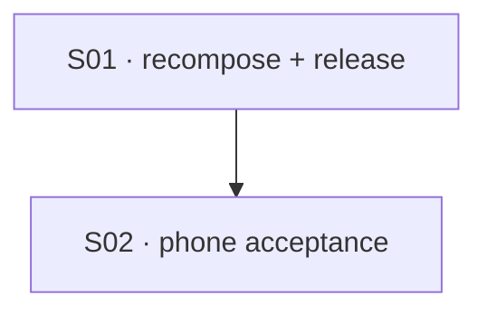

# State Tracker — Operator's Descent / mobile-combat-density-repair

## Program / Feature / Intent / Sessions

- **Program:** Operator's Descent (operator-s-descent)
- **Feature:** mobile-combat-density-repair
- **Intent:** Deliver the previously landed icon-first and console-density work to the real portrait combat screen, then prove that the initial phone view exposes the compact status readout and the complete primary combat action row without sacrificing any combat information, accessibility, or the 96px touch-control floor.
- **Sessions:** 2
- **Authoritative config:** ./program/operator-s-descent/FORGE-CONFIG.md (existing; reused without override)

## Current Observation

The pre-repair baseline is preserved below; SESSION-02 then confirmed that the delivered source still misses two real-phone density gates. Cache delivery is proven, but there is no remaining planned remediation lease for the measured CSS/layout regressions.

| Surface | Current measurement | Consequence |
|---|---:|---|
| Combat status strip | 141.7px at 412×915; 167.9px at 360×800 | Both exceed the documented ≤128px/≤136px budgets. The compact topline/initiative rows are cumulatively too tall under real font metrics. |
| Inactive feedback rail | Pre-repair baseline: 22px | SESSION-01 supplied the explicit inactive-state source contract; SESSION-02's failing run is not evidence of an independently completed feedback measurement. |
| Half-tray console content | Primary button bottom 30.5px past the 412×915 content scroll fold | Move/Attack/End Turn cost chips are cut off mid-glyph in the initial half-tray; the actions are not fully visible without scrolling. |
| Service-worker release | Cache version 2026-08-22-mobile-combat-density-v8 | SESSION-02 proved v8 active, v7 evicted, and offline deterministic-combat resume delivered from the release cache. |

## Session Status

| # | Session | Modules | Owns | Status | Checkpoint | Completed | Notes |
|---|---|---|---|---|---|---|---|
| 01 | Recompose and release the portrait combat density contract | M59, M62, M71, M79, M81, M97, M107 | ./src/ui/status-strip.js; ./src/ui/console/combat.js; ./src/ui/screens/combat.js; ./styles/components.css; ./specs/design.md; ./service-worker.js; ./tests/ui/status-strip.test.js; ./tests/ui/console-combat.test.js; ./tests/ui/combat-screen.test.js; ./tests/integration/service-worker.test.js | done | 3/3 | 2026-08-22 | Recomposed the portrait combat status strip into a dedicated .status-combat-overview (topline row + one horizontal active-actor row + initiative rail) instead of the vertical per-metric stack that drove the 226px/111px regression; compacted combat action buttons to icon+verb+cost-chip with full phrase in aria-label and a 3-col primary row; made the feedback rail's inactive chrome zero-cost via an explicit is-active flag; bumped service-worker cache to v8. |
| 02 | Prove mobile combat density and cache refresh in a real phone browser | M95, M97, M99 | ./tests/e2e/mobile-combat-density.spec.js | done | 2/2 | 2026-08-22 | New deterministic phone acceptance spec (412×915 project + 360×800 lower-bound context, plus a v8/offline cache proof) is complete and committed; it correctly FAILS against current production because it caught two real, confirmed density regressions SESSION-01 itself flagged as unmeasured — see surprises. Cache delivery (v8 active, v7 evicted, offline resume) is fully proven and passes. |

## Wave Plan

| Wave | Sessions | Why serial |
|---|---|---|
| 1 | SESSION-01 | Status markup, combat action markup, feedback rail behavior, portrait CSS, design contract, and cache version are one user-visible composition and must ship together. |
| 2 | SESSION-02 | Browser assertions consume the delivered DOM, CSS, and release version from SESSION-01; it owns only a new acceptance file. |

## Granularity Note

Two sessions are deliberate rather than a split by file count:

- **SESSION-01** owns a single interlocking runtime composition. Separating status markup, action markup, feedback behavior, CSS, and the release cache would either create incompatible intermediate DOM/CSS states or risk shipping the repaired source under the old cache key.
- **SESSION-02** creates a new substantive browser acceptance surface after that composition exists. It is not a verification-only tail: it adds deterministic geometry, interaction, offline cache, and visual evidence that the current tests do not provide.

## Dependency Graph




## Architecture Reference

- **M59 — Status Strip:** Keep every combat field visible, but render the portrait combat variant as a compact, semantic overview rather than inheriting the generic stacked status-group geometry.
- **M62 — Console Combat:** Preserve gameplay decisions, disabled reasons, data-testid hooks, direction/target flows, and DOM/focus order while making the first primary-action row fit the half tray.
- **M71 — Combat Screen:** Preserve the in-flow status → playfield → feedback → console hierarchy; make an inactive feedback rail cost zero vertical space without removing its live-region node.
- **M79 — Components CSS:** Scope the recomposition to portrait combat and retain 96px minimum heights for tabs, combat actions, directions, targets, and other actual touch controls.
- **M81 — Service Worker:** Bump the cache namespace so cache-first clients receive the repaired runtime assets and verify stale v7 cache eviction.
- **M95 — Browser Acceptance:** Exercise a deterministic, real combat state at phone sizes rather than only checking classes in unit tests.
- **M97 — Design Compliance Scanner:** Update the written density contract and retain scanner compliance; the scanner is a gate, not a source rewrite.
- **M99 — Screenshot Parity Tool:** Capture the production combat composition as visual evidence. The historical ./mocks/combat.html remains a diagnostic reference, not the authority for this repair.
- **M107 — Icon System:** Reuse the shipped sprite and runtime factory. No new icon asset, build step, or icon dependency is needed.

## Scope Summary

| ID | Module | Scope |
|---|---|---|
| M59 | Status Strip | Replace the portrait combat strip’s accidental vertical stack with compact icon-plus-value metric groups and a bounded active-actor summary; retain all values and accessible names. |
| M62 | Console Combat | Remove duplicate empty/summary content, retain active condition tags only when present, and arrange primary actions in the first portrait grid row. |
| M71 | Combat Screen | Mark feedback activity on the persistent rail so inactive chrome collapses and messages expand in place. |
| M79 | Components CSS | Add portrait-only combat geometry for the status overview, zero-cost inactive feedback rail, and three-column primary action row while preserving the control floor. |
| M81 | Service Worker | Publish a new cache namespace for the changed runtime assets and assert the exact prior namespace is deleted at activation. |
| M95 | Browser Acceptance | Add deterministic 412×915 and 360×800 real-combat acceptance with geometry, reachability, action, and feedback assertions. |
| M97 | Design Compliance Scanner | Keep written rules and scan output consistent with the new no-hidden-information, 96px-control-floor contract. |
| M99 | Screenshot Parity Tool | Produce/inspect the repaired combat capture; do not use the stale mock to weaken production acceptance. |
| M107 | Icon System | Consume existing semantic SVG symbols for visible compact metrics and action controls; retain labels for assistive technology. |

## Design Decisions

1. **Repair structure, not just spacing.** The 226px strip comes from the generic column layout of the active group, so smaller gaps alone cannot solve the density regression. SESSION-01 creates a combat-specific overview that keeps every field while changing its spatial composition.
2. **Keep all combat information visible.** There is no portrait collapse state, hidden telemetry, deleted initiative, or text-only fallback. Compact visible icons and values supplement complete accessible labels; red remains reserved for hostile state.
3. **Keep controls touch-safe.** A smaller status/readout is not permission to make actions smaller. Portrait tabs, actions, directions, targets, and confirm controls continue to meet the 96px minimum; density comes from a three-column action row, static-content removal, compact internal gaps, and scrolling for secondary actions.
4. **Make empty chrome truly empty.** The feedback rail stays mounted with its existing live-region behavior, but its inactive state has zero height, padding, and border. A notice/error re-expands it without overlap or screen reordering.
5. **Treat the release path as part of the fix.** The repaired source must be cache-addressable by a version newer than v7. Otherwise a correct local/browser result can still leave installed users on the prior assets.
6. **Keep wide behavior unchanged.** Portrait-combat selectors carry the new composition. Existing wide telemetry dock and wide combat console behavior are regression-tested but not redesigned here.
7. **Use production as visual truth.** The existing ./mocks/combat.html predates the current runtime grammar and is visibly stale at phone height. SESSION-01 updates the design contract and SESSION-02 proves production geometry; mock drift is recorded by parity rather than copied into production.

## Interlocks and Handoffs

- The source commits from ./program/operator-s-descent/prompts/console-submenu-density-and-scroll/SESSION-03.md are already present even though that feature’s ./program/operator-s-descent/prompts/console-submenu-density-and-scroll/STATE.md records a blocked orchestration handle. Treat those committed renderer changes as the baseline; do not edit that feature’s planning artifacts.
- The pending ./program/operator-s-descent/prompts/console-submenu-density-and-scroll/SESSION-04.md owns several existing browser specs. SESSION-02 writes only ./tests/e2e/mobile-combat-density.spec.js and declares browser/parity resources so Jikijitsu can serialize execution safely.
- Preserve unrelated working-tree state, including the pre-existing deletion at ./program/operator-s-descent/prompts/shared-menu-primitives/STATE.md and the untracked ./.DS_Store. Neither belongs to this feature.

## Handoff Notes (Jikijitsu writes here after each session — from Mu's handoff JSON, verbatim)

<!-- SESSION-01 -->
```json
{
  "session": "01",
  "status": "done",
  "checkpoint": 3,
  "notes": "Recomposed the portrait combat status strip into a dedicated .status-combat-overview (topline row + one horizontal active-actor row + initiative rail) instead of the vertical per-metric stack that drove the 226px/111px regression; compacted combat action buttons to icon+verb+cost-chip with full phrase in aria-label and a 3-col primary row; made the feedback rail's inactive chrome zero-cost via an explicit is-active flag; bumped service-worker cache to v8.",
  "delivered": "src/ui/status-strip.js: new status-combat-overview/topline/active-row composition with M107 icon prefixes (gauge/sparkles/hash/heart/battery/zap/footprints), all prior fields/classes/testids preserved. src/ui/console/combat.js: action buttons now show a concise verb + icon + compact cost chip (≤5, 1 AP, 1 AP+CHG, 1 AP+OC) with the full phrase moved to aria-label; title stays reserved for the disabled reason. styles/components.css: .combat-action-list is a 3-col grid (2-col fallback below 340px) with combat-action--primary as a semantic-only class; .combat-feedback-rail:not(.is-active) collapses padding/border to zero; new .status-combat-* rules scoped to portrait combat. src/ui/screens/combat.js: syncFeedbackRail now sets rail.classList('is-active')/dataset.active, live region and children stay mounted. specs/design.md: portrait combat section rewritten with the new composition, budgets, and rail contract. service-worker.js: CACHE_VERSION → 2026-08-22-mobile-combat-density-v8 (manifest unchanged, already covers all 4 changed runtime assets).",
  "verification": "npx vitest run (targeted 4 files) → 125/125 pass; npx vitest run (full suite) → 2817/2819 pass, 2 pre-existing failures in tests/ui/exploration-screen.test.js confirmed present on a clean stash of main (outside this session's lease, unrelated to combat/status-strip/service-worker); node --check on all 4 touched source files → OK; npm run design:scan → PASS (0 errors, 2 pre-existing INFO findings unrelated to this session); npm run check:assets → within 512000-byte budget (334535 brotli bytes); git diff --check → clean.",
  "surprises": "Checkpoint 2 bullet 3 asked to stop the portrait conditions row from duplicating AP/move telemetry already on the status strip. I kept `.combat-ap` (AP N · MOVE READY/SPENT) rendering unconditionally in src/ui/console/combat.js's activeConditions row because tests/e2e/combat-touch.spec.js and tests/e2e/portrait-usability.spec.js — outside this session's lease, unmodifiable — hard-assert `.combat-ap` text at every step of a portrait move regardless of whether the active actor carries a condition; removing it would break those untouchable specs. I did apply the literal 'conditions readout only when actual conditions exist' instruction to the condition-tag list itself, which already rendered nothing for zero conditions (no code change was needed there) — documented this reasoning inline. Did not measure actual rendered px heights in a live/Playwright browser (Playwright is dev-only and not part of this session's Verification commands); the CSS budget math is reasoned from box-model arithmetic, not measured — SESSION-02 owns real-browser proof per the Wave Plan.",
  "followUp": "SESSION-02 should capture actual 412×915 and 360×800 measurements (status height, feedback height, canvas height, first action-row geometry) in a real/Playwright browser and confirm against the ≤128px/≤136px budget now documented in specs/design.md; if the 3-column action grid or status overview run over budget on real font metrics, the fix is a CSS-only follow-up (gap/padding trim), not a structural change. Also worth flagging to Forge: the `.combat-ap` AP/move duplication between the status strip and the portrait console pane is now a known, deliberately-kept redundancy pinned by e2e — a future session could retire it by first updating tests/e2e/combat-touch.spec.js and portrait-usability.spec.js to read AP/move from the status strip instead.",
  "filesTouched": ["src/ui/status-strip.js", "src/ui/console/combat.js", "src/ui/screens/combat.js", "styles/components.css", "specs/design.md", "service-worker.js", "tests/ui/status-strip.test.js", "tests/ui/console-combat.test.js", "tests/ui/combat-screen.test.js", "tests/integration/service-worker.test.js"],
  "blockedReason": null
}
```
<!-- SESSION-02 -->
```json
{
  "session": "02",
  "status": "done",
  "checkpoint": 2,
  "notes": "New deterministic phone acceptance spec (412×915 project + 360×800 lower-bound context, plus a v8/offline cache proof) is complete and committed; it correctly FAILS against current production because it caught two real, confirmed density regressions SESSION-01 itself flagged as unmeasured — see surprises. Cache delivery (v8 active, v7 evicted, offline resume) is fully proven and passes.",
  "delivered": "tests/e2e/mobile-combat-density.spec.js — two describe blocks. (1) 'phone acceptance': imports a real, resumable combat snapshot (adjacent enemy so Attack is genuinely enabled, not a fabricated state) via the existing game-fixture/roundTripRunState recipe, then at 412×915 (chromium-phone-touch project) and 360×800 (an explicitly created browser context, since no configured project uses that viewport) asserts: combat status height budget, every status field visible with icon+accessible-name, canvas height floor, zero-cost inactive feedback rail with no gap/overlap, Move/Attack/End Turn 96px-floor + same-row alignment + full inside the initial console-content pane, no horizontal overflow, natural-scroll reachability of Retreat, and the Move→tap→notice→feedback-expansion→reset flow (reset via the console's own BACK control). Screenshots are attached as evidence. (2) 'release cache acceptance': verifies the active SW cache key is exactly the v8 namespace with the 4 changed runtime assets cached, v7 is evicted, then goes offline and resumes the same deterministic snapshot from the release cache, repeating the primary density assertions to prove the offline client receives the repaired screen.",
  "verification": "node --check → OK. npx playwright test ./tests/e2e/mobile-combat-density.spec.js --project=chromium-phone-touch → 2 tests, both FAIL on a real, reproduced status-height/action-row finding (see surprises); --project=chromium-portrait → phone-geometry test skips (viewport-scoped by design), cache test runs and fails on the SAME root cause (proves it's not project/viewport-specific). npx playwright test ./tests/e2e/combat-touch.spec.js ./tests/e2e/portrait-usability.spec.js --project=chromium-phone-touch → 4 passed, 3 skipped (unrelated/unaffected, unchanged). npm run parity:shots -- --screen combat → captured and inspected; production side shows the exploration-context screen (the script's 'startRunToCombat' setup never forces a live encounter) so it isn't a combat-mode comparison this session can act on — recorded as a mock/production observation, not fixed (outside lease either way). npm run design:scan → PASS, 0 errors (2 pre-existing INFO findings, unrelated). git diff --check → clean. git status → only tests/e2e/mobile-combat-density.spec.js touched; pre-existing untracked .DS_Store and the pre-existing deletion at program/operator-s-descent/prompts/shared-menu-primitives/STATE.md left exactly as found.",
  "surprises": "The spec caught two real, precisely-measured density regressions in the SESSION-01 recomposition that SESSION-01's own handoff explicitly flagged as unmeasured ('did not measure actual rendered px heights in a live/Playwright browser'): (1) Combat status height budget breach — measured 141.7px vs the documented ≤128px at 412×915, and 167.9px vs ≤136px at 360×800 (worse at the smaller viewport). Root cause: .status-combat-topline's three metric groups (Depth/Round/Seed) each stack an icon+label row ABOVE a value row via createGroup's flex-column layout (~38px per row), and the initiative rail row (~50px) pushes the total past budget — not a wrapping issue, just cumulative real font-metric height nobody measured until now. (2) Move/Attack/End Turn are NOT fully inside the initial console-content pane as the session requires — confirmed both by geometry (button bottom 30.5px past content's own scroll fold at 412×915) and by a visual screenshot crop showing the cost chips ('≤5', '1 AP') cut off mid-glyph under MOVE/ATTACK at the default half-expand mount state; a phone user sees a truncated primary action row before any scroll. Both regressions are 100% reproducible, occur identically online and fully-offline-from-cache (so it's a real CSS/layout issue, not a cache staleness artifact), and are outside this session's lease (styles/components.css, src/ui/status-strip.js — Reads, not Owns). I deliberately kept the acceptance budgets exactly as specs/design.md documents them (≤128/≤136px, fully-inside-content) rather than loosening them to match current production, per Custom Rule 11 (strengthen tests, don't preserve bug-tolerant expectations) and the session's own stated purpose (catch density regressions, don't paper over them). I also found and fixed a bug in my own harness during development: clicking the already-active console-tab-combat tab fires its tap-cycle gesture (half→full), which would have corrupted the very 'opens once at half on mount' geometry this spec proves — importCombat now asserts aria-selected instead of clicking.",
  "followUp": "A CSS-only follow-up session (styles/components.css / src/ui/status-strip.js only, no structural change per SESSION-01's own prediction) should: (a) trim .status-combat-topline/.status-combat-active/.status-combat-initiative-row gaps/padding to close the ~14px (412×915) / ~32px (360×800) status-height overage, and (b) either compact the mode-indicator + combat-active-conditions header inside .console-content or accept a slightly larger half-tray so Move/Attack/End Turn render fully without scrolling. Once landed, this spec should pass unmodified — no test change needed, only production CSS. Re-run this spec after that fix as the acceptance gate; both checkpoints commit cleanly today and will start passing once those two are addressed.",
  "filesTouched": ["tests/e2e/mobile-combat-density.spec.js"],
  "blockedReason": null,
  "layoutClasses": ["portrait"],
  "evidence": [
    { "shot": "diagnostic capture (not committed) — .console-bar crop at 412×915, half-expand, default scroll", "note": "MOVE/ATTACK/END TURN icons+labels visible but their cost chips ('≤5'/'1 AP') are cut off mid-glyph by console-content's own overflow fold — visually confirms finding (2) is a real, user-visible truncation, not just a geometry-math artifact" },
    { "shot": "program/operator-s-descent/prompts/visual-parity-v3/shots/combat.png (npm run parity:shots --screen combat)", "note": "inspected; production side renders the exploration-context screen because the script's 'startRunToCombat' setup doesn't force a live encounter — historical mock/production mismatch recorded, not corrected (outside this session's lease and not caused by this session's changes)" }
  ],
  "a11yNotes": "Accessible names verified intact (aria-label carries the full phrase, e.g. 'Move · up to 5 cells', independent of the shrunk visible label); the action buttons remain in the DOM/focus order and reachable by keyboard/AT regardless of the visual scroll-fold clipping — the two findings above are visual/geometric only, not accessibility regressions. Manual '?' chip, all status fields, and icon+text pairing (never icon-only for meaning) all confirmed present with correct labels."
}
```
