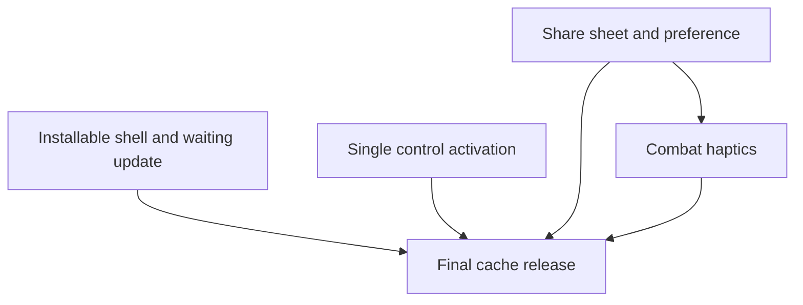

# State Tracker — Operator's Descent / mobile-pwa-hardening

## Program / Feature / Intent / Sessions

| Field | Value |
|---|---|
| **Program** | Operator's Descent |
| **Feature** | `mobile-pwa-hardening` |
| **Intent** | Make the static roguelike safely updateable, installable, zoomable, cutout-safe, and less frictional on touch devices. |
| **Sessions** | 5 |
| **Authoritative config** | `./program/operator-s-descent/FORGE-CONFIG.md` |

### Scope Boundary

- **Included**: viewport zoom, standalone/PWA shell, safe-area insets, service-worker waiting/reload protocol, duplicate control activation, share-sheet fallback, opt-in haptic preference, combat feedback, and final cache release.
- **Deferred**: the unrelated screen-wide issues in `./docs/accessibility-audit.md` Waves B3–B5. They remain a separate accessibility feature because their screen and stylesheet leases are materially broader.

## Session Status

| # | Session | Modules | Owns | Status | Checkpoint | Completed | Notes |
|---|---|---|---|---|---|---|---|
| 01 | PWA shell and safe update contract | M80, M81, M84, M86, M56, M77, M79, M101, M94–M96 | `./index.html`, `./manifest.webmanifest`, `./assets/app-icon.svg`, `./assets/app-icon-180.png`, `./assets/app-icon-192.png`, `./assets/app-icon-512.png`, `./service-worker.js`, `./src/runtime.js`, `./src/ui/components.js`, `./styles/base.css`, `./styles/components.css`, `./styles/wide.css`, `./scripts/server.js`, `./tools/serve.mjs`, `./scripts/verify-assets.js`, `./scripts/report-budget.js`, `./tests/integration/service-worker.test.js`, `./tests/integration/runtime.test.js`, `./tests/ui/components.test.js`, `./tests/tools/pwa-shell.test.js`, `./tests/e2e/pwa-shell.spec.js` | done | 3/3 | 2026-08-23 | v13 cache (operator-descent-2026-08-23-mobile-pwa-hardening-v13) isolates all reads via caches.open(CACHE_NAME), defers precache to activation for the v12 bridge, and only activates a waiting worker after a single-in-scope-window SKIP_WAITING consent handshake; PWA manifest+icons shipped and safe-area insets applied to #app-root/.in-run-screen/.wide-shell/.update-toast. |
| 02 | Single native control activation | M57, M61, M95 | `./src/ui/input.js`, `./tests/ui/input.test.js` | pending | — | — | Removes the `touchend` + synthetic-click double path. |
| 03 | Share sheet and haptic preference | M45, M73, M76 | `./src/state/library.js`, `./src/ui/screens/settings.js`, `./src/ui/screens/scorecard.js`, `./tests/state/library.test.js`, `./tests/ui/persistence-screens.test.js` | pending | — | — | Durable default is haptics off; share stays seed-only. |
| 04 | Combat haptic feedback | M45, M71 | `./src/ui/screens/combat.js`, `./tests/ui/combat-screen.test.js` | pending | — | — | Depends on SESSION-03's persisted preference contract. |
| 05 | Final offline cache release | M81, M94–M96 | `./service-worker.js`, `./tests/integration/service-worker.test.js`, `./tests/tools/build-pages.test.js` | pending | — | — | Required hard release dependency; produces final v14 cache and restores safe waiting-time precache. |

## Wave Plan

| Wave | Sessions | Why concurrent |
|---|---|---|
| 1 | SESSION-01, SESSION-02, SESSION-03 | Their `Owns` paths do not intersect. SESSION-01 alone reserves `playwright:test-results`. |
| 2 | SESSION-04 | Needs SESSION-03's persisted `hapticsEnabled` setting; it can launch as soon as SESSION-03 is done, including alongside any unfinished SESSION-01/SESSION-02 work because those leases are disjoint. |
| 3 | SESSION-05 | Needs all earlier source artifacts so its cache precaches their exact final bodies. It is intentionally serialized. |

## Dependency Graph

## Architecture Reference (Feature-Specific)

- **M80 HTML shell**: gains install metadata and an unrestricted browser-zoom viewport declaration.
- **M81 service worker**: reads only its own `CACHE_NAME`, never a global cache match. v13 defers cache population until activation to protect legacy v12 clients; v14 resumes waiting-time precache. An update waits for `SKIP_WAITING`, and the worker denies that handoff while more than one in-scope app window is open. `clients.claim()` remains in activation after an approved single-client handoff (first installs still activate normally).
- **M86 runtime**: detects `registration.waiting` and `updatefound`/`installed`, shows one reload toast on every route, turns a multi-tab rejection into a retry message, and reloads only after a player activation request produces `controllerchange`.
- **M45/M76**: own an additive, backward-compatible `hapticsEnabled: boolean` setting, defaulting to `false`; M73 consumes the share-sheet behavior.
- **M71**: turns only resolved combat hit/crit/death log entries into short best-effort Vibration API calls; iOS/no-API paths are no-ops.
- **M94/M96**: explicitly recognize PWA manifest/icons as production singletons so Pages staging and transfer budgets stay honest.

## Scope Summary

| Module | Effect |
|---|---|
| M80, M81, M84, M86 | PWA identity, cache isolation/lifecycle, single-client runtime reload consent, local MIME correctness |
| M56, M57, M71, M73, M76 | Toast semantics, click-only action binding, sharing, settings, haptics |
| M45 | Persisted preference normalization |
| M77, M79, M101 | Safe-area frame padding, safe toast placement, and wide available-frame sizing |
| M94–M96 | Manifest/icon validation, staged Pages proof, browser/offline regression coverage |

## Design Decisions

1. **Zoom remains browser-controlled**: remove both `maximum-scale` and `user-scalable=no`; preserve in-canvas camera gestures as a separate game control.
2. **Standalone is portrait-first**: manifest uses `display: standalone`, `orientation: portrait`, root-relative-to-scope startup, original committed icons, dark theme/background colors, and Apple metadata.
3. **No silent service-worker takeover**: installation never calls `skipWaiting()` automatically. Cache lookup is version-specific, so a waiting cache cannot answer old-client requests. The client sends `SKIP_WAITING` only from the toast button; the worker accepts it only with one in-scope app window, then the requester reloads on the resulting controller change.
4. **Safe areas are frame-level**: apply `env(safe-area-inset-*)` to the content frame, keep CRT overlays edge-to-edge, and offset fixed update UI independently.
5. **Native semantics win**: native `<button>` controls use the browser `click` activation path once; no parallel `touchend` handler is retained.
6. **Share before clipboard**: call `navigator.share()` directly in the user gesture when available; cancellation is not copied; unsupported/non-cancel failures use the existing clipboard/select fallback.
7. **Haptics are opt-in**: `hapticsEnabled` defaults false and vibration is short, nonessential, and guarded for unsupported browsers.
8. **Two cache versions are intentional**: `v13` establishes the isolation protocol and defers its own precache until activation only for the legacy bridge; `v14` precaches safely while waiting and captures all subsequent changed client files. This is a hard sequential delivery split, not a verification-only session.
9. **The v12 bridge is safely non-forcing**: a deployed v12 client cannot learn v13's new waiting-worker UI and uses a global cache matcher. v13 therefore creates no v13 cache until the legacy worker is gone; v13 then safely prompts for all later releases, including v14.

## Handoff Notes

### SESSION-01 — 2026-08-23

- **Notes:** v13 cache (operator-descent-2026-08-23-mobile-pwa-hardening-v13) isolates all reads via caches.open(CACHE_NAME), defers precache to activation for the v12 bridge, and only activates a waiting worker after a single-in-scope-window SKIP_WAITING consent handshake; PWA manifest+icons shipped and safe-area insets applied to #app-root/.in-run-screen/.wide-shell/.update-toast.
- **Delivered:** Installable PWA shell (manifest.webmanifest, original app-icon.svg + 180/192/512 PNGs, index.html metadata, zoomable viewport-fit=cover) plus a service worker that (1) reads/writes only its own versioned cache, never a global caches.match(), (2) defers the v12→v13 bridge's precache to activation so a live v12 tab can't see v13 bytes, and (3) never calls skipWaiting() without an explicit SKIP_WAITING message from the sole in-scope app window, deferring with UPDATE_DEFERRED_MULTI_CLIENT otherwise. src/runtime.js and src/ui/components.js's createUpdateToast were rewired so the update toast requests activation and only reloads after the resulting controllerchange, with an in-place setDeferred() retry state for multi-tab. Safe-area env() insets pad #app-root (content frame) while #crt-overlays stays edge-to-edge; .in-run-screen and .wide-shell/.wide-console-dock switched from raw 100vh/100vw to 100% so they track the padded frame instead of bypassing it.
- **Verification:** node --check on all touched .js files passed; npx vitest run ./tests/integration/service-worker.test.js ./tests/integration/runtime.test.js ./tests/ui/components.test.js ./tests/tools/pwa-shell.test.js → 113/113 pass; npm run check:assets → 123 manifest assets, 423075/371137 gzip/brotli under the 512000 budget; npm run build:pages -- --output <tmp> staged manifest + all 4 icons; E2E_PORT=8081 npx playwright test tests/e2e/pwa-shell.spec.js (2/2) and tests/e2e/offline.spec.js (1/1) pass; also spot-checked tests/e2e/adaptive-layout.spec.js (49/49 non-skipped), tests/e2e/wide-panes.spec.js (10/10) on the assigned port to confirm the safe-area CSS change didn't regress wide-layout rendering; git diff --check clean; node scripts/lint-sigils.js passed.
- **Surprises:** Full `npx vitest run` (FORGE-CONFIG's broader unit-test gate) surfaces 2 failures outside this session's lease, both direct, expected consequences of in-lease changes hitting out-of-lease files: (1) tests/ui/front-door.test.js still asserts the old contract (RELOAD click → immediate window.location.reload()) — now fails because onReload requests SKIP_WAITING instead, per this session's explicit mandate. (2) tests/tooling/check-tokens.test.js now reports 4 warning-level findings because the new --safe-area-* custom properties aren't in specs/design.md's token table (same category as the existing DERIVED_SURFACE_TOKENS allowlist for scrollbar/fade tokens). Neither file nor specs/design.md is in this session's Write set, so I left them and documented the exact fix in the arch fragment instead. Also pre-existing/unrelated (confirmed via git stash against the pre-session commit): tests/ui/exploration-screen.test.js has 2 failing tap-to-move tests, and tests/e2e/touch-flow.spec.js's phone-touch tap-to-move journey is flaky — both reproduce identically without any of my changes.
- **Follow-up:** 1) Update tests/ui/front-door.test.js's update-toast test to the consent flow (RELOAD → SKIP_WAITING postMessage → reload only after controllerchange). 2) Add --safe-area-{top,right,bottom,left} to specs/design.md's DERIVED_SURFACE_TOKENS allowlist to clear the check-tokens warnings. 3) scripts/lint-sigils.js SKIP_DIRS still lacks test-results/ (pre-existing debt) — a concurrent/leftover Playwright run can trip sigil-lint until manually cleaned; I cleaned my own test-results/playwright-report before finishing. 4) SESSION-05 owns the final v14 cache bump and should resume waiting-time (install-time) precaching now that cache isolation makes it safe again — the v13 activation-time precache was a one-time bridge measure, not the new standing pattern. Arch fragment written to .forge/signal/SESSION-01.arch.md (M80/M81/M86/M56/M77/M101/M94/M96/M95 deltas) — not committed, per orchestrated-mode convention.
