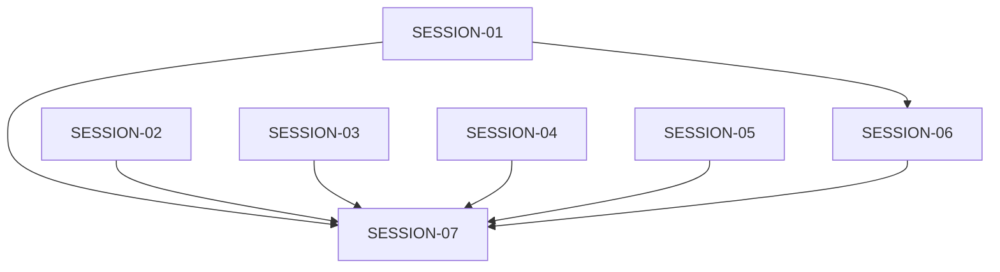

# STATE — Portrait Usability and Regression Repair

## Feature Status

| Field | Value |
|---|---|
| **Feature** | `portrait-usability-regression-repair` |
| **Status** | In Progress |
| **Started** | 2026-08-21 15:43 CDT |
| **Completed** | — |
| **Authoritative plan** | `./program/operator-s-descent/prompts/portrait-usability-regression-repair/MASTER.md` |

## Session Table

| Session | Status | Depends on | Checkpoint | Owns summary | Notes |
|---|---|---|---:|---|---|
| SESSION-01 | in-progress | — | 0/3 | Combat/status DOM + unit tests | Remove critical-data collapse and turn-driven console sizing; add feedback rail. |
| SESSION-02 | in-progress | — | 0/3 | Viewport gestures + touch-flow test | Harden release classification and replace stale post-wheel geometry. |
| SESSION-03 | pending | — | 0/2 | RunState log policy + log tests | Keep rich live detail; canonicalize persisted events to slim rows. |
| SESSION-04 | pending | — | 0/2 | Title state + navigation E2E | Manual close restores START without history mutation. |
| SESSION-05 | in-progress | — | 0/3 | Bus contracts + integration tests | Make masterVolume and inventory-change reachable and validated. |
| SESSION-06 | pending | SESSION-01 | 0/4 | CSS/design/tooling + adaptive/combat E2E | In-flow responsive console, 96px touch floors, clean scan. |
| SESSION-07 | pending | SESSION-01–06 | 0/3 | New integrated acceptance specification | Geometry, screenshots, and full release checks. |

## Wave Plan

| Wave | Sessions | Resource notes |
|---|---|---|
| 1 | SESSION-01 ∥ SESSION-02 ∥ SESSION-05 | Disjoint writes; SESSION-02 alone holds `e2e:playwright`. |
| Browser queue | SESSION-03 → SESSION-04 → SESSION-06 | Serialized on `e2e:playwright`; SESSION-06 also depends on SESSION-01 and holds `design:scan`. |
| Final | SESSION-07 | Solo; exclusive full-suite, `e2e:playwright`, and `design:scan`. |

## Dependency Graph

## Design Decisions

1. Portrait combat uses an in-flow, bounded tray; no absolute bottom overlay and no dim layer.
2. Existing console state names and keyboard/touch mode switching remain compatible, but state names no longer imply percentage-of-frame heights.
3. All combat-critical status fields remain rendered. The status-collapse button and state store are removed.
4. Portrait move feedback is a dedicated live region outside the console scroller.
5. The canonical target floor is 96 CSS px for every touch-capable row at the phone, 1080 portrait, and 1024 touch-wide layouts. Density comes from bounded scrollers and compact noninteractive content, not smaller controls.
6. The persisted event boundary is the single source of truth for stripping rich log detail, including on load of older payloads.
7. Title route state resets locally on `ui:manual-close`; the manual remains a modal, not a route.
8. Screenshot evidence supplements, but never replaces, rectangle and hit-target assertions.

## Baseline Receipts

- `npm test`: 2742 passed / 1 failed (`--hp` palette mismatch).
- `npm run design:scan`: 0 errors / 12 warnings / 2 informational findings.
- Focused Playwright: 77 passed / 13 failed / 91 skipped.
- Pre-existing workspace state outside every lease: `./README.MD` is staged as an empty addition and has later unstaged content; `./.DS_Store` files are untracked/ignored.

## Handoff Notes

No Mu handoffs yet. Jikijitsu appends each session's exit-contract notes here and updates checkpoint/status cells. If a session needs any file outside its `Owns`, it returns `blocked` rather than widening its lease.
