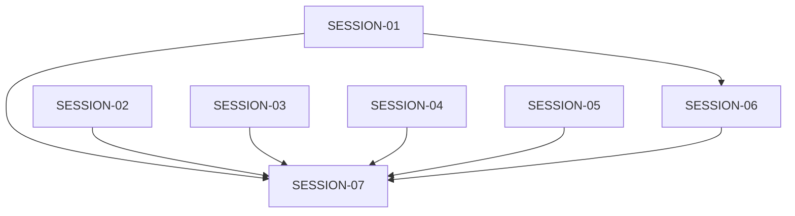

# STATE — Portrait Usability and Regression Repair

## Feature Status

| Field | Value |
|---|---|
| **Feature** | `portrait-usability-regression-repair` |
| **Status** | Blocked |
| **Started** | 2026-08-21 15:43 CDT |
| **Completed** | — |
| **Authoritative plan** | `./program/operator-s-descent/prompts/portrait-usability-regression-repair/MASTER.md` |

## Session Table

| Session | Status | Depends on | Checkpoint | Owns summary | Notes |
|---|---|---|---:|---|---|
| SESSION-01 | done | — | 3/3 | Combat/status DOM + unit tests | Removed status-strip collapse toggle; portrait combat feedback now lives on a screen-owned live-region rail between playfield and console; console opens once at 'half' and is never resized by playback or turn boundaries. |
| SESSION-02 | done | — | 3/3 | Viewport gestures + touch-flow test | Release-time gesture classification with a fixed origin, disqualified latch surviving pinch/cancel/lostpointercapture, and a live-canvas-derived post-wheel cell step for the phone drag proof. |
| SESSION-03 | done | — | 2/2 | RunState log policy + log tests | normalizePersistedEvent is now the single canonical boundary for persisted events; recordEvent strips detail, and load-time normalization filters legacy fat/rich entries so recentEvents on state is always slim {type, message, sequence?}. |
| SESSION-04 | done | — | 2/2 | Title state + navigation E2E | Title screen now subscribes to ui:manual-close and locally resets START ↔ branches to its canonical START-visible/branches-hidden view with focus on START; no history mutation, no route remount, no fragment change. |
| SESSION-05 | done | — | 3/3 | Bus contracts + integration tests | Human override accepted the completed functional work despite checkpoint 1 commit `05af9ec` including `./README.MD` outside `Owns`; the violation remains recorded below. |
| SESSION-06 | done | SESSION-01 | 4/4 | CSS/design/tooling + adaptive/combat E2E | Portrait console-bar now an in-flow flex child (no overlay, no dim layer); every touch-capable row hits the 96px floor; --hp added to design.md palette; deploy-p/deploy-e classes production-defined; design scan 0 warnings. |
| SESSION-07 | blocked | SESSION-01–06 | 3/3 | New integrated acceptance specification | Rerun returned no parseable handoff JSON; see `./.forge/results/SESSION-07.result.md`. Existing checkpoint 3/3 commits remain clean. |

## Wave Plan

| Wave | Sessions | Resource notes |
|---|---|---|
| 1 | SESSION-01 ∥ SESSION-02 ∥ SESSION-05 | Disjoint writes; SESSION-02 alone holds `e2e:playwright`. |
| Browser queue | SESSION-03 → SESSION-04 → SESSION-06 | Serialized on `e2e:playwright`; SESSION-06 also depends on SESSION-01 and holds `design:scan`. |
| Final | SESSION-07 | Solo; exclusive full-suite, `e2e:playwright`, and `design:scan`. |

## Dependency Graph

## Design Decisions

1. Portrait combat uses an in-flow, bounded tray; no absolute bottom overlay and no dim layer.
2. Existing console state names and keyboard/touch mode switching remain compatible, but state names no longer imply percentage-of-frame heights.
3. All combat-critical status fields remain rendered. The status-collapse button and state store are removed.
4. Portrait move feedback is a dedicated live region outside the console scroller.
5. The canonical target floor is 96 CSS px for every touch-capable row at the phone, 1080 portrait, and 1024 touch-wide layouts. Density comes from bounded scrollers and compact noninteractive content, not smaller controls.
6. The persisted event boundary is the single source of truth for stripping rich log detail, including on load of older payloads.
7. Title route state resets locally on `ui:manual-close`; the manual remains a modal, not a route.
8. Screenshot evidence supplements, but never replaces, rectangle and hit-target assertions.

## Baseline Receipts

- `npm test`: 2742 passed / 1 failed (`--hp` palette mismatch).
- `npm run design:scan`: 0 errors / 12 warnings / 2 informational findings.
- Focused Playwright: 77 passed / 13 failed / 91 skipped.
- Pre-existing workspace state outside every lease: `./README.MD` is staged as an empty addition and has later unstaged content; `./.DS_Store` files are untracked/ignored.

## Handoff Notes

### SESSION-01

- **Completed:** 2026-08-21
- **Notes (verbatim):** Removed status-strip collapse toggle; portrait combat feedback now lives on a screen-owned live-region rail between playfield and console; console opens once at 'half' and is never resized by playback or turn boundaries.
- **Follow-up (verbatim):** DOM/class contract for SESSION-06 to consume: (a) portrait feedback rail is `
` between playfield and console; children `
` and `
`, each shown by clearing `hidden` when text is present. (b) Portrait status-strip no longer emits any `.status-collapsed` class — density styling must come from CSS/layout, not JS hide. (c) Wide dock renders `combat-notice`/`combat-error` before `combat-actions` and `combat-targets` inside `.wide-console-content-body` (portrait has zero of these testids). (d) Portrait playfield no longer sets `style.marginBottom = '96px'`; the console is now a bounded in-flow tray and the rail sits directly below the playfield.

### SESSION-02

- **Completed:** 2026-08-21
- **Notes (verbatim):** Release-time gesture classification with a fixed origin, disqualified latch surviving pinch/cancel/lostpointercapture, and a live-canvas-derived post-wheel cell step for the phone drag proof.
- **Follow-up (verbatim):** SESSION-06 owns the documented 96px touch-row floor and its geometry assertions; the touch-flow E2E's `>= 48` visible-row guard is deliberately retained per checkpoint-3 instruction as an interim baseline for that session to raise. `tapCoordForCell` in ./tests/e2e/touch-flow.spec.js still duplicates ENTRY_CELL_PX=40 from ./src/ui/screens/exploration.js DEFAULT_ENTRY_CELL_PX — if that entry-zoom constant ever changes, this helper (and the new postWheelCellStepPx) needs the same knob.

### SESSION-05

- **Blocked:** 2026-08-21
- **Reason:** Lease violation: checkpoint 1 commit `05af9ec` included `./README.MD` outside `Owns`; the committed user state was not altered or reverted by Jikijitsu.
- **Notes (verbatim):** SETTING_KEYS gained 'masterVolume' and EVENT_CONTRACTS gained state:inventory-change with hasRunState; three test files pin the live paths.
- **Follow-up (verbatim):** The MU.md 'explicit pathspec, lease only' precept is easier to enforce with `git commit -m … -- <paths>` than with `git add -- <paths> && git commit` when the workspace has pre-existing staged files; consider tightening that guidance for future sessions. If SESSION-06 or SESSION-07 needs to also register a bus contract for a new event, follow the state:inventory-change pattern (add to EVENT_CONTRACTS + document the payload shape + assert in state/bus.test.js).

### SESSION-03

- **Completed:** 2026-08-21
- **Notes (verbatim):** normalizePersistedEvent is now the single canonical boundary for persisted events; recordEvent strips detail, and load-time normalization filters legacy fat/rich entries so recentEvents on state is always slim {type, message, sequence?}.
- **Follow-up (verbatim):** The load-time sanitizer is deliberately lenient per-entry (drop-and-continue) so Custom Rule 13 corpora keep decoding; if a future session ever wants strict per-entry rejection on load, it must first freeze a new symbol-table snapshot and re-encode the affected v4 fixtures with well-formed events. The persisted boundary is now the ONLY place that guarantees slim events — runtime.js's appendRuntimeLogEntry still hands the full payload (with detail/entry/timestamp) to currentRunState.recordEvent, and that is fine because recordEvent applies the sanitizer; no runtime edit was required (as the session explicitly noted).

### SESSION-04

- **Completed:** 2026-08-21
- **Notes (verbatim):** Title screen now subscribes to ui:manual-close and locally resets START ↔ branches to its canonical START-visible/branches-hidden view with focus on START; no history mutation, no route remount, no fragment change.
- **Follow-up (verbatim):** The new reset listener is scoped to the mounted title controller by design: manual close during exploration/settings/creation never navigates or fires this handler because the listener only exists while title.js is mounted. If a future session ever wants a title reset triggered from a non-title surface, add a new listener at that surface's own controller — do NOT hoist this into the runtime (that would remount routes on every manual close, which SESSION-04's contract explicitly forbids). The retired ./src/ui/screens/tutorial.js still sits on disk (design-scan scanner map and front-door test both hard-reference the path); removing it will need a session with a lease covering those tooling files. Wide layout was NOT E2E-verified this session (session prompt scoped commit-condition to --project=chromium-portrait per SESSION-07's ownership of geometry/screenshot coverage), but both mountPortrait and mountWide got the same listener wiring and reset helper, so the wide-layout coverage in SESSION-07 has a natural asymmetry to close.

### SESSION-06

- **Completed:** 2026-08-21
- **Notes (verbatim):** Portrait console-bar now an in-flow flex child (no overlay, no dim layer); every touch-capable row hits the 96px floor; --hp added to design.md palette; deploy-p/deploy-e classes production-defined; design scan 0 warnings.
- **Follow-up (verbatim):** SESSION-07 should re-verify at the failing portrait engines (chromium-phone-touch 412×915, chromium-portrait 1080×1920) that the in-flow console + feedback rail geometry stays as tested — the new assertPortraitLayoutRegions helper in tests/e2e/combat-touch.spec.js can be lifted for reuse. The wide 48px densification is now scoped to `.wide-console-content-body` only under `@media (hover: hover) and (pointer: fine) and (not (any-pointer: coarse))`; any new wide surface that needs pointer-only densification must add itself to that block and never let it match on coarse-pointer / touch-wide. The corner-radius scan continues to report 2 informational findings (Panels/console and Sigil cells at 0px) with no tracked utility class — SESSION-07 may either add radius-panel/.radius-sigil utility classes or accept the info-level status quo. The wide-settings screenshot from checkpoint 3 attaches to Playwright test-results and shows a clean two-column form with stable slider tracks — visually confirmed no overlaps, no wrapping. Also: the pre-existing README.MD staged addition and .DS_Store untracked file remained untouched (both outside every lease this session).

### Orchestration Stop

- **Date:** 2026-08-21
- **Reason:** SESSION-05 was marked blocked after checkpoint 1 commit `05af9ec` included `./README.MD` outside its write lease. SESSION-07 requires SESSION-01–06 all done and therefore was not launched.

### Human Override and Resume

- **Date:** 2026-08-21 18:37 CDT
- **Instruction (verbatim):** mark it done then
- **Decision:** SESSION-05 is accepted as done at checkpoint 3/3. The lease violation remains in the record. SESSION-07 is released for the final acceptance gate.

### SESSION-07

- **Blocked:** 2026-08-21
- **Reason (verbatim):** Full feature gate fails on 2 unit tests (./tests/ui/exploration-screen.test.js lines 378 + 395; owning session per bisect: portrait-usability-regression-repair SESSION-02 via ./src/ui/viewport.js; command `npx vitest run tests/ui/exploration-screen.test.js`) AND 13 Playwright tests (./tests/e2e/accessibility.spec.js:78 × 4 projects [pre-existing at 5f501cc, no owner in this feature]; ./tests/e2e/manual.spec.js:301 + :314 × 4 projects [introduced by SESSION-01–06, most likely SESSION-04 title-manual close reset]; ./tests/e2e/touch-flow.spec.js:136 × chromium-phone-touch [pre-existing at 5f501cc]; command `E2E_PORT=4187 npx playwright test --reporter=line`). Every failing file is outside SESSION-07's write lease of ./tests/e2e/portrait-usability.spec.js; per session prompt: 'A production or pre-existing-spec failure outside the lease returns blocked with the owning path, failing project, screenshot/trace path, and exact command.' Trace/screenshot artifacts for each failing e2e sit under ./test-results/<test-slug>/{trace.zip, test-failed-1.png, video.webm, error-context.md} after each run of the exact command.
- **Notes (verbatim):** New integrated spec ./tests/e2e/portrait-usability.spec.js added and passes 7/7 across every project for which it is selected (chromium-portrait, chromium-phone-touch; firefox-portrait + webkit-portrait skip by design). Full feature gate blocked by 15 test failures outside SESSION-07's lease — 2 unit regressions in ./tests/ui/exploration-screen.test.js and 13 e2e failures across ./tests/e2e/accessibility.spec.js, ./tests/e2e/manual.spec.js, and ./tests/e2e/touch-flow.spec.js.
- **Follow-up (verbatim):** Follow-up session with a lease over ./tests/ui/exploration-screen.test.js needs to reconcile the 2 unit tests against SESSION-02's release-time gesture classification (src/ui/viewport.js) — likely the tests need to synthesize pointerdown+pointermove+pointerup rather than assuming pointerdown alone triggers the tap intent. Follow-up session with a lease over ./tests/e2e/manual.spec.js needs to reconcile the 8 manual-dismissal failures at lines 301+314 against SESSION-04's ui:manual-close reset-to-START behavior (the invoker.focus in ./src/ui/manual/manual-modal.js runs BEFORE the ui:manual-close dispatch, so the title's local listener then pulls focus back to START — old tests likely expected focus to stay on the invoker). The 5 pre-existing failures (accessibility.spec.js × 4, touch-flow.spec.js × 1) were carried forward from 5f501cc and appear as-is. My spec's tap coord math is copied verbatim from combat-touch.spec.js — if src/ui/screens/combat.js COMBAT_PORTRAIT_CELL_PX or src/ui/viewport.js MAX_ZOOM_SCALE changes, both specs need the same knob (combat-touch.spec.js already documents this coupling). The wide-square case runs on chromium-portrait with page.setViewportSize({width:1024,height:1024}) because the chromium-wide-square project's testMatch is scoped to adaptive-layout.spec.js in ./playwright.config.js; if a future feature widens that testMatch to include portrait-usability.spec.js, the test's PROJECT_NAME skip guard should be extended to also allow the wide-square project. Extracted PNG copies of every attachment (name-prefixed by project) currently live under /tmp/pw-shots for human review; regenerate by running the JSON reporter and base64-decoding testInfo.attach payloads.

### Human Rerun Request

- **Date:** 2026-08-21 19:44 CDT
- **Instruction (verbatim):** run seven
- **Decision:** SESSION-07 is relaunched from its committed checkpoint 3/3 to rerun the integrated and full acceptance gates.

### SESSION-07 Rerun Outcome

- **Blocked:** 2026-08-21
- **Reason:** no handoff JSON; see `./.forge/results/SESSION-07.result.md`
- **Raw final message (verbatim):** Failed to parse tool arguments: JSON Parse error: Property name must be a string literal
- **Checkpoint reconciliation:** Existing SESSION-07 checkpoint commits remain 3/3 with no uncommitted lease work.
