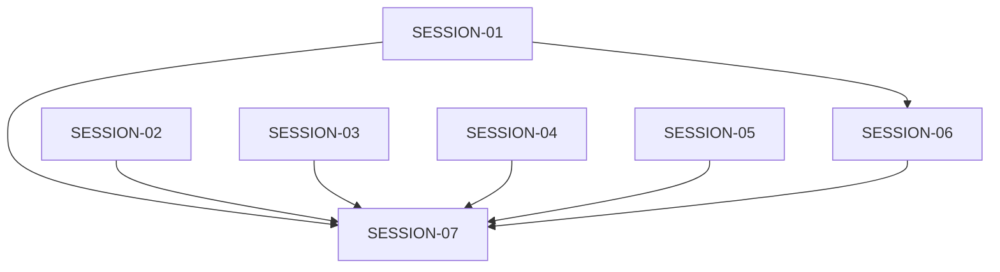

# STATE — Portrait Usability and Regression Repair

## Feature Status

| Field | Value |
|---|---|
| **Feature** | `portrait-usability-regression-repair` |
| **Status** | In Progress |
| **Started** | 2026-08-21 15:43 CDT |
| **Completed** | — |
| **Authoritative plan** | `./program/operator-s-descent/prompts/portrait-usability-regression-repair/MASTER.md` |

## Session Table

| Session | Status | Depends on | Checkpoint | Owns summary | Notes |
|---|---|---|---:|---|---|
| SESSION-01 | done | — | 3/3 | Combat/status DOM + unit tests | Removed status-strip collapse toggle; portrait combat feedback now lives on a screen-owned live-region rail between playfield and console; console opens once at 'half' and is never resized by playback or turn boundaries. |
| SESSION-02 | done | — | 3/3 | Viewport gestures + touch-flow test | Release-time gesture classification with a fixed origin, disqualified latch surviving pinch/cancel/lostpointercapture, and a live-canvas-derived post-wheel cell step for the phone drag proof. |
| SESSION-03 | done | — | 2/2 | RunState log policy + log tests | normalizePersistedEvent is now the single canonical boundary for persisted events; recordEvent strips detail, and load-time normalization filters legacy fat/rich entries so recentEvents on state is always slim {type, message, sequence?}. |
| SESSION-04 | pending | — | 0/2 | Title state + navigation E2E | Manual close restores START without history mutation. |
| SESSION-05 | blocked | — | 3/3 | Bus contracts + integration tests | Lease violation: checkpoint 1 commit `05af9ec` included `./README.MD` outside `Owns`; the committed user state was not altered or reverted by Jikijitsu. |
| SESSION-06 | pending | SESSION-01 | 0/4 | CSS/design/tooling + adaptive/combat E2E | In-flow responsive console, 96px touch floors, clean scan. |
| SESSION-07 | pending | SESSION-01–06 | 0/3 | New integrated acceptance specification | Geometry, screenshots, and full release checks. |

## Wave Plan

| Wave | Sessions | Resource notes |
|---|---|---|
| 1 | SESSION-01 ∥ SESSION-02 ∥ SESSION-05 | Disjoint writes; SESSION-02 alone holds `e2e:playwright`. |
| Browser queue | SESSION-03 → SESSION-04 → SESSION-06 | Serialized on `e2e:playwright`; SESSION-06 also depends on SESSION-01 and holds `design:scan`. |
| Final | SESSION-07 | Solo; exclusive full-suite, `e2e:playwright`, and `design:scan`. |

## Dependency Graph

## Design Decisions

1. Portrait combat uses an in-flow, bounded tray; no absolute bottom overlay and no dim layer.
2. Existing console state names and keyboard/touch mode switching remain compatible, but state names no longer imply percentage-of-frame heights.
3. All combat-critical status fields remain rendered. The status-collapse button and state store are removed.
4. Portrait move feedback is a dedicated live region outside the console scroller.
5. The canonical target floor is 96 CSS px for every touch-capable row at the phone, 1080 portrait, and 1024 touch-wide layouts. Density comes from bounded scrollers and compact noninteractive content, not smaller controls.
6. The persisted event boundary is the single source of truth for stripping rich log detail, including on load of older payloads.
7. Title route state resets locally on `ui:manual-close`; the manual remains a modal, not a route.
8. Screenshot evidence supplements, but never replaces, rectangle and hit-target assertions.

## Baseline Receipts

- `npm test`: 2742 passed / 1 failed (`--hp` palette mismatch).
- `npm run design:scan`: 0 errors / 12 warnings / 2 informational findings.
- Focused Playwright: 77 passed / 13 failed / 91 skipped.
- Pre-existing workspace state outside every lease: `./README.MD` is staged as an empty addition and has later unstaged content; `./.DS_Store` files are untracked/ignored.

## Handoff Notes

### SESSION-01

- **Completed:** 2026-08-21
- **Notes (verbatim):** Removed status-strip collapse toggle; portrait combat feedback now lives on a screen-owned live-region rail between playfield and console; console opens once at 'half' and is never resized by playback or turn boundaries.
- **Follow-up (verbatim):** DOM/class contract for SESSION-06 to consume: (a) portrait feedback rail is `
` between playfield and console; children `
` and `
`, each shown by clearing `hidden` when text is present. (b) Portrait status-strip no longer emits any `.status-collapsed` class — density styling must come from CSS/layout, not JS hide. (c) Wide dock renders `combat-notice`/`combat-error` before `combat-actions` and `combat-targets` inside `.wide-console-content-body` (portrait has zero of these testids). (d) Portrait playfield no longer sets `style.marginBottom = '96px'`; the console is now a bounded in-flow tray and the rail sits directly below the playfield.

### SESSION-02

- **Completed:** 2026-08-21
- **Notes (verbatim):** Release-time gesture classification with a fixed origin, disqualified latch surviving pinch/cancel/lostpointercapture, and a live-canvas-derived post-wheel cell step for the phone drag proof.
- **Follow-up (verbatim):** SESSION-06 owns the documented 96px touch-row floor and its geometry assertions; the touch-flow E2E's `>= 48` visible-row guard is deliberately retained per checkpoint-3 instruction as an interim baseline for that session to raise. `tapCoordForCell` in ./tests/e2e/touch-flow.spec.js still duplicates ENTRY_CELL_PX=40 from ./src/ui/screens/exploration.js DEFAULT_ENTRY_CELL_PX — if that entry-zoom constant ever changes, this helper (and the new postWheelCellStepPx) needs the same knob.

### SESSION-05

- **Blocked:** 2026-08-21
- **Reason:** Lease violation: checkpoint 1 commit `05af9ec` included `./README.MD` outside `Owns`; the committed user state was not altered or reverted by Jikijitsu.
- **Notes (verbatim):** SETTING_KEYS gained 'masterVolume' and EVENT_CONTRACTS gained state:inventory-change with hasRunState; three test files pin the live paths.
- **Follow-up (verbatim):** The MU.md 'explicit pathspec, lease only' precept is easier to enforce with `git commit -m … -- <paths>` than with `git add -- <paths> && git commit` when the workspace has pre-existing staged files; consider tightening that guidance for future sessions. If SESSION-06 or SESSION-07 needs to also register a bus contract for a new event, follow the state:inventory-change pattern (add to EVENT_CONTRACTS + document the payload shape + assert in state/bus.test.js).

### SESSION-03

- **Completed:** 2026-08-21
- **Notes (verbatim):** normalizePersistedEvent is now the single canonical boundary for persisted events; recordEvent strips detail, and load-time normalization filters legacy fat/rich entries so recentEvents on state is always slim {type, message, sequence?}.
- **Follow-up (verbatim):** The load-time sanitizer is deliberately lenient per-entry (drop-and-continue) so Custom Rule 13 corpora keep decoding; if a future session ever wants strict per-entry rejection on load, it must first freeze a new symbol-table snapshot and re-encode the affected v4 fixtures with well-formed events. The persisted boundary is now the ONLY place that guarantees slim events — runtime.js's appendRuntimeLogEntry still hands the full payload (with detail/entry/timestamp) to currentRunState.recordEvent, and that is fine because recordEvent applies the sanitizer; no runtime edit was required (as the session explicitly noted).
