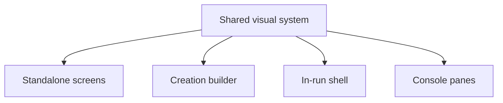

# State Tracker — Operator's Descent / prod-ui-mock-parity

## Program / Feature / Intent / Sessions

- **Program:** Operator's Descent (`operator-s-descent`)
- **Feature:** `prod-ui-mock-parity`
- **Intent:** Bring the production UI back into visual parity with `./mocks/*.html` after the user reported that the production UI is far off from the mocks.
- **Config:** `./program/operator-s-descent/FORGE-CONFIG.md` exists and is authoritative.
- **Current evidence:** `npm run design:scan -- --json` passes with `0` errors but reports `73` warnings, mostly missing mock class parity and touch-target warnings. `npm run parity:shots -- --all` completed using the current harness and wrote images under `./program/operator-s-descent/prompts/visual-parity-v3/shots`, but SESSION-01 must fix the harness because it compares mock and production at different viewport sizes.
- **Sessions:** 5 sessions. Split by file ownership, not by effort.

## Session Status

| # | Session | Modules | Owns | Status | Checkpoint | Completed | Notes |
|---|---------|---------|------|--------|------------|-----------|-------|
| 01 | Shared Visual System and Parity Harness | M56, M77, M78, M79, M97, M99 | `./styles/base.css`, `./styles/components.css`, `./styles/crt.css`, `./src/ui/components.js`, `./scripts/screenshot-parity.js`, `./tests/ui/components.test.js`, `./tests/tooling/check-mock-parity.test.js` | done | 4/4 | 2026-08-13 | Fixed parity capture dimensions/reporting, aligned shared frame and CRT styling, and reduced mock-class warnings from 73 to 2 intentional deployment markers. Follow-up: SESSION-02 standalone spacing/overflow; SESSION-03 creation density; SESSION-04 in-run proportions; SESSION-05 console pane alignment. |
| 02 | Standalone Screens Match Mocks | M68, M72, M73, M74, M75, M76 | `./src/ui/screens/title.js`, `./src/ui/screens/library.js`, `./src/ui/screens/scorecard.js`, `./src/ui/screens/import.js`, `./src/ui/screens/tutorial.js`, `./src/ui/screens/settings.js`, `./tests/ui/front-door.test.js`, `./tests/ui/persistence-screens.test.js` | done | 4/4 | 2026-08-13 | Aligned all six standalone screens with mock composition, fixed title branching, and preserved persistence/import/settings behavior. Follow-up: scorecard DOM/tests are aligned, but production screenshot route needs harness support for scorecard state. |
| 03 | Creation Builder Mock Parity | M69, M92 | `./src/ui/screens/creation.js`, `./tests/ui/creation-screen.test.js` | pending | — | Runs after S01; disjoint from S02/S04/S05. |
| 04 | In-Run Viewport, Status, and Combat Shell Parity | M58, M59, M70, M71 | `./src/ui/playfield.js`, `./src/ui/status-strip.js`, `./src/ui/screens/exploration.js`, `./src/ui/screens/combat.js`, `./tests/ui/playfield.test.js`, `./tests/ui/status-strip.test.js`, `./tests/ui/exploration-screen.test.js`, `./tests/ui/combat-screen.test.js` | done | 5/5 | 2026-08-13 | Aligned exploration/combat status groups, shell composition, canvas sizing, fog textures, markers, initiative rail, and targeting overlays with the mocks. Follow-up: future harness update should provide deterministic combat state and transient exploration-alert capture. |
| 05 | Console Shell and Mode Pane Parity | M60–M67 | `./src/ui/console/console.js`, `./src/ui/console/move.js`, `./src/ui/console/combat.js`, `./src/ui/console/party.js`, `./src/ui/console/gear.js`, `./src/ui/console/tech.js`, `./src/ui/console/loot.js`, `./src/ui/console/log.js`, `./tests/ui/console.test.js`, `./tests/ui/party-gear.test.js`, `./tests/ui/tech-loot-log.test.js` | done | 5/5 | 2026-08-13 | Aligned the seven-mode console shell and all mode panes with mock composition while preserving movement, combat, equipment, protocol, loot, junk, and sharing behavior. Follow-up: future parity-harness work should provide populated fixtures for LOOT/combat and map MOVE to `./mocks/exploration.html`. |

## Wave Plan

| Wave | Sessions | Why concurrent |
|------|----------|----------------|
| 1 | SESSION-01 | Owns shared CSS/components/tooling that every downstream session reads; must land first. |
| 2 | SESSION-02, SESSION-03, SESSION-04, SESSION-05 | Owns are disjoint: standalone screens, creation screen, in-run shell, and console folder/tests. All depend only on shared visual contracts from SESSION-01. `parity:shots` is an exclusive resource, so screenshot commands may serialize even while file leases remain disjoint. |

## Dependency Graph



## Architecture Reference (feature-specific only; full config in `./program/operator-s-descent/FORGE-CONFIG.md`)

- Production remains buildless vanilla ES modules and hand-written CSS.
- Do not copy Tailwind/CDN usage from mocks; translate mock intent into `./styles/*.css` and semantic DOM classes.
- The portrait frame remains fixed-aspect and letterboxed. Any scroll happens inside in-frame containers such as `.screen-body`.
- The console remains the single gameplay input surface; no map tapping or floating panels.
- Visual glitch stays constant and author-time configured; no game-state-driven visual glitch intensity.
- Parity screenshots are required evidence, but the harness must use equivalent mock/prod capture dimensions before judgments are made.

## Scope Summary (modules affected, indexed by ID)

| Module ID | Scope |
|-----------|-------|
| M56 | Shared UI factory classes and scroll-body helpers. |
| M58 | Canvas playfield visual tuning. |
| M59 | Status-strip DOM/readout parity. |
| M60–M67 | Console shell and seven mode panes. |
| M68–M76 | Screens: title, creation, exploration, combat, library, scorecard, import, tutorial, settings. |
| M77–M79 | Base/CRT/components CSS visual system. |
| M97 | Design scanner expectations for mock class parity. |
| M99 | Screenshot parity capture/report tooling. |

## Design Decisions (choice + rationale)

1. **Fix the harness first.** The current parity tool compares mock/prod at different viewport sizes; downstream visual work should not chase distorted screenshots.
2. **One shared visual session.** `./styles/components.css` is shared by almost every screen; all CSS edits belong in SESSION-01 to avoid cross-session merge conflicts.
3. **Screens split by file ownership.** Standalone screens, creation, in-run shell, and console panes have disjoint write sets after shared CSS lands, so they can run in the same wave.
4. **No verification-only session.** Each session verifies its own screens; no separate final audit session is generated.
5. **Scanner warnings are not automatically blockers.** Mock classes can be intentionally supported, aliased, or documented as mock-only utilities; SESSION-01 decides centrally.

## Handoff Notes (Jikijitsu writes here after each session — from Mu's handoff JSON, verbatim)

### SESSION-01 — done — 2026-08-13

**Jikijitsu receive note:** full git log shows checkpoint 4 (`d6d970b`) as an empty checkpoint commit for the baseline-capture checkpoint; accepted after human correction. Path-limited lease log shows source-changing checkpoints 1–3.

```json
{
  "session": "01",
  "status": "done",
  "checkpoint": 4,
  "notes": "Fixed parity capture dimensions/reporting, aligned shared frame and CRT styling, and reduced mock-class warnings from 73 to 2 intentional deployment markers.",
  "delivered": "Added shared 600x900 mock/production capture with configurable viewport/output directory and JSON reporting; aligned CRT layers, controls, shared selectors, factories, and component contract tests; captured all 15 parity pairs.",
  "verification": "Syntax passed; targeted tests: 6/6 passed; design scan: 0 errors, 10 warnings; parity capture: 15/15 ready under ./program/operator-s-descent/prompts/prod-ui-mock-parity/shots; full Vitest: 1768 passed, 1 pre-existing token-registration failure.",
  "surprises": "Full Vitest still fails because five previously introduced scroll tokens in ./styles/base.css are absent from ./specs/design.md, which is outside this lease. Remaining scan warnings are those five tokens, three existing non-interactive min-height findings, and two intentional mock-generated deploy-p/deploy-e markers.",
  "followUp": "SESSION-02 should address title/standalone-screen spacing and overflow; SESSION-03 creation density and structure; SESSION-04 exploration playfield/status/console proportions; SESSION-05 console pane content and alignment. Mock frames render 450x800 while production frames render 506x900 at the shared 600x900 viewport; the report now exposes this natural-size difference.",
  "filesTouched": [
    "./styles/base.css",
    "./styles/components.css",
    "./styles/crt.css",
    "./src/ui/components.js",
    "./scripts/screenshot-parity.js",
    "./tests/ui/components.test.js",
    "./tests/tooling/check-mock-parity.test.js"
  ],
  "blockedReason": null
}
```

### SESSION-02 — done — 2026-08-13

```json
{
  "session": "02",
  "status": "done",
  "checkpoint": 4,
  "notes": "Aligned all six standalone screens with mock composition, fixed title branching, and preserved persistence/import/settings behavior.",
  "delivered": "Rebuilt title, library, scorecard, import, tutorial, and settings layouts using shared panels and scroll bodies; added scorecard library navigation, dead-roster styling, named import states, and structural tests.",
  "verification": "Syntax passed; targeted Vitest: 9/9 passed; design scan: 0 errors, 10 warnings; parity shots: 6/6 generated and inspected; full Vitest: 1767/1768 passed with one pre-existing token-registration failure.",
  "surprises": "Full Vitest still fails because five SESSION-01 scroll tokens in ./styles/base.css are absent from ./specs/design.md, both outside this lease. The scorecard parity harness captures the production title instead of a populated scorecard, while its mock side renders correctly.",
  "followUp": "Standalone title, library, import, tutorial, and settings compositions are visually aligned. Scorecard DOM/tests are aligned, but its production screenshot route needs harness support for scorecard state.",
  "filesTouched": [
    "./src/ui/screens/title.js",
    "./src/ui/screens/library.js",
    "./src/ui/screens/scorecard.js",
    "./src/ui/screens/import.js",
    "./src/ui/screens/tutorial.js",
    "./src/ui/screens/settings.js",
    "./tests/ui/front-door.test.js",
    "./tests/ui/persistence-screens.test.js"
  ],
  "blockedReason": null
}
```

### SESSION-04 — done — 2026-08-13

```json
{
  "session": "04",
  "status": "done",
  "checkpoint": 5,
  "notes": "Aligned exploration/combat status groups, shell composition, canvas sizing, fog textures, markers, initiative rail, and targeting overlays with the mocks.",
  "delivered": "Built grouped exploration and combat status readouts; fixed bottom-console playfield regions; tuned 20×32 exploration and 8×16 combat canvas rendering; preserved combat actions, targeting, movement, saves, and read-only canvas behavior.",
  "verification": "Targeted UI: 21/21 passed; runtime and sigil regression: 29/29 passed; design scan: 0 errors, 10 warnings; full Vitest: 1771/1772 passed with one pre-existing token-registration failure; exploration and combat parity shots generated on port 8082.",
  "surprises": "Combat parity capture still shows production exploration because the read-only parity harness does not successfully enter combat. Exploration intentionally starts with its alert hidden and console collapsed, unlike the mock's visible alert and expanded console. Remaining design warnings and full-suite token failure are outside this lease.",
  "followUp": "SESSION-05 should complete console-pane alignment. A future harness update should provide deterministic combat state and optionally expose transient exploration-alert capture.",
  "filesTouched": [
    "./src/ui/playfield.js",
    "./src/ui/status-strip.js",
    "./src/ui/screens/exploration.js",
    "./src/ui/screens/combat.js",
    "./tests/ui/playfield.test.js",
    "./tests/ui/status-strip.test.js",
    "./tests/ui/exploration-screen.test.js",
    "./tests/ui/combat-screen.test.js"
  ],
  "blockedReason": null
}
```

### SESSION-05 — done — 2026-08-13

**Jikijitsu receive note:** full git log shows checkpoint 5 (`0a4aae3`) as an empty sweep checkpoint; path-limited lease log shows source-changing checkpoints 1–4. Accepted after prior human correction that empty checkpoint commits count.

```json
{
  "session": "05",
  "status": "done",
  "checkpoint": 5,
  "notes": "Aligned the seven-mode console shell and all mode panes with mock composition while preserving movement, combat, equipment, protocol, loot, junk, and sharing behavior.",
  "delivered": "Added accessible shell state semantics, mock-aligned pane headings and groupings, corrected combat direction layout, target range/cover previews, timestamped log rows, share panel presentation, and expanded structural coverage.",
  "verification": "Syntax checks passed; targeted Vitest: 19/19 passed; design scan: 0 errors and 10 warnings; six requested parity screenshots generated and inspected; full Vitest: 1771/1772 passed.",
  "surprises": "Full Vitest retains one pre-existing failure because five scroll tokens in ./styles/base.css are absent from ./specs/design.md, both outside this lease. The parity harness maps console-move to ./mocks/console-log.html, cannot activate LOOT with its generated fixture, and does not initiate combat for the combat capture, limiting direct visual comparison for those states.",
  "followUp": "Console PARTY, GEAR, TECH, and LOG compositions align structurally with their mocks. Future parity-harness work should provide populated fixtures for LOOT and combat and map MOVE to ./mocks/exploration.html.",
  "filesTouched": [
    "./src/ui/console/console.js",
    "./src/ui/console/move.js",
    "./src/ui/console/combat.js",
    "./src/ui/console/party.js",
    "./src/ui/console/gear.js",
    "./src/ui/console/tech.js",
    "./src/ui/console/loot.js",
    "./src/ui/console/log.js",
    "./tests/ui/console.test.js",
    "./tests/ui/party-gear.test.js",
    "./tests/ui/tech-loot-log.test.js"
  ],
  "blockedReason": null
}
```
