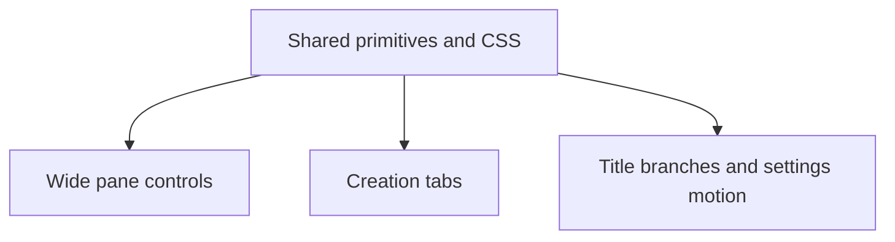

# State Tracker — Operator's Descent / shared-menu-primitives

## Program / Feature / Intent / Sessions

| Field | Value |
|-------|-------|
| **Program** | Operator's Descent (`operator-s-descent`) |
| **Feature** | shared-menu-primitives |
| **Intent** | Add a small DOM-native menu/action primitive layer and safely consolidate creation tabs, title branches, settings motion options, and wide pane collapse controls without changing visual, ARIA, keyboard, touch, test, or mock contracts. |
| **Sessions** | 4 |
| **Authoritative config** | `./program/operator-s-descent/FORGE-CONFIG.md` |
| **Plan directory** | `./program/operator-s-descent/prompts/shared-menu-primitives/` |

## Session Status

| # | Session | Modules | Owns | Status | Checkpoint | Completed | Notes |
|---|---------|---------|------|--------|------------|-----------|-------|
| 01 | Shared menu/action primitives and CSS contract | M56, M79, M101 | `./src/ui/components.js`, `./tests/ui/components.test.js`, `./styles/components.css`, `./styles/wide.css` | done | 4/4 | 2026-08-21 | Shared menu/action primitives and additive CSS contract complete. |
| 02 | Wide pane controls on the shared action grammar | M100, M95 | `./src/ui/layout.js`, `./tests/ui/layout.test.js` | done | 2/2 | 2026-08-21 | Wide pane collapse controls now use the shared action primitive. |
| 03 | Creation tablist through the shared tab primitive | M69, M95 | `./src/ui/screens/creation.js`, `./tests/ui/creation-screen.test.js` | done | 3/3 | 2026-08-21 | Creation tabs now use the shared tab primitive with lifecycle cleanup. |
| 04 | Title branches and settings motion group | M68, M76, M95 | `./src/ui/screens/title.js`, `./src/ui/screens/settings.js`, `./tests/ui/front-door.test.js` | done | 3/3 | 2026-08-21 | Title branches and settings motion group consolidated across portrait and wide layouts. |

## Wave Plan

| Wave | Sessions | Why concurrent |
|------|----------|----------------|
| 1 | SESSION-01 | The shared exported API and CSS classes must land before consumer sessions. |
| 2 | SESSION-02, SESSION-03, SESSION-04 | Dependencies are satisfied and the literal write sets are disjoint: layout, creation, and title/settings. Each reads the foundation but none writes it. |
| Final gate | No session | Run the complete focused unit command, the three requested e2e files, `npm run design:scan`, and `npm run parity:shots` after all implementation leases; a verification-only session is intentionally not generated. |

## Dependency Graph



## Architecture Reference (feature-specific)

- **M56 / public API:** `./src/ui/components.js` gains `createMenuAction`, `createMenuGroup`, and `createTabGroup`. The existing `createButton` signature and DOM contract remain backward-compatible. Actions expose cleanup; groups expose child lookup/state and aggregate cleanup.
- **Dependency flow:** M100, M69, M68, and M76 import M56 only. No consumer imports another consumer. M60/M57 remain read-only compatibility references.
- **M79/M101 CSS:** `.menu-action` and `.menu-group` are additive hooks. Existing surface classes remain authoritative for layout and visual state; wide rules remain in the existing media block.
- **Semantics:** creation remains tablist/tabpanel; settings remains radiogroup/radio; title START gains disclosure/focus state only where it does not disturb modal focus recovery; pane controls remain native buttons with the same labels and test IDs.
- **Architecture ownership:** Mu sessions must not own `./program/operator-s-descent/arch/ui.md`. Jikijitsu records the final M56 contract and any M68/M69/M76/M100 public-surface changes there from handoff notes.

## Scope Summary (modules affected, indexed by ID)

| ID | Module | Read/Write | Feature impact |
|----|--------|------------|----------------|
| M56 | UI Components | write in SESSION-01 | Shared action/group/tab factories, title/icon/ARIA/state/cleanup behavior. |
| M79 | Components CSS | write in SESSION-01 | Additive menu/action state grammar; retain legacy selectors and touch floors. |
| M101 | Wide CSS | write in SESSION-01 | Narrow compatibility hook only; no pane/tab density changes. |
| M100 | Layout Controller | write in SESSION-02 | Collapse buttons use shared action grammar; pane state machine unchanged. |
| M69 | Creation Screen | write in SESSION-03 | Portrait tablist uses `createTabGroup`; panel/render behavior unchanged. |
| M68 | Title Screen | write in SESSION-04 | Both branch layouts use shared groups; START disclosure/focus improved. |
| M76 | Settings Screen | write in SESSION-04 | Motion options use shared radio/segmented group state and cleanup. |
| M57 | UI Input | read-only | Confirm native controls do not duplicate keyboard/touch binding. |
| M60 | Console Shell | read-only | `MODE_REGISTRY` and all mode/expand/shortcut contracts remain untouched. |
| M95 | Browser Acceptance | read-only | Existing adaptive, portrait-usability, and wide-pane specs are regression gates; no e2e lease. |
| M97 | Design Compliance Scanner | read-only | `npm run design:scan` is a checkpoint/final gate; no scanner session. |

## Design Decisions

1. **Four sessions, split by file ownership:** one shared API/CSS lease, then three disjoint consumer leases. The split is not an effort phase or a verification phase; each consumer session owns the files it changes and has implementation checkpoints.
2. **Native action construction:** factor the existing `createButton` internals rather than creating a parallel DOM grammar. `createMenuAction` accepts an explicit style class so `.btn-crt` is not forced onto `.tab-btn` or `.pane-collapse-btn`.
3. **Small stateful return contract:** individual actions have idempotent cleanup and state update; groups expose actions by stable ID and aggregate cleanup. This lets settings update selected radio state without manually duplicating ARIA mutations.
4. **Compatibility-first CSS:** add `.menu-action`/`.menu-group` and shared state selectors, but retain `.mode-tab`, `.wide-mode-tab`, `.tab-btn`, `.branch-list`, `.motion-options`, and `.pane-collapse-btn`. No broad visual rewrite or touch-floor change is authorized.
5. **Console is out of scope:** `MODE_REGISTRY` is already the correct source of truth. Console tests run as a regression gate, but no console source lease exists.
6. **START disclosure is the bounded accessibility improvement:** add `aria-expanded`/`aria-controls`, focus the first revealed branch, and preserve `ui:manual-close` focus restoration to START. Do not redesign the title navigation model.
7. **No test camouflage:** existing e2e specs, mocks, `./service-worker.js`, `./.DS_Store`, and `./.envelope-server.pid` are not owned. Failures are fixed in the implementation lease or recorded as a concrete block.

## Handoff Notes (Jikijitsu writes here after each session — from Mu's handoff JSON, verbatim)

### SESSION-01

```json
{"session":"01","status":"done","checkpoint":4,"notes":"Shared menu/action primitives and additive CSS contract complete.","delivered":"Added createMenuAction, createMenuGroup, and createTabGroup with ARIA state, stable test IDs, icons, state updates, lookup, and idempotent cleanup. Added additive menu CSS hooks while preserving legacy selectors and touch floors.","verification":"76 tests passed; npm run design:scan passed with 2 informational findings and 0 errors; git diff --check passed.","surprises":"Untracked .DS_Store remains outside the lease. console.js and input.js were read-only compatibility references.","followUp":"Consumer sessions should use getAction(id), setItemState(id, state), and tab onSelect(id, event, item).","filesTouched":["./src/ui/components.js","./tests/ui/components.test.js","./styles/components.css","./styles/wide.css"],"blockedReason":null}
```

### SESSION-02

```json
{"session":"02","status":"done","checkpoint":2,"notes":"Wide pane collapse controls now use the shared action primitive.","delivered":"Refactored both collapse buttons to createMenuAction while preserving native button semantics, labels, classes, test IDs, append order, pane state, persistence, and cleanup.","verification":"83 focused unit tests passed; wide-panes e2e: 10 passed, 30 skipped; git diff --check and syntax check passed.","surprises":"A pre-staged deletion outside the lease was included in checkpoint 1 commit: ./program/operator-s-descent/prompts/icon-first-ui-density/STATE.md. Concurrent creation-session changes were observed outside the lease.","followUp":"No architecture fragment needed. Width bounds, data attributes, storage shape, visible arrows, child-tab auto-expand, and ./src/ui/input.js remain unchanged.","filesTouched":["./src/ui/layout.js","./tests/ui/layout.test.js","./program/operator-s-descent/prompts/icon-first-ui-density/STATE.md"],"blockedReason":null}
```

### SESSION-03

```json
{"session":"03","status":"done","checkpoint":3,"notes":"Creation tabs now use the shared tab primitive with lifecycle cleanup.","delivered":"Refactored portrait creation tabs to createTabGroup, preserving classes, ARIA, IDs, labels, panel targets, and layout styling. Added cleanup on rerender/unmount and regression tests.","verification":"105 focused unit tests passed; design scan passed with 0 errors; visual captures inspected for portrait and wide layouts; e2e: 48 passed, 2 unrelated wide touch-floor failures, 82 skipped.","surprises":"Concurrent changes exist outside lease in settings/title/front-door tests and untracked .DS_Store; left untouched. E2E failures were outside this lease.","followUp":"Wide creation markup and console behavior intentionally unchanged.","filesTouched":["./src/ui/screens/creation.js","./tests/ui/creation-screen.test.js"],"blockedReason":null,"layoutClasses":["portrait","wide"],"evidence":[{"shot":"creation-portrait.png","note":"Tab strip remains contained with six controls, active underline, and no overlap."},{"shot":"creation-wide.png","note":"Wide creation surface remains unchanged and visually stable."}],"a11yNotes":"Native tablist/tab/tabpanel semantics, aria-selected, aria-controls, labels, and idempotent listener cleanup preserved."}
```

### SESSION-04

```json
{"session":"04","status":"done","checkpoint":3,"notes":"Title branches and settings motion group consolidated across portrait and wide layouts.","delivered":"Shared menu groups now render title branches and settings motion options with preserved labels, test IDs, routes, icons, ARIA state, cleanup, START disclosure/focus behavior, and 44px BACK target.","verification":"71 focused unit tests passed; 50 e2e tests passed, 82 skipped by project selection; design scan passed with 0 errors; git diff --check passed.","surprises":"Untracked .DS_Store remains outside the lease.","followUp":"No architecture fragment needed. Visual captures for portrait and wide title/branches/settings were inspected; focus and radiogroup state verified.","filesTouched":["./src/ui/screens/title.js","./src/ui/screens/settings.js","./tests/ui/front-door.test.js"],"blockedReason":null,"layoutClasses":["portrait","wide"],"evidence":[{"shot":"/tmp/session04-portrait-branches.png","note":"Portrait title branches render with preserved hierarchy, spacing, icons, and secondary row."},{"shot":"/tmp/session04-wide-branches.png","note":"Wide title branch composition preserves centered primary stack and secondary flex row."},{"shot":"/tmp/session04-wide-settings.png","note":"Wide settings columns, 96px motion rows, radio group, and BACK target render without overlap."}],"a11yNotes":"START exposes aria-controls/aria-expanded and focuses the first revealed branch; motion options expose radiogroup/radio semantics with synchronized aria-selected, aria-checked, and aria-pressed state."}
```
