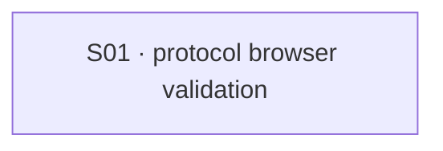

# State Tracker — Operator's Descent / tech-protocol-e2e-validation

## Program / Feature / Intent / Sessions

- **Program:** Operator's Descent (`operator-s-descent`)
- **Feature:** `tech-protocol-e2e-validation`
- **Intent:** Create browser-level, data-driven behavioral validation for every TECH protocol through the real import, TECH, target, and confirm flows — **tests only, with no product repair**.
- **Sessions:** 1
- **Authoritative config:** `./program/operator-s-descent/FORGE-CONFIG.md` (existing; reused without override)

## Session Status

| # | Session | Modules | Owns | Status | Checkpoint | Completed | Notes |
|---|---|---|---|---|---|---|---|
| 01 | Build the 20-protocol browser validation matrix | M07, M20, M24, M33, M65, M71, M86, M95 | `./tests/helpers/tech-protocol-e2e-fixture.js`, `./tests/e2e/tech-protocols.spec.js` | done | 3/3 | 2026-08-23 | Added the deterministic 20-protocol real-browser TECH validation matrix; no production repair performed. |

## Wave Plan

| Wave | Sessions | Why serial |
|---|---|---|
| 1 | SESSION-01 | The legal fixture builder and its 20-case browser matrix share one test contract and one small write lease; splitting them would create unnecessary coordination risk. |

## Dependency Graph

## Architecture Reference

- **Catalog source of truth:** `./data/protocols.json` supplies all 20 protocol identities, schools, tiers, cost, and card content. `./specs/requirements.md` supplies the authoritative effect contract.
- **Fixture boundary:** `./tests/helpers/tech-protocol-e2e-fixture.js` composes legal, deterministic active-combat run state using the existing fixture utilities, then encodes it before page navigation. Every fragment must round-trip and remain below 1500 characters.
- **Real user path:** each case must import via the actual URL/import screen, resume the run, select TECH, select the rendered protocol, choose a rendered target when necessary, and use the rendered confirm action.
- **Observation boundary:** DOM is the primary assertion surface. `./src/runtime.js` may be queried only as a read-only post-action observer; browser tests may not mutate runtime state, call rule functions, dispatch gameplay events, or write storage after navigation.
- **Baseline policy:** `TECH_PROTOCOL_STRICT=1` exposes raw contract failures. Normal-mode `test.fail(...)` annotations are permitted only for confirmed product defects and must become XPASS failures when behavior begins working.
- **Repair policy:** no production/data/style/config/dependency/documentation repair is in scope for this feature. A future feature may use the strict failure matrix as input.

## Scope Summary

| ID | Module | Scope in this feature |
|---|---|---|
| M07 | Protocols Data | Read-only authored catalog source. |
| M20 | Protocols Rules | Read-only expected-effect reference; never invoked from browser tests. |
| M24 | Combat Rules | Read-only fixture and durable-outcome reference. |
| M33 | Run State | Read-only persistent active-combat shape and codec compatibility reference. |
| M65 | Console Tech | Read-only real UI surface exercised by the matrix. |
| M71 | Combat Screen | Read-only real resume/combat-state surface exercised by the matrix. |
| M86 | Hot Runtime | Read-only diagnostic snapshot observer after UI interaction. |
| M95 | Browser Acceptance | Owns the two new data-driven test artifacts. |

## Design Decisions

1. **Exhaustive rather than sampled:** the matrix has one independently named workflow for each of the 20 catalog protocols.
2. **Legal fixtures rather than mocks:** test state is constructed with the existing fixture helper, encoded, imported, and resumed like a user save.
3. **UI-only execution:** no direct rule invocation, event dispatch, storage write, or browser-state mutation may replace a user action.
4. **Strict behavior retained:** state outcomes, not merely result messages, establish correctness; strict mode is always the source baseline.
5. **XFAILs are evidence:** normal-mode expected failures represent only confirmed present product gaps and must XPASS after a future repair.
6. **Pointer and touch both matter:** run the matrix on `chromium-portrait` and `chromium-phone-touch`, then run the existing full browser regression suite.
7. **No repair this round:** only the two test files are allowed to change, even if a raw protocol gap is discovered.

## Handoff Notes

### SESSION-01 — completed 2026-08-23

- **Notes:** Added the deterministic 20-protocol real-browser TECH validation matrix; no production repair performed.
- **Delivered:** Created legal encoded combat fixtures and one named Playwright workflow each for DISRUPT/SPARK–OBLITERATE, WARD/PATCH–FORTRESS, SCRY/PING–ORACLE, and REWRITE/FLIP–REFORMAT.
- **Verification:** node --check both leased files passed; focused Vitest passed (53 tests); strict Chromium established TECH invalid-rng baseline failures; normal Chromium portrait and phone-touch SPARK runs passed as intentional XFAILs.
- **Surprises:** Confirmed product gap: TECH confirmation reports invalid-rng, leaving durable protocol effects and CHARGE/AP updates absent. All 20 cases are marked normal-mode XFAIL with strict mode preserving raw failures. Pre-existing untracked .DS_Store remained outside the lease.
- **Follow-up:** Repair the TECH console/runtime RNG cursor wiring, then remove each EXPECTED_BASELINE_FAILURES entry as its case XPASSes. Full 20-case desktop/touch and full browser regression runs remain the final post-repair gate.
- **Files touched:** `tests/helpers/tech-protocol-e2e-fixture.js`, `tests/e2e/tech-protocols.spec.js`
- **Checkpoint:** 3
