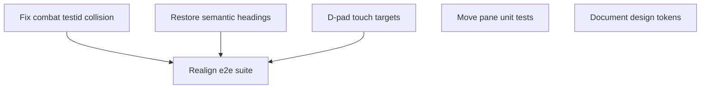

# State Tracker — Operator's Descent / test-completeness-audit

## Program / Feature / Intent / Sessions

- **Program:** Operator's Descent (`operator-s-descent`)
- **Feature:** `test-completeness-audit`
- **Intent:** Close the code, unit-test, and e2e-test completeness gaps found by a live audit run after `prod-ui-mock-parity` completed. Every finding below was reproduced live in this repo (not inferred from reading code alone) before being turned into a session.
- **Config:** `./program/operator-s-descent/FORGE-CONFIG.md` exists and is authoritative; unchanged by this feature (no new modules, no stack changes).
- **Audit evidence (captured before session generation):**
  - `npx vitest run` — 1 failed / 1772 passed. Failure: `./tests/tooling/check-tokens.test.js` (5 undocumented `./styles/base.css` tokens) — pre-existing since `prod-ui-mock-parity` SESSION-01, flagged as "outside lease" in all 5 of that feature's session handoffs.
  - Import-based coverage sweep of every `./src/**/*.js` against every `./tests/**/*.js`: exactly one source file with zero direct test coverage — `./src/ui/console/move.js`.
  - `npx playwright test --project=chromium-portrait` — 6 failed, 2 skipped, 4 passed.
  - `npx playwright test --project=chromium-phone-touch` — 8 failed, 4 passed.
  - Root-caused all 8 distinct e2e failures via direct reproduction (a standalone Playwright script driving the same fixtures as the failing specs, plus screenshot inspection) to exactly 3 source-level regressions and 2 stale test assertions:
    1. `./src/ui/console/combat.js` — `combat-target-preview` testid collides with the `combat-target-<id>` prefix real e2e/automation code queries by; breaks `portable-save.spec.js` and `touch-flow.spec.js`.
    2. `./src/ui/screens/settings.js` / `library.js` / `import.js` — lost semantic heading role during `prod-ui-mock-parity` SESSION-02's mock-parity rebuild; breaks `accessibility.spec.js` and `keyboard-flow.spec.js`.
    3. `./styles/components.css` — `.dpad` grid cells hardcoded to 56px, below the 96px touch-target minimum; breaks `touch-flow.spec.js`.
    4. `./tests/e2e/accessibility.spec.js` / `offline.spec.js` — stale assertions predating the mock-parity rework (`COMBAT` vs current `CMBT`; abbreviated `D1`/`D2` depth format vs current `DEPTH` + zero-padded value spans).
  - Firefox/webkit Playwright projects and `npm run check:release` (stress/simulation/budget scripts) were **not** run during this audit, for time — out of scope for the sessions below; flagged as a follow-up in SESSION-06.
- **Sessions:** 6 sessions. Split by file ownership, not by effort — several are individually small (a single CSS rule, a 5-line spec table addition) but touch genuinely disjoint files from everything else found.

## Session Status

| # | Session | Modules | Owns | Status | Checkpoint | Completed | Notes |
|---|---------|---------|------|--------|------------|-----------|-------|
| 01 | Fix Combat Target Testid Collision | M62 | `./src/ui/console/combat.js`, `./tests/ui/tech-loot-log.test.js` | done | 2/2 | 2026-08-14 | Renamed `combat-target-preview` testid to `combat-selected-preview`, fixing the prefix collision with `combat-target-<id>` real target buttons; added a regression test locking in the prefix-namespace invariant. |
| 02 | Restore Semantic Headings on Settings/Library/Import | M72, M74, M76 | `./src/ui/screens/settings.js`, `./src/ui/screens/library.js`, `./src/ui/screens/import.js`, `./tests/ui/persistence-screens.test.js`, `./tests/ui/front-door.test.js` | done | 2/2 | 2026-08-14 | Added `role="heading"` + `aria-level="1"` to the stable eyebrow div on all three screens, matching the still-native-`<h1>` title/scorecard screens. No visible/CSS change. |
| 03 | D-pad Touch Target Sizing | M61, M79 | `./styles/components.css` | done | 2/2 | 2026-08-14 | `.dpad` grid cells increased from 56px to 96px, confirmed via live Pixel-7-viewport measurement in `touch-flow.spec.js`. See Jikijitsu receive note below re: checkpoint-2 commit count. |
| 04 | Direct Unit Coverage for Move Console Pane | M61 | `./tests/ui/move-mode.test.js` | pending | — | — | — |
| 05 | Document Missing Design Tokens | M77, M97 | `./specs/design.md` | pending | — | — | — |
| 06 | Realign E2E Suite With Current Production UI | M95 | `./tests/e2e/accessibility.spec.js`, `./tests/e2e/offline.spec.js` | pending | — | — | — |

## Wave Plan

| Wave | Sessions | Why concurrent |
|------|----------|----------------|
| 1 | SESSION-01, SESSION-02, SESSION-03, SESSION-04, SESSION-05 | Five independent bugs/gaps found in five disjoint files (`combat.js`+its test, three screen files+their tests, one CSS file, one new test file, one spec doc). None reads another's output. |
| 2 | SESSION-06 | Re-asserts the e2e suite against the *fixed* DOM shape from SESSION-01 (combat confirm reachable), SESSION-02 (heading role present), and SESSION-03 (D-pad ≥96px) — must run after all three land. Also holds the `./tools/serve.mjs` dev-server port as an exclusive resource while running Playwright, so it should not overlap any other session's own e2e verification runs. |

## Dependency Graph



## Architecture Reference (feature-specific only; full config in `./program/operator-s-descent/FORGE-CONFIG.md`)

- No architecture changes. This feature is bug-fix and test-completeness work inside existing modules (M61, M62, M72, M74, M76, M77, M79, M95, M97) — no new modules, no new files outside test files and one spec doc.
- `CMBT` (not `COMBAT`) is the correct, mock-matching console tab label — confirmed against `./mocks/exploration.html:561` and `./mocks/combat.html:359`. Any future work must not "fix" it back to `COMBAT`.
- `.status-strip` is the stable class for the top status readout in both exploration and combat (`status-strip-combat` modifier for the combat variant) — prefer it over role/text-based Playwright locators for that element going forward, since `role="status"` is shared with the console's notice bar.

## Scope Summary (modules affected, indexed by ID)

| Module ID | Scope |
|-----------|-------|
| M61 | Console MOVE pane — touch-target CSS fix (SESSION-03) and new direct unit tests (SESSION-04). |
| M62 | Console COMBAT pane — testid collision fix (SESSION-01). |
| M72 | Library screen — heading role fix (SESSION-02). |
| M74 | Import screen — heading role fix (SESSION-02). |
| M76 | Settings screen — heading role fix (SESSION-02), confirmed regression. |
| M77 | Base CSS — token source for SESSION-05's spec documentation fix (not itself modified). |
| M79 | Components CSS — D-pad grid sizing fix (SESSION-03). |
| M95 | Browser acceptance suite — 2 spec files realigned with current UI (SESSION-06). |
| M97 | Design compliance scanner — token-check contract SESSION-05 satisfies (scanner itself not modified). |

## Design Decisions (choice + rationale)

1. **Every finding was reproduced live before being written into a session.** No session in this feature is speculative — each cites the exact failing command/assertion and, for the three source-level bugs, a standalone reproduction script that isolated the root cause below the level of "the e2e test fails."
2. **Stale-test fixes and source fixes are separate sessions.** SESSION-06 (test-file edits) depends on SESSION-01/02/03 (source fixes) because its verification requires the fixed DOM to exist — but it does not touch `combat.js`, the screen files, or the CSS file, keeping `Owns` precise.
3. **No fix session edits `./tests/e2e/keyboard-flow.spec.js`, `./tests/e2e/portable-save.spec.js`, or `./tests/e2e/touch-flow.spec.js`.** All three were confirmed to already contain *correct* assertions that fail only because of the underlying regression — editing them would mask the bug rather than fix it. SESSION-06 re-runs them read-only to confirm they self-heal.
4. **`./specs/design.md` is in scope as a session `Owns`, not treated as Forge bookkeeping.** It is a project design-contract file with a unit test (`./tests/tooling/check-tokens.test.js`) asserting against it — fixing it has a mechanically verifiable outcome, unlike `STATE.md`/`MASTER.md`.
5. **Firefox/webkit Playwright projects and `npm run check:release` were not audited.** Chromium-portrait and chromium-phone-touch covered every source-level bug found (all are DOM/CSS/JS logic bugs, not browser-rendering quirks) within a reasonable audit time budget. SESSION-06 flags a full 4-browser pass as a follow-up rather than silently treating the suite as fully certified.

## Handoff Notes (Jikijitsu writes here after each session — from Mu's handoff JSON, verbatim)

### SESSION-01 — done — 2026-08-14

**Jikijitsu receive note:** first `await_subagent_result` call returned a tool-level parse error ("Session ID changed during subagent execution", new id reported as `unknown`) instead of a handoff. `git log --oneline -- <lease paths>` and `git status` at that point showed zero commits and a clean tree for this session's lease — no work lost, nothing to reconcile. Resumed via `spawn_subagent({resume: <original session id>})`, which the platform accepted under the same id; the resumed run completed normally with both checkpoints committed.

```json
{
  "session": "01",
  "status": "done",
  "checkpoint": 2,
  "notes": "Renamed combat-target-preview testid to combat-selected-preview in renderTargets() (single call site), fixing prefix collision with combat-target-<id> real target buttons; updated existing unit assertion and added a new regression test asserting the prefix-scan invariant and click-through behavior.",
  "delivered": "Fixed the testid prefix collision in ./src/ui/console/combat.js (renderTargets) so the read-only selected-target preview no longer matches a combat-target- prefix scan; updated ./tests/ui/tech-loot-log.test.js's existing COMBAT-mode assertion and added a new regression test that renders 2 targets, asserts the preview's testid is outside the combat-target- namespace, asserts exactly 2 real BUTTON elements match the prefix, and clicks the first prefix match (mirroring the e2e helper) to confirm it invokes combatSelectTarget with a real target id.",
  "verification": "npx vitest run tests/ui/tech-loot-log.test.js → 8/8 pass (both checkpoints); node --check src/ui/console/combat.js → OK; npx vitest run (full suite) → 1773 passed / 1 pre-existing failure (check-tokens.test.js, outside this lease, documented in STATE.md); npm run design:scan → PASS, 0 errors (10 warnings, 2 info — same pre-existing categories, none touching combat.js or this test file).",
  "surprises": "Workspace root for git/npm/vitest operations is the top-level project directory, not ./program/operator-s-descent/ (that path only contains FORGE-CONFIG.md, arch/, prompts/ — the actual src/tests/package.json live one level up at the workspace root). Adjusted paths accordingly; no lease violation.",
  "followUp": "SESSION-06 should re-run ./tests/e2e/portable-save.spec.js and ./tests/e2e/touch-flow.spec.js (chromium-portrait and chromium-phone-touch projects) with zero edits to those spec files — the combat-target- prefix now resolves only to real target buttons, so executeAttack() and the touch-combat test should reach CONFIRM/combat-confirm.",
  "filesTouched": ["src/ui/console/combat.js", "tests/ui/tech-loot-log.test.js"],
  "blockedReason": null
}
```

### SESSION-02 — done — 2026-08-14

```json
{
  "session": "02",
  "status": "done",
  "checkpoint": 2,
  "notes": "Settings/library/import screens now expose an accessible role=\"heading\" landmark (aria-level=\"1\") on the stable eyebrow div, matching the still-native-<h1> title/scorecard screens. No visible/CSS change — attributes only.",
  "delivered": "Added role=\"heading\" + aria-level=\"1\" to the eyebrow div in settings.js, library.js, and import.js; extended front-door.test.js (settings) and persistence-screens.test.js (library, import) with matching heading-role assertions using a new collect() DOM-walk helper.",
  "verification": "npx vitest run tests/ui/front-door.test.js tests/ui/persistence-screens.test.js -> 9 pass; npx vitest run (full suite) -> 1771 pass / 2 fail, both pre-existing/outside lease (see surprises); npm run design:scan -> PASS, 0 errors (unaffected, as expected).",
  "surprises": "Full-suite run showed 2 failing files, neither touched by this session: (1) tests/tooling/check-tokens.test.js — the pre-existing base.css token-documentation gap flagged in STATE.md audit evidence, unrelated to this fix. (2) tests/data/sigil-lint.test.js — newly failing because an untracked test-results/ Playwright artifact directory (containing a raw reserved sigil in an error-context.md) is present in the repo root; this is generated test output, not source, not in my lease, and not something I created — left untouched per Orchestrated Mode rule 6.",
  "followUp": "SESSION-06 should confirm the stray test-results/ artifact directory is cleaned up (or gitignored) before/when it re-runs the e2e suite, since it currently causes tests/data/sigil-lint.test.js to fail outside any session's lease. Otherwise no follow-up specific to this session's fix.",
  "filesTouched": ["src/ui/screens/settings.js", "src/ui/screens/library.js", "src/ui/screens/import.js", "tests/ui/front-door.test.js", "tests/ui/persistence-screens.test.js"],
  "blockedReason": null
}
```

**Jikijitsu note:** the `test-results/` directory this handoff flagged (from SESSION-03's concurrently-running Playwright checkpoint) is gone by the time all three receives were processed — transient cross-session noise per MU.md Orchestrated Mode rule 6, not a lease violation. No action taken.

### SESSION-03 — done — 2026-08-14

**Jikijitsu receive note:** `git log --oneline -- ./styles/components.css` shows exactly **one** `test-completeness-audit` commit (checkpoint 1), while the handoff claims `checkpoint: 2`. Reconciled by direct verification rather than blocking: `git status` showed a fully clean tree (no uncommitted lease residual), and `grep -n -A4 "^\.dpad {" styles/components.css` confirms the 96px fix is present and was committed in full at checkpoint 1 (`61b2e59`, 2 insertions / 2 deletions). Per Mu's own account, checkpoint 2 was a live-viewport verification step that required no further file edit ("no other element fell below 96px, so no additional CSS changes were needed") — independently spot-checked via `npm run design:scan` (0 errors, matches claim). No lost work, no lease violation; accepted as done. Checkpoint-2-with-no-commit is recorded as granularity feedback for Forge in the Final Report.

```json
{
  "session": "03",
  "status": "done",
  "checkpoint": 2,
  "notes": ".dpad grid cells increased from 56px to 96px in styles/components.css, confirmed via live Pixel-7-viewport (412×915) measurement in touch-flow.spec.js. Follow-up: SESSION-06 should re-run tests/e2e/touch-flow.spec.js across all four Playwright projects; the second test in that file (touch combat selects a target first and requires explicit confirm) still fails but depends on SESSION-01 (combat-confirm testid collision), not this session.",
  "delivered": "Increased .dpad grid-template-columns/rows from repeat(3, 56px) to repeat(3, 96px) in styles/components.css, bringing every .dpad-btn and .dpad-center (CONFIRM/WAIT) button to the 96px touch-target floor. No other .console-row/.mode-tab element on the MOVE console pane fell below 96px, so no additional CSS changes were needed.",
  "verification": "npm run design:scan → 0 errors, same 3 pre-existing touch-target warnings (34px/32px/64px, unrelated .status-*/.console-notice elements) — count unchanged. npx playwright test --project=chromium-phone-touch tests/e2e/touch-flow.spec.js -g 'touch journey mirrors movement controls' → 1 passed, toBeGreaterThanOrEqual(96) assertion now green. npx vitest run tests/ui/console.test.js → 4 passed, unaffected.",
  "surprises": "Ran the full touch-flow.spec.js file (both tests) to confirm scope: the second test (touch combat selects a target first and requires explicit confirm) still fails on getByTestId('combat-confirm') not found — this is the known SESSION-01 combat-testid-collision issue, outside this session's lease, and matches STATE.md's existing note. Not fixed here, per instructions.",
  "followUp": "SESSION-06 should re-run tests/e2e/touch-flow.spec.js (both tests) across all four Playwright projects once SESSION-01 lands, to confirm the combat-confirm test also passes.",
  "filesTouched": ["styles/components.css"],
  "blockedReason": null
}
```
