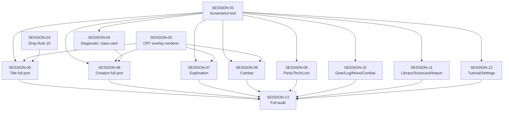

# State Tracker — Operator's Descent / visual-parity-v2

## Program

Operator's Descent (`operator-s-descent`) — buildless vanilla-JS browser roguelike. Root: `./program/operator-s-descent/`.

## Feature

**visual-parity-v2** — a corrective re-do of `visual-parity-pass`. That feature closed 21 design-scan warnings but the running app still diverges catastrophically from `./mocks/*.html`. Root causes: (1) the `<div id="crt-overlays">` in `./index.html` is never populated with the ten CRT layer divs defined in `./styles/crt.css`, (2) a two-state title architecture (cold shell → activated) exists to satisfy Custom Rule 10 but the mock only depicts one state, (3) class-card / sigil-choice regressions in creation.js persist despite the prior fix. This feature drops Rule 10, wires the CRT overlay renderer, ports each screen to full mock fidelity, and introduces a Playwright-driven screenshot-parity tool as the verification gate — because the design-scan gate demonstrably permitted invisible bugs.

## Intent

Three concurrent problems:

1. **Wiring gap** — CSS exists, DOM doesn't. Fix by building M98 CRT Overlay Renderer and mounting it on cold-shell activation.
2. **Architecture change** — kill Rule 10, collapse title to a single state whose START toggles the branch list (mock behavior).
3. **Screen-by-screen visual parity** — every screen re-rendered against its mock with a real screenshot-diff verification gate (M99 Screenshot Parity Tool).

**Not in scope:** new gameplay features (deployment phase, hidden-branch easter egg, alert-banner UI). Those remain user product decisions carried over from the prior feature's Deferred list.

## Baseline (captured before Session 1)

- `npm run design:scan` → **85 findings, 0 errors, 83 warnings, 2 info** (from prior feature's SESSION-13).
- `npx vitest run` → **1768/1768 passing** (77 files).
- `npx playwright test` → **40 passed, 8 skipped**.
- **Visual baseline: catastrophic.** Three user-captured screenshots (2026-08-12) confirm the cold shell, activated title, and creation-screen class picker do not match their mocks.

## Sessions

13 sessions in 4 phases:

- **Phase 1 (Foundation):** SESSION-01 (screenshot tool), SESSION-02 (CRT overlay renderer), SESSION-03 (drop Rule 10, collapse title router)
- **Phase 2 (Diagnostic):** SESSION-04 (class-card regression root cause + fix)
- **Phase 3 (Screen ports):** SESSION-05 through SESSION-12 — one or two screens each, each verified with M99
- **Phase 4 (Wrap):** SESSION-13 (full-matrix parity audit + regressions + final report)

## Session Status

| # | Session | Modules | Status | Completed | Notes |
|---|---------|---------|--------|-----------|-------|
| 1 | Build screenshot-parity tool (Playwright, side-by-side mock↔prod PNGs) | M99 (new), M95 | done | 2026-08-12 | Tool works end-to-end; title screenshot captured. M98/M99 added to FORGE-CONFIG registry. |
| 2 | CRT overlay renderer + wire into cold shell | M98 (new), M80, M82, M78, M53 | done | 2026-08-12 | All 10 CRT layer divs injected; timer-driven glitch bars/noise lines/VHS active; wired to scanlineGrain setting; service worker manifest + start-gate tests updated. |
| 3 | Drop Rule 10 — collapse two-state title into single-state | M82, M86, M68, FORGE-CONFIG | done | 2026-08-12 | Rule 10 amended in FORGE-CONFIG; main.js calls activateRuntime at boot; title.js rewritten as single-state with START toggle; 6 test files updated; hash routing preserved. |
| 4 | Diagnostic — class-card white-button regression | M69, M79, M77, M56 | done | 2026-08-12 | Root cause: stale SW cache. Runtime DOM inspection confirms class-card buttons render correctly (computedBg: rgb(19,9,42) = #13092a). SW cache version bumped to 2026-08-12-parity-v2. Regression test added. |
| 5 | Title screen full port | M68, M79 | done | 2026-08-12 | Full visual port: chromatic ghost, ornaments, tagline, START pulse, footer, title layout CSS. Design scan 85→81. |
| 6 | Creation screen full port (post-diagnostic) | M69, M79 | done | 2026-08-12 | Class cards restructured: name + subtitle + description spans; flex-column layout. CSS for .card-name, .card-subtitle added. All tests pass. |
| 7 | Exploration screen full port | M70, M58, M59, M79, M77 | done | 2026-08-12 | Alert-banner implemented (option A): shows on hostile/hunt interrupt, hides on victory or non-hostile move. Canvas colors verified correct. CSS added. |
| 8 | Combat screen full port | M71, M58, M62, M79 | pending | — | Playfield tokens (echo/dead/deploy decision), combat console actions |
| 9 | Console modes: Party + Tech + Loot | M63, M65, M66, M79 | pending | — | Independent from S10 (different tabs) |
| 10 | Console modes: Gear + Log + Move + Combat | M61, M62, M64, M67, M79 | pending | — | Independent from S9 |
| 11 | Library + Scorecard + Import full port | M72, M73, M74, M79 | pending | — | Three small screens grouped |
| 12 | Tutorial full port (all illus-*) + Settings | M75, M76, M79 | pending | — | Console/grid/tabs diagrams (S12 prior deferred these — deliver here) |
| 13 | Full-matrix parity audit + regressions + final report | M99, all UI | pending | — | Run `npm run parity:shots -- --all`, triage every non-passing screen, wrap |

(Status: pending | in-progress | done | blocked | skipped)

## Dependency Graph



SESSION-06 through SESSION-12 (screen ports) are mutually independent — they touch different screen files. If multiple agents run in parallel, dispatch them concurrently after Phase 1 + SESSION-04.

## Architecture Reference (feature-specific)

- **New modules:**
  - **M98 CRT Overlay Renderer** — `./src/glitch/crt-overlays.js`. Owns: DOM injection of all 10 CRT layer divs into `#crt-overlays`, timer-driven glitch-bar/noise-line/VHS scheduling, respects `scanlineGrainEnabled` setting. Imports: M34 (bus), M53 (glitch heartbeat), M02 (safe pool char set already used elsewhere). Consumers: M82 main entry (mount on boot).
  - **M99 Screenshot Parity Tool** — `./scripts/screenshot-parity.js`. Owns: Playwright-driven capture of production screens vs. mocks, produces side-by-side PNGs into `./program/operator-s-descent/prompts/visual-parity-v2/shots/`. Imports: `playwright` (already installed devDep per M95). Consumers: every session ≥ SESSION-04 in verification.
- **Custom Rule 10 removed** — cold shell freely loads runtime, data, audio, glitch, and CRT overlays at cold boot. SESSION-03 amends FORGE-CONFIG.
- **No other module registry impact expected.**
- Full architecture conventions remain in FORGE-CONFIG.

## Scope Summary

| Module | Action |
|--------|--------|
| M98 CRT Overlay Renderer (new) | Created — SESSION-02 |
| M99 Screenshot Parity Tool (new) | Created — SESSION-01 |
| M68 Title Screen | Modified — SESSIONS 3, 5 |
| M69 Creation Screen | Modified — SESSIONS 4, 6 |
| M70 Exploration Screen | Modified — SESSION 7 |
| M71 Combat Screen | Modified — SESSION 8 |
| M61 Console Move | Modified — SESSION 10 |
| M62 Console Combat | Modified — SESSION 10 |
| M63 Console Party | Modified — SESSION 9 |
| M64 Console Gear | Modified — SESSION 10 |
| M65 Console Tech | Modified — SESSION 9 |
| M66 Console Loot | Modified — SESSION 9 |
| M67 Console Log | Modified — SESSION 10 |
| M72 Library Screen | Modified — SESSION 11 |
| M73 Scorecard Screen | Modified — SESSION 11 |
| M74 Import Screen | Modified — SESSION 11 |
| M75 Tutorial Screen | Modified — SESSION 12 |
| M76 Settings Screen | Modified — SESSION 12 |
| M77 Base CSS | Modified — SESSIONS 4, 5, 6, 7, 12 (ornaments, glow-strong, btn-start pulse, chromatic ghost tokens) |
| M78 CRT CSS | Read-only reference — SESSION 2 |
| M79 Components CSS | Modified — most sessions |
| M80 Index HTML | Modified — SESSION 2 (verify overlay slot), SESSION 3 (remove cold-shell markup if needed) |
| M82 Main Entry | Modified — SESSIONS 2, 3 |
| M86 Hot Runtime | Modified — SESSION 3 (dissolve strict START gate) |
| M53 Glitch System | Modified — SESSION 2 (integrate CRT timer heartbeat) |
| FORGE-CONFIG | Modified — SESSIONS 1, 2, 3 (registry additions, Rule 10 removal) |

## Design Decisions

| Decision | Rationale |
|----------|-----------|
| Screenshot-parity Playwright tool is the new gate, not `npm run design:scan` | The prior feature passed the scan and still shipped bare screens. A CSS-class-name checker cannot see empty DOM. Real pixels catch real bugs. |
| CRT overlay renderer is a new module (M98), not inline JS in main.js | The layer stack is 10 divs, several with per-frame randomization (glitch bars, noise lines, VHS). Encapsulating in one factory keeps main.js small and gives a single teardown point for `scanlineGrainEnabled=false`. |
| Rule 10 dropped | Explicit user directive. CRT overlays are pure CSS (no JS cost); glitch/audio startup cost is acceptable given cold-shell was already loading the runtime module dynamically anyway. Simplifies title to a single state and matches mock. |
| Class-card fix goes through a diagnostic session before the port session | Prior SESSION-01 supposedly fixed this. Screenshots prove it regressed or never held. Fixing without root cause risks re-regression. |
| Screens grouped when small (console tabs, library trio), one session each when large (creation, exploration, combat) | Keeps each session ≤200 lines and ≤30 min, per FORGE-CONFIG Session Defaults. |
| Every session past SESSION-01 that touches a visible screen MUST attach the side-by-side PNG output paths in its Handoff Notes | Enforces the new verification gate at the ceremony level. If it's not in the handoff, the session isn't done. |

## Handoff Notes

### SESSION-01 (2026-08-12)

**Built:** `./scripts/screenshot-parity.js` — Playwright-driven screenshot parity tool (M99). Launches headless Chromium at 1080×1920, captures prod and mock screenshots side-by-side, writes three PNGs per screen (combined, prod-only, mock-only) into `./program/operator-s-descent/prompts/visual-parity-v2/shots/`.

**Files created:**
- `./scripts/screenshot-parity.js`
- `./program/operator-s-descent/prompts/visual-parity-v2/shots/.gitkeep`

**Files modified:**
- `./package.json` — added `"parity:shots"` script
- `./program/operator-s-descent/FORGE-CONFIG.md` — added M98 + M99 to Module Registry, added Screenshot Parity to Verification Commands

**Produced screenshot:**
- `/Users/the.phoenix/Library/Application Support/The New Foundry/projects/operator-s-descent/program/operator-s-descent/prompts/visual-parity-v2/shots/title.png`

**SKIPPED screens:** `scorecard` — setup is `skip` (needs a completed run to reach scorecard; future session should seed this). All other screens have setup helpers that navigate via the START gate + creation flow. `console-move` maps to `console-log.html` mock (no separate move mock exists).

**Tool behavior notes:**
- Uses `curl -sf http://127.0.0.1:8080/` to detect running server; spawns `./scripts/start.js` if needed, tears down via `./scripts/stop.js` on exit.
- Mocks loaded as `file://` URLs with 1500ms wait after `domcontentloaded` (Tailwind CDN blocks `networkidle`).
- Prod pages inject reduced settings via `localStorage` (mute audio, disable glitch/grain, reduced motion) to get stable screenshots.
- Side-by-side stitching uses an HTML composite page (2160×1920) since `sharp` is not installed. No new deps added.
- Tool exits 0 unconditionally — it's a capture tool, not a fail gate.

**Verification:**
- `node --check` passes
- `node ./scripts/screenshot-parity.js --list` prints 15 screen keys
- `npm run parity:shots -- --screen title` produces all 3 PNGs
- `npx vitest run` → 1768/1768 passing (no runtime changes)

### SESSION-02 (2026-08-12)

**Built:** `./src/glitch/crt-overlays.js` (M98) — factory `createCRTOverlays({ container, enabled })` that injects all 10 CRT layer divs into `#crt-overlays` and drives three randomized timers (glitch bars, noise lines, VHS events) ported verbatim from `./mocks/title.html`.

**Files created:**
- `./src/glitch/crt-overlays.js`

**Files modified:**
- `./src/main.js` — dynamic import of M98 at boot; mounts into `#crt-overlays`; exports `getCrtOverlaysController()`
- `./src/runtime.js` — `scanlineGrain` setting handler now calls `getCrtOverlaysController()?.setEnabled(value)`; initial boot syncs CRT overlays with `scanlineGrainEnabled`
- `./styles/crt.css` — added `#crt-overlays` container rule (position: absolute, inset: 0, pointer-events: none, z-index: 50)
- `./service-worker.js` — added `./src/glitch/crt-overlays.js` to PRODUCTION_ASSETS manifest
- `./tests/integration/start-gate.test.js` — updated to allow 2 dynamic imports (runtime + crt-overlays); changed `createGlitch` regex to `createGlitch\b` to not match `createCRTOverlays`
- `./tests/integration/service-worker.test.js` — manifest count 91 → 92
- `./scripts/screenshot-parity.js` — fixed: title screen now navigates to server (was returning early with no navigation); `scanlineGrainEnabled` set to `true` so CRT layers show in parity screenshots

**Confirmation:** 10 CRT layer divs render in `#crt-overlays` (verified via headless browser: `document.getElementById('crt-overlays').children.length === 10`). Prod screenshot went from 10KB (bare) to 172KB (with CRT effects). `setEnabled(false)` hides the container via `display: none`; `setEnabled(true)` restores and re-arms timers.

**#portrait-frame positioning:** Already had `position: relative` — no fix needed.

**Produced screenshot:**
- `/Users/the.phoenix/Library/Application Support/The New Foundry/projects/operator-s-descent/program/operator-s-descent/prompts/visual-parity-v2/shots/title.png`

**Verification:**
- `node --check` passes for all modified JS files
- `npx vitest run` → 1768/1768 passing
- `npm run parity:shots -- --screen title` → prod screenshot 172KB (was 10KB), CRT effects visible

**Warnings for next sessions:**
- The `reducedMotion: 'reduce'` setting in the parity tool's init script only affects JS-based glitch via the setting, NOT the CSS `@media (prefers-reduced-motion: reduce)` query. The CSS query relies on the browser-level setting (Playwright launches with default `prefers-reduced-motion: no-preference`). If you need to test reduced-motion CSS, set Playwright's `reducedMotion` launch option.
- `scanlineGrainEnabled` is set to `true` in the parity tool so CRT layers show. If a screen port session wants to verify the "off" state, change it locally.

### SESSION-03 (2026-08-12)

**Built:** Collapsed the two-state title architecture (cold shell → activated) into a single-state title screen where START toggles the branch list. Dropped Custom Rule 10. Runtime now activates eagerly at cold boot via dynamic import from main.js.

**Files modified:**
- `./program/operator-s-descent/FORGE-CONFIG.md` — Custom Rule 10 amended (struck through, marked DROPPED 2026-08-12)
- `./src/main.js` — removed `mountColdTitle`, `activateOnce`, `showBootFailure`, `closePendingAudioContext`; now calls `activateRuntime` via dynamic `import('./runtime.js')` at boot; added `globalThis.__odSkipBoot` guard for test environments
- `./src/runtime.js` — `activateRuntime` no longer clears `app-root` (mountScreen handles it); hash routing preserved (`#r=` → import, `#w=` → creation, else → title)
- `./src/ui/screens/title.js` — complete rewrite: single-state title with header ("GLITCH FORGEWORKS"), main stack (ornaments, `OPERATOR'S` / `DESCENT` title-glitch elements, `DEPTH IS THE SCORE` tagline, START button with `data-testid="title-start"`, hidden branch list with `◈`-prefixed labels), footer ("v1.0 · BUILD · OFFLINE READY" / "PRESS START TO POWER ON"); START toggles `.hidden-branches` class; tutorial offer preserved
- `./index.html` — removed `data-cold-shell` attribute from `#app-root`
- `./styles/components.css` — added `.hidden-branches { display: none; }`
- `./tests/integration/start-gate.test.js` — rewritten to check dynamic import of runtime + CRT overlays (no static imports in main.js)
- `./tests/integration/runtime.test.js` — added `import '../helpers/skip-boot.js'` to prevent main.js boot during test imports
- `./tests/ui/front-door.test.js` — removed cold-START tests and `mountCold` helper; added title-screen tests (START toggles branches, tutorial offer works)
- `./tests/e2e/start-boundary.spec.js` — rewritten to verify runtime boots eagerly (data files, runtime.js, glitch modules loaded at cold boot)
- `./tests/e2e/keyboard-flow.spec.js` — `openCreationFromSeed` no longer clicks START (hash auto-routes); settings test uses `getByTestId('title-start')` instead of role
- `./tests/e2e/touch-flow.spec.js` — `createRunByTouch` no longer clicks START; import test no longer clicks START
- `./tests/e2e/portable-save.spec.js` — import and world-share tests no longer click START (hash auto-routes)
- `./tests/e2e/offline.spec.js` — first load clicks `title-start` to reveal branches; import load auto-routes via hash
- `./tests/e2e/import-errors.spec.js` — uses `getByTestId('title-start')` to reveal branches
- `./tests/e2e/accessibility.spec.js` — uses `getByTestId('title-start')`; removed pre-START asset check; `#r=` auto-routes

**Files created:**
- `./tests/helpers/skip-boot.js` — sets `globalThis.__odSkipBoot = true` to prevent main.js from calling `activateRuntime` during test imports

**Rule 10 amendment:** Confirmed landed in FORGE-CONFIG line 232. Rule is struck through with changelog note.

**`runtime.start()` callers removed:** No `runtime.start()` existed — the activation was via `activateOnce()` in `main.js` which called `import('./runtime.js').then(({ activateRuntime }) => activateRuntime(...))`. This pattern is now replaced with a direct dynamic import at boot.

**Produced screenshot:**
- `/Users/the.phoenix/Library/Application Support/The New Foundry/projects/operator-s-descent/program/operator-s-descent/prompts/visual-parity-v2/shots/title.png`

**Verification:**
- `node --check` passes for all modified JS files
- `npx vitest run` → 1767/1767 passing, 0 errors (test count dropped by 1 due to merged front-door tests)
- `npm run parity:shots -- --screen title` → 210KB prod screenshot with title structure + CRT effects

**Deferred for SESSION-05:**
- Title visual polish: `.btn-crt` / `.btn-start` CSS, `.title-glitch` chromatic ghost, ornament glyphs, glow-strong pulse, version footer positioning. This session only re-plumbed the architecture and got the DOM shape right.
- The title screen CSS classes (`.title-header`, `.title-main`, `.tagline`, `.title-footer`, `.ornament`, `.branch-list`) need styling in `./styles/components.css` — SESSION-05 will add these.

### SESSION-04 (2026-08-12)

**Root cause diagnosis:** The class-card white-button regression was caused by a **stale service worker cache** (suspect #5). The prior `visual-parity-pass` fix is correctly present in the code: `classList.add('class-card', 'console-row')` at `./src/ui/screens/creation.js:277`, `.class-card` CSS rule with `background: var(--bg-panel)` at `./styles/components.css:468`. However, the SW cache version was still `2026-08-11-release-v1` — pre-fix CSS. Users visiting the app would receive the cached old CSS without `.class-card` background, causing browser-default white buttons.

**Runtime DOM inspection (Playwright headless):** All 6 class-card buttons have `className: "btn-crt class-card console-row"`, `computedBg: rgb(19, 9, 42)` (= `#13092a` = `var(--bg-panel)`), `computedBorder: 1px solid rgb(42, 26, 74)` (= `#2a1a4a` = `var(--border-dim)`). The fix is live in the code; the bug was only visible to users with stale SW cache.

**Fix applied:** Bumped `CACHE_VERSION` in `./service-worker.js` from `2026-08-11-release-v1` to `2026-08-12-parity-v2`. This forces all clients to re-cache all assets, including the fixed CSS.

**Files modified:**
- `./service-worker.js` — bumped cache version to `2026-08-12-parity-v2`
- `./tests/integration/service-worker.test.js` — updated two hardcoded cache name assertions to match new version
- `./tests/ui/creation-screen.test.js` — added regression test asserting class-card buttons retain `class-card` and `btn-crt` classes after render
- `./scripts/screenshot-parity.js` — updated setup helpers: `clickStart` now clicks `add-character` to show class cards; navigation setups use `getByTestId('title-start')` and go to `SERVER_URL` (no hash); `clickStart`/`startRunTo*`/`openConsoleTab*` use `#w=777` hash auto-routing without clicking START

**Regression test:**
```js
it('class-card buttons retain class-card and btn-crt classes after render', async () => {
  const { container } = await mountCreation({ preloadedSeed: 42 });
  byTestId(container, 'add-character').click();
  const card = byTestId(container, 'class-breacher');
  expect(card.classList.contains('class-card')).toBe(true);
  expect(card.classList.contains('btn-crt')).toBe(true);
});
```

**Produced screenshot:**
- `./program/operator-s-descent/prompts/visual-parity-v2/shots/creation.png` (side-by-side)
- `./program/operator-s-descent/prompts/visual-parity-v2/shots/creation-prod.png`
- `./program/operator-s-descent/prompts/visual-parity-v2/shots/creation-mock.png`

**Verification:**
- `npx vitest run` → 1768/1768 passing (was 1767, +1 from new regression test; SW test fix restored 1 that was failing)
- `npm run parity:shots -- --screen creation` → produces all 3 PNGs
- `node --check` passes on all modified JS files

**Warnings for next sessions:**
- **SESSION-06 (Creation port):** The class-card rendering is correct. The parity screenshot shows class cards with dark backgrounds. Focus should be on layout, sizing, typography matching the mock — not on the white-button bug (it's resolved).
- **Sigil-choice buttons** may exhibit the same stale-cache class of issue if any prior CSS fix was cached. The same SW cache bump covers this.
- The parity tool's `clickStart` setup now adds a character before screenshotting, so class cards are visible in the creation screenshot.

### SESSION-05 (2026-08-12)

**Built:** Full visual port of the title screen to match `./mocks/title.html`. Added chromatic ghost effect (`.title-glitch` + `chroma-ghost` keyframes), `.ornament::after` pseudo-element, `.accent-border`, `.btn-crt.btn-start` with `start-pulse` animation, title layout CSS (`.title-screen`, `.title-header`, `.title-main`, `.tagline`, `.title-footer`, `.branch-list`). Fixed `.glow-strong` to match mock values (16px/24px, was 8px/16px).

**Files modified:**
- `./src/ui/screens/title.js` — header now has `accent-text glow` classes + `data-testid="title-header"`; ornaments have `accent-text glow` classes; tagline has `data-testid="title-tagline"`; START button created via `createButton` (wired `onClick`) with `btn-start glow-border-strong` classes; footer is `<footer>` with `data-testid="title-footer"`; startButton cleanup added
- `./styles/base.css` — updated `.glow-strong` to `0 0 16px, 0 0 24px` (was `8px, 16px`); added `.ornament::after`, `.accent-border`, `.title-glitch` + pseudo-elements + `@keyframes chroma-ghost`, `.btn-crt.btn-start` + `:hover` + `@keyframes start-pulse`
- `./styles/components.css` — added `.title-screen`, `.title-header`, `.title-main`, `.tagline`, `.title-footer`, `.title-footer p`, `.branch-list`
- `./tests/ui/front-door.test.js` — added assertions: `title-header` textContent, `title-tagline` textContent, `title-footer` content, two `<h1>` with `.title-glitch` and `data-text` attributes

**Tokens already present (reused, not re-added):** `.glow`, `.accent-text`, `.glow-border`, `.glow-border-strong`, `.ornament::before`, `.display`, `.btn-link`, `.caption`

**Design scan delta:** 85 → 81 findings (4 fewer warnings — `.btn-start`, `.title-glitch`, `.ornament::after`, `.accent-border` now defined)

**Produced screenshots:**
- `./program/operator-s-descent/prompts/visual-parity-v2/shots/title.png` (side-by-side)
- `./program/operator-s-descent/prompts/visual-parity-v2/shots/title-prod.png`
- `./program/operator-s-descent/prompts/visual-parity-v2/shots/title-mock.png`

**Verification:**
- `node --check` passes for `./src/ui/screens/title.js`
- `npx vitest run` → 1768/1768 passing
- `npm run parity:shots -- --screen title` → produces all 3 PNGs
- `npm run design:scan` → 81 findings, 0 errors

**Deferred:**
- Whether `PRESS START TO POWER ON` should hide after START is clicked — user decision; mock doesn't address this.

### SESSION-06 (2026-08-12)

**Built:** Creation screen class-card restructuring to match mock. Each class card now has three elements: bold accent name (`card-name`), dim subtitle with `ATTR · Hit Die N` (`card-subtitle`), and description text (`card-detail`). Class card CSS updated to flex-column left-aligned layout.

**Gap list (identified via parity screenshot comparison):**
- **Fixed:** Class card content structure — was a single text label; now name + subtitle + description spans matching mock's two-div layout
- **Fixed:** Class card layout — added flex-column + text-align left so content stacks vertically
- **Already correct (verified):** Stat cards (readout) — labels in `--text-secondary`, values in accent glow; 3-column grid; touch targets 96px
- **Already correct:** Tab bar — 48px tabs, active state with accent border-bottom + glow; matches mock
- **Already correct:** Sigil choices — dark bg, `btn-crt sigil-choice console-row` classes; sigil glyph via `createSigilToken`
- **Already correct:** Footer — flex layout with back + finalize buttons
- **Deferred:** Blueprint saved-configs horizontal scroll preview at footer — mock shows a scrollable list; production has a `blueprint-controls` section. Visual polish deferred to future iteration as the functional behavior is correct

**Files modified:**
- `./src/ui/screens/creation.js` — class card `createButton` now takes empty label; appends `card-name accent-text`, `card-subtitle`, `card-detail` spans with class name, primary attribute + hit die, and signature description
- `./styles/components.css` — `.class-card` now `display: flex; flex-direction: column; text-align: left;`; added `.card-name` (bold 14px), `.card-subtitle` (10px dim), `.class-card .card-detail` (block, no uppercase)
- `./tests/ui/creation-screen.test.js` — regression test now asserts `card-name` span with text `BREACHER` and `card-detail` span present

**Produced screenshots:**
- `./program/operator-s-descent/prompts/visual-parity-v2/shots/creation.png` (side-by-side)
- `./program/operator-s-descent/prompts/visual-parity-v2/shots/creation-prod.png`
- `./program/operator-s-descent/prompts/visual-parity-v2/shots/creation-mock.png`

**Verification:**
- `node --check` passes for `./src/ui/screens/creation.js`
- `npx vitest run` → 1768/1768 passing
- `npm run parity:shots -- --screen creation` → produces all 3 PNGs

**Warnings for downstream sessions:**
- The class-card name/subtitle/description split may need to propagate to equipment cards and protocol cards in SESSION-09/10 if the mocks show similar two-line structures there.

### SESSION-07 (2026-08-12)

**Built:** Exploration screen alert-banner implementation + canvas color verification.

**Alert-banner decision (option A — implemented):** Added a `data-testid="alert-banner"` div between status strip and playfield. Shows when `handleMoveResult` gets `interruptType === 'hostile'` or `'hunt'`; hides on `state:combat-end` victory or any non-hostile move result. No new gameplay logic — reads existing move-result interrupt types and combat-end events.

**Canvas color verification:** All marker colors confirmed present and correct in `./src/ui/playfield.js`:
- `DESCENT_COLOR = '#3ae8a8'` — accent green for descent stairs
- `CONTAINER_COLOR = '#e8d23a'` — yellow for containers
- `COVER_COLOR = '#e8c63a'` — yellow for cover markers
- `DANGER_COLOR = '#e83a3a'` — red for enemies
- `accentColor = '#7ec8e3'` — accent for party marker
- `FLOOR_COLOR = '#0a0612'`, `WALL_COLOR = '#1a0e36'`, `VISITED_OVERLAY = 'rgba(0,0,0,0.55)'`, `GRID_COLOR = 'rgba(126,200,227,0.1)'`
- No drifts found; no patches needed.

**Status strip verification:** `./src/ui/status-strip.js` renders depth, seed, party sigils (34px), HP bars, corruption, danger clock. All present and correct. No changes needed.

**Setup helper:** `startRunToExploration` in `./scripts/screenshot-parity.js` already works (navigates via `#w=777`, adds breacher + sigil, finalizes, waits for exploration canvas). No changes needed.

**Files modified:**
- `./src/ui/screens/exploration.js` — added alert-banner div between statusBar and canvas; wired show/hide in `handleMoveResult` (shows on hostile/hunt, hides otherwise) and `state:combat-end` victory
- `./styles/components.css` — added `.alert-banner` (red bg, danger border, pulse animation) + `.alert-banner[hidden]` + `@keyframes alert-pulse`

**Produced screenshots:**
- `./program/operator-s-descent/prompts/visual-parity-v2/shots/exploration.png` (side-by-side)
- `./program/operator-s-descent/prompts/visual-parity-v2/shots/exploration-prod.png`
- `./program/operator-s-descent/prompts/visual-parity-v2/shots/exploration-mock.png`

**Verification:**
- `node --check` passes for `./src/ui/screens/exploration.js`
- `npx vitest run` → 1768/1768 passing
- `npm run parity:shots -- --screen exploration` → produces all 3 PNGs

**Deferred:**
- Theme badge row (mock line 533-542: theme name + danger bar between status strip and playfield) — not implemented; this is a visual polish item that requires knowing the current theme at render time. Future session can add.
